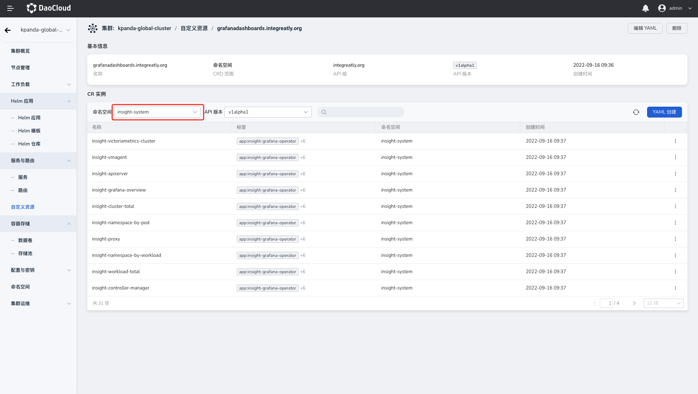
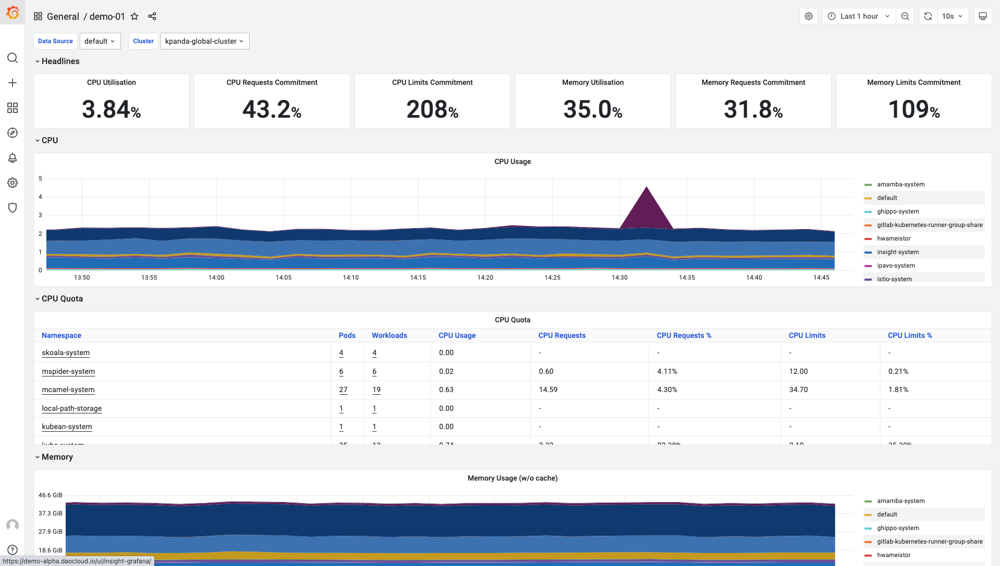

# import custom dashboard

This page introduces how to import customized dashboards through CRD and UI interface.

## Import Dashboard via CRD

1. Log in to the DCE 5.0 platform, enter `Container Management` from the left navigation bar, and select the target cluster in the cluster list.

2. Select `Custom Resources` on the left navigation bar, find `grafanadashboards.integreatly.org` file in the list, and enter the details.

    

3. Click `Create with YAML` and use the following template, replacing the dashboard JSON in the `Json` field.

    - `namespace`: Fill in the target namespace;
    - `name`: fill in the name of the dashboard.

    ```yaml
    apiVersion: integrally.org/v1alpha1
    kind: Grafana Dashboard
    metadata:
      labels:
        app: insight-grafana-operator
        operator.insight.io/managed-by: insight
      name: sample-dashboard
      namespace: insight-system
    spec:
      json: >
        {
          "id": null,
          "title": "Simple Dashboard",
          "tags": [],
          "style": "dark",
          "timezone": "browser",
          "editable": true,
          "hideControls": false,
          "graphTooltip": 1,
          "panels": [],
          "time": {
            "from": "now-6h",
            "to": "now"
          },
          "timepicker": {
            "time_options": [],
            "refresh_intervals": []
          },
          "templating": {
            "list": []
          },
          "annotations": {
            "list": []
          },
          "refresh": "5s",
          "schemaVersion": 17,
          "version": 0,
          "links": []
        }
    ```

4. After clicking `Confirm`, wait for a while to view the newly imported dashboard in `Dashboard`.

## Import Dashboard via UI

This section explains how to access native Grafana to build custom dashboards.

1. Click `Dashboards` > `Import` on the left navigation bar.

    

2. You can choose to import in the following ways:

    - Upload the dashboard JSON file
    - Paste the [Grafana.com](https://grafana.com) dashboard URL
    - Paste the dashboard JSON into the text area

    

3. After clicking `Load`, fill in the following parameters:

    - name: set the name of the dashboard
    - Floder: select the target path for dashboard storage
    - Prometheus: select data source

    

4. Click `Import` to import the dashboard successfully.

    

!!! info

    If you need to customize the dashboard, please refer to [Add Dashboard Panel](https://grafana.com/docs/grafana/latest/dashboards/add-organize-panels/).