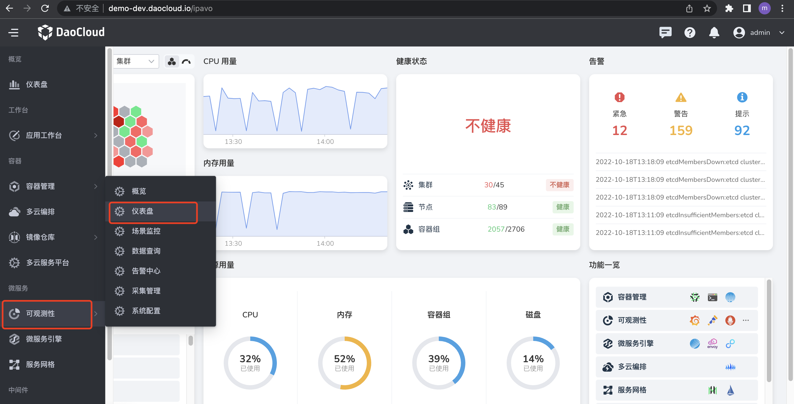
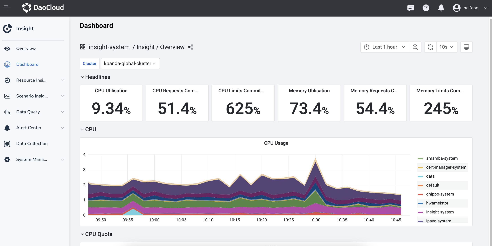

# Log Collection Troubleshooting Guide

After installing the `insight-agent` in the cluster, `Fluent Bit` in `insight-agent` will collect logs in the cluster by default, including Kubernetes event logs, node logs, container logs, etc. `Fluent Bit` has already configured various log collection plugins, related filter plugins, and log output plugins. The working status of these plugins determines whether log collection is normal. Below is a dashboard for `Fluent Bit` that monitors the working conditions of each `Fluent Bit` in the cluster and the collection, processing, and export of plugin logs.

1. Use DCE 5.0 platform, enter `Observability`, and select the `Dashboard` in the left navigation bar.

    

2. Click the dashboard title `Overview`.

    

3. Switch to the `insight-system` -> `Fluent Bit` dashboard.

    

4. There are several check boxes above the `Fluent Bit` dashboard to select the input plugin, filter plugin, output plugin, and cluster in which it is located.

    

## Plugin Description

Here are some plugins for `Fluent Bit`.

**Log Collection Plugin**

| Input Plugin           | Plugin Description                      | Collection Directory                                              |
| ---------------------- | ---------------------------------- | ------------------------------------------------------------------- |
| tail.kube              | Collect container logs             | /var/log/containers/*.log                                          |
| tail.kubeevent         | Collect Kubernetes event logs      | /var/log/containers/*-kubernetes-event-exporter*.log              |
| tail.syslog.dmesg      | Collect host dmesg logs            | /var/log/dmesg                                                      |
| tail.syslog.messages   | Collect frequently used host logs  | /var/log/secure, /var/log/messages, /var/log/syslog,/var/log/auth.log |
| syslog.syslog.RSyslog  | Collect RSyslog logs               |                                                                     |
| systemd.syslog.systemd | Collect Journald daemon logs       |                                                                     |
| tail.audit_log.k8s    | Collect Kubernetes audit logs      | /var/log/*/audit/*.log                                            |
| tail.audit_log.ghippo | Collect global management audit logs | /var/log/containers/*_ghippo-system_audit-log*.log              |
| tail.skoala-gw         | Collect microservice gateway logs  | /var/log/containers/*_skoala-gw*.log                             |

**Log Filter Plugin**

| Filter Plugin      | Plugin Description |
| ------------------------ | ---------------------------------- |
| Lua.audit_log.k8s | Use lua to filter Kubernetes audit logs that meet certain conditions |

!!! note

    There are more filter plugins than Lua.audit_log.k8s, which only introduces filters that will discard logs.

**Log Output Plugin**

| Output Plugin          | Plugin Description              |
| ------------------------ | ---------------------------------- |
| es.kube.kubeevent.syslog | Write Kubernetes audit logs, event logs, and syslog logs to [ElasticSearch cluster](../../middleware/elasticsearch/intro/index.md) |
| forward.audit_log | Send Kubernetes audit logs and [global management audit logs](../../ghippo/user-guide/audit/audit-log.md) to `Global Management` |
| es.skoala | Write [request logs](../../skoala/gateway/logs/reqlog.md) and [instance logs](../../skoala/gateway/logs/inslog.md) of microservice gateway to ElasticSearch cluster
