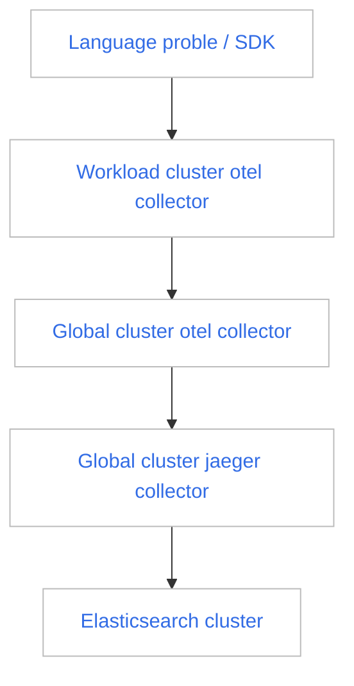

# Trace Collection Troubleshooting Guide

Before attempting to troubleshoot issues with trace data collection, you need to understand the transmission path of trace data. The following is a schematic diagram of the transmission of trace data:

As shown in the above figure, any transmission failure at any step will result in the inability to query trace data. If you find that there is no trace data after completing the application trace enhancement, please perform the following steps:

1. Use DCE 5.0 platform, enter __Insight__ , and select the __Dashboard__ in the left navigation bar.

    

2. Click the dashboard title __Overview__ .

    

3. Switch to the __insight-system__ -> __insight tracing debug__ dashboard.

    

4. You can see that this dashboard is composed of three blocks, each responsible for monitoring the data transmission of different clusters and components. Check whether there are problems with trace data transmission through the generated time series chart.

    - workload opentelemetry collector
    - global opentelemetry collector
    - global jaeger collector

    

## Block Introduction

1. **workload opentelemetry collector**

    Display the __opentelemetry collector__ in different working clusters receiving language probe/SDK trace data and sending aggregated trace data. You can select the cluster where it is located by the __Cluster__ selection box in the upper left corner.

    

    !!! note

        Based on these four time series charts, you can determine whether the __opentelemetry collector__ in this cluster is running normally.

2. **global opentelemetry collector**

    Display the __opentelemetry collector__ in the __Global Service Cluster__ receiving trace data from the __working cluster__ 's __otel collector__ and sending aggregated trace data.

    

    !!! note

        The __opentelemetry collector__ in the __Global Management Cluster__ is also responsible for sending audit logs of all working clusters' [global management module](../../ghippo/intro/index.md) and Kubernetes audit logs (not collected by default) to the __audit server__ component of the global management module.

3. **global jaeger collector**

    Display the __jaeger collector__ in the __Global Management Cluster__ receiving data from the __otel collector__ in the __Global Management Cluster__ and sending trace data to the [ElasticSearch cluster](../../middleware/elasticsearch/intro/index.md).
