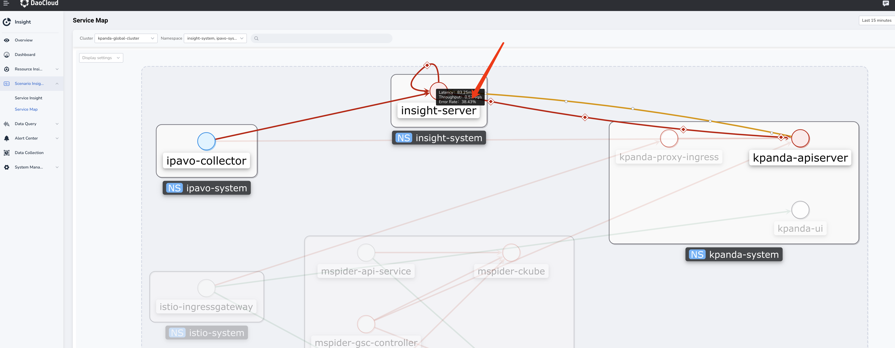
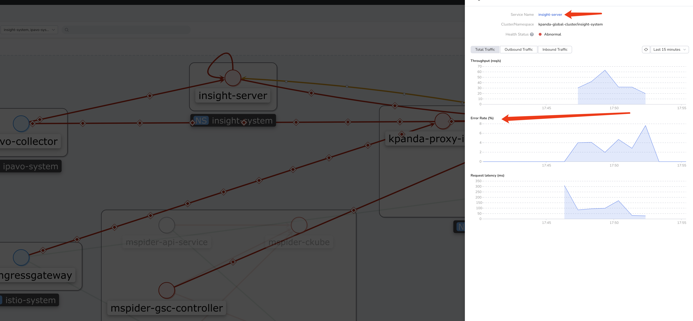
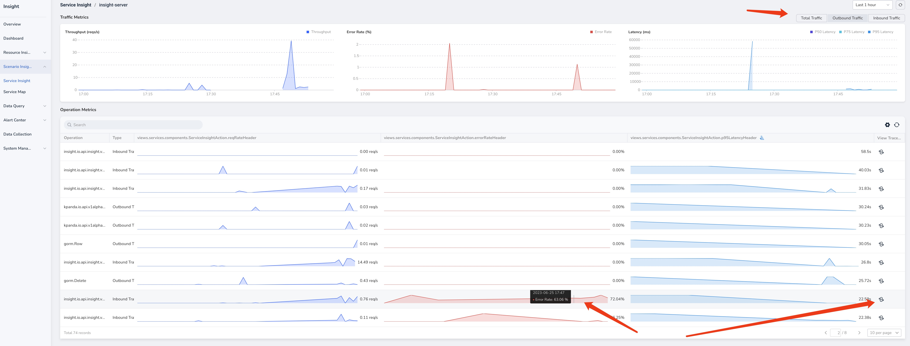
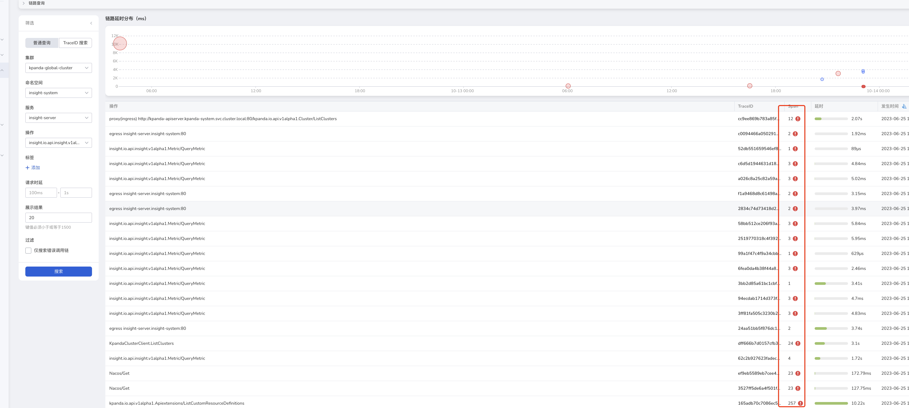
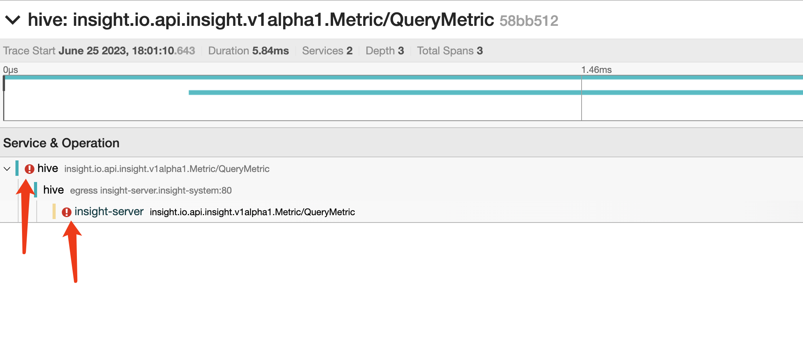
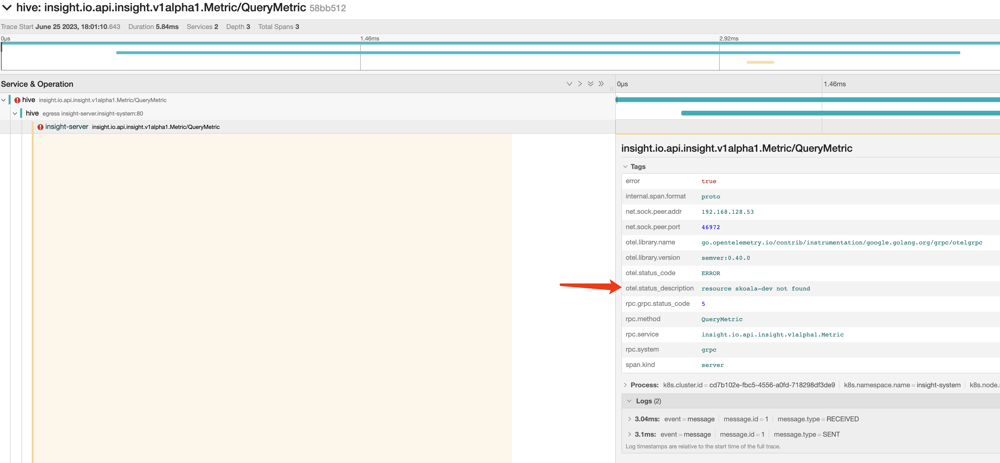

# Use Insight to find service's problems

This article will use DCE 5.0 as an example to explain how to find the abnormal components in DCE 5.0 through Insight and analyze the root cause(problems) of component exceptions.

This post assumes that you already understand Insight's product features or vision.

## Service Map(as well-known Topology) – Detect abnormalities from a macro perspective

With the practice of microservice architecture in enterprises, the number of services in the enterprise may face a large number and complex calls, and it is difficult for development or operation and maintenance personnel to sort out the relationship between services, so Insight provides the function of service map monitoring, and we can make a preliminary diagnosis of the microservices running in the current system through the service map.

As shown in the figure below, we found that the color of the node `Insight-Server` is `red` through the service map, and we moved the mouse over the node to find that the error rate of the node is `238.43%`. Therefore, we would like to look at more details to find out why the error rate of this service is not `0`:

Of course, we can also click the service name at the top to enter the overview UI of the service:

## Service Overview – Start your detailed analysis

When you need to analyze the inbound and outbound traffic of the service separately, you can switch the filter in the upper right corner, after filtering the data, we find that the service has many `operations` corresponding to an error rate that is not `0`. At this point, we can analyze the trace generated and recorded by the `operations` during this time by clicking `View Traces`:

## Trace Details - Find the root causes of errors and eliminate them

In the trace list, we can intuitively find the `error` trace in the trace list through the UI (circled in red box in the figure above), and we can click the wrong trace to view the trace details, as shown in the following figure:

In the trace diagram, we can also find at a glance that the last piece of data of the trace is in the `error` state, expand its right `logs`, and we find the cause of this request error:

Based on the above analysis method, we can also find traces with other `operation` errors:

## Now - Get started your analyze!
