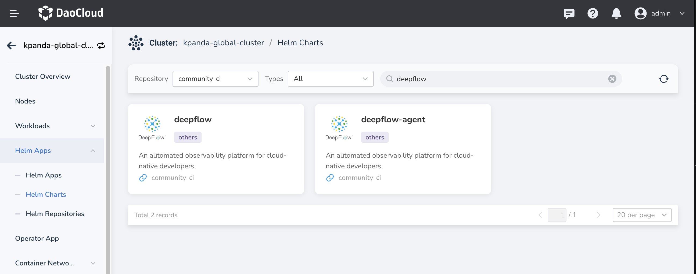
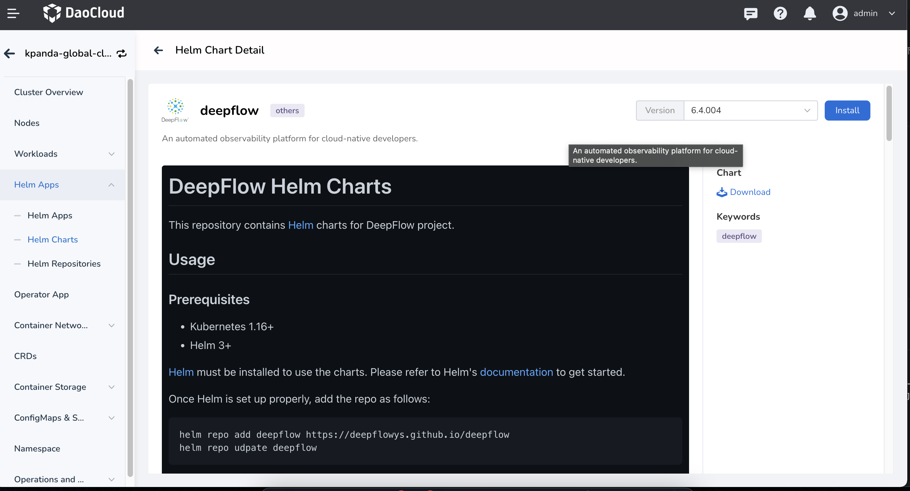
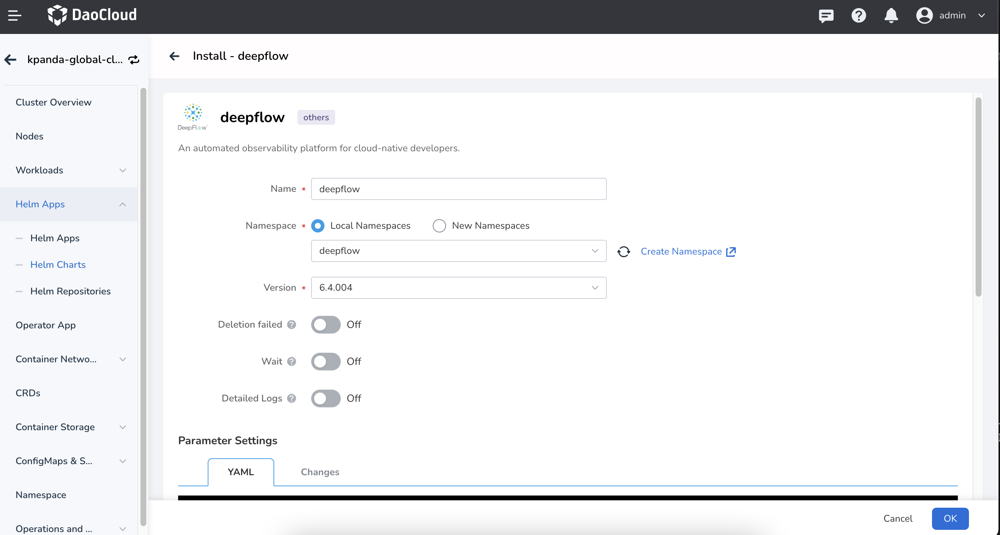
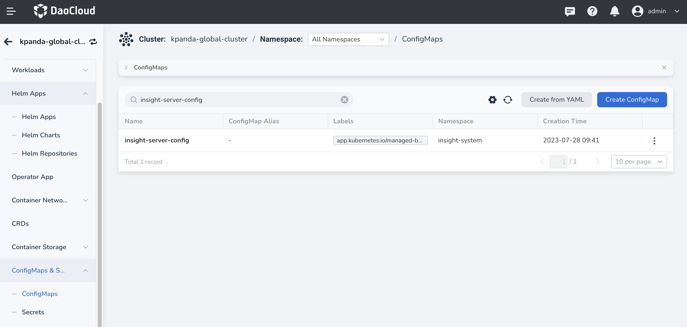
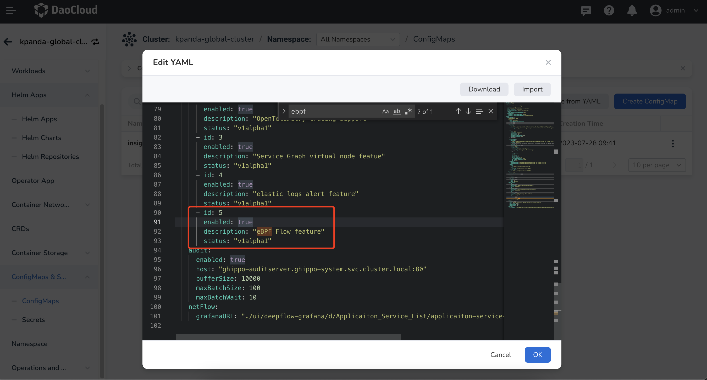

# Integrate DeepFlow

DeepFlow is an observability product based on eBPF. Its community edition has been integrated into Insight. The following is the integration process.

## Prerequisites

- Your global service cluster has installed Insight
- Insight minimum version requirement is v0.23.0
- Understand and meet the [DeepFlow runtime permissions and kernel requirements](https://deepflow.io/docs/ce-install/overview/#runtime-permissions-and-kernel-requirements)
- Storage volume is ready

## Install DeepFlow and Configure Insight

Installing DeepFlow components requires two charts:

- `deepflow`: includes components such as `deepflow-app`, `deepflow-server`, `deepflow-clickhouse`, `deepflow-agent`, etc.
  Generally, `deepflow` is deployed in the global service cluster, so it also installs `deepflow-agent` together.
- `deepflow-agent`: only includes the `deepflow-agent` component, used to collect eBPF data and send it to `deepflow-server`.

### Install DeepFlow

DeepFlow needs to be installed in the global service cluster.

1. Go to the __kpanda-global-cluster__ cluster and click
   __Helm Apps__ -> __Helm Charts__ in the left navigation bar, select __community__ as the repository, and search for `deepflow` in the search box:
    
    
    
1. Click the deepflow card to enter the details page:
    
    
    
1. Click __Install__ to enter the installation page:
    
    
    
1. Most of the values have default values. Clickhouse and Mysql require applying storage volumes, and their default sizes are __10Gi__.
   You can search for relevant configurations and modify them using the __persistence__ keyword.
    
1. After configuring, click __OK__ to start the installation.

### Configure Insight

After installing DeepFlow, you also need to enable the related feature switches in Insight.
    
1. Click __ConfigMps & Keys__ -> __ConfigMaps__ in the left navigation bar, search for insight-server-config in the search box, and edit it:
    
    
    
1. In the YAML, find the __eBPF Flow feature__ switch and enable it:
    
    
    
1. Save the changes and restart insight-server. The Insight main page will display __Network Observability__ :
    
    

## Install DeepFlow Agent

DeepFlow Agent is installed in the sub-cluster using the `deepflow-agent` chart. It is used to collect eBPF observability data from the sub-cluster and report it to the global service cluster.
Similar to installing `deepflow`, go to __Helm Apps__ -> __Helm Charts__, select __community__ as the repository, and search for `deepflow-agent` in the search box. Follow the process to enter the installation page.

Parameter Explanation:

- __DeployComponent__ : deployment mode, default is `daemonset`.
- __timezone__ : timezone, default is `Asia/Shanghai`.
- __DeepflowServerNodeIPS__ : addresses of the nodes where deepflow server is installed.
- __deepflowK8sClusterID__ : cluster UUID.
- __agentGroupID__ : agent group ID.
- __controllerPort__ : data reporting port of deepflow server, can be left blank, default is `30035`.
- __clusterNAME__ : cluster name.

After configuring, click __OK__ to complete the installation.

## Usage

After correctly installing DeepFlow, click __Network Observability__ to enter the DeepFlow Grafana UI. It contains a large number of dashboards for viewing and helping analyze issues.
Click __DeepFlow Templates__ to browse all available dashboards:

