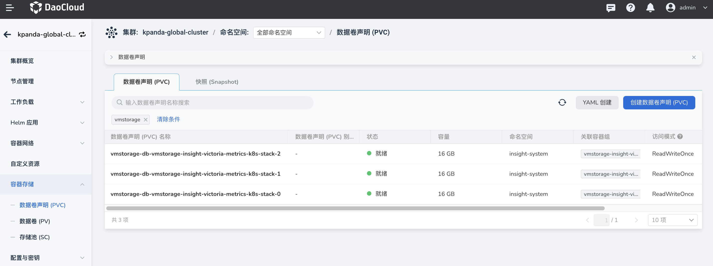
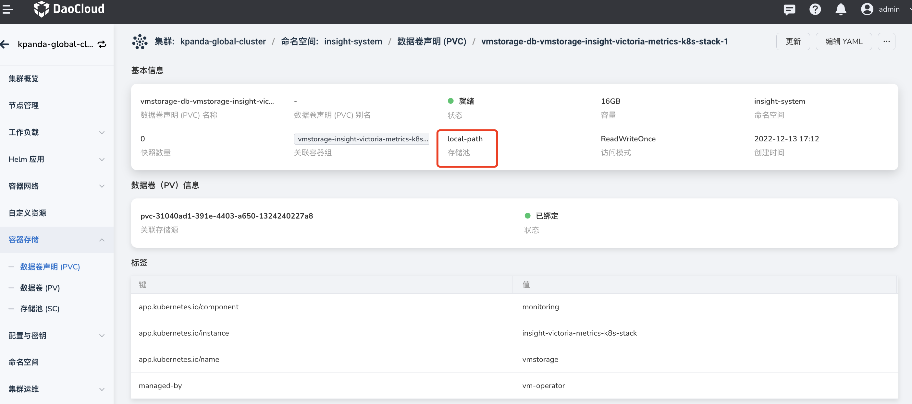
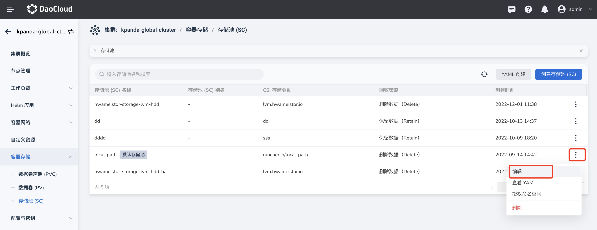
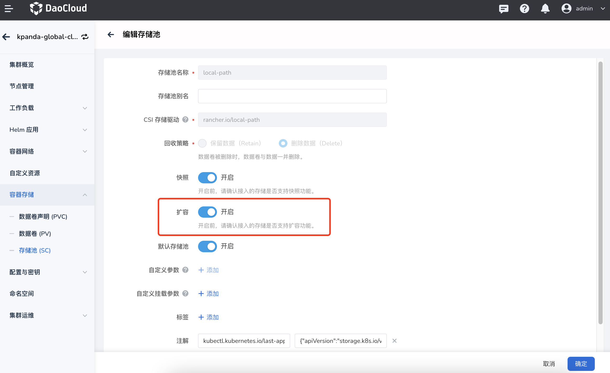
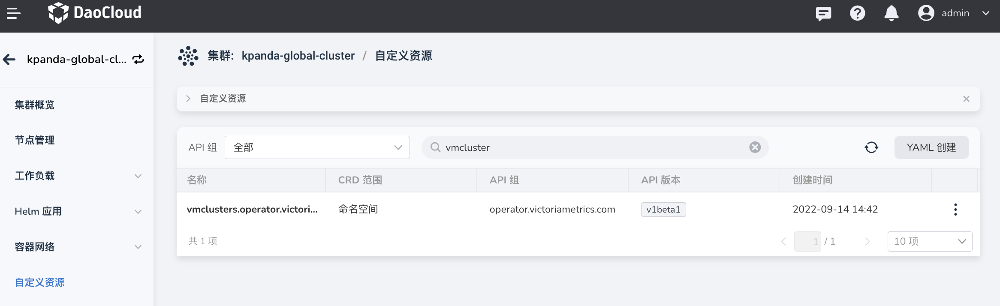
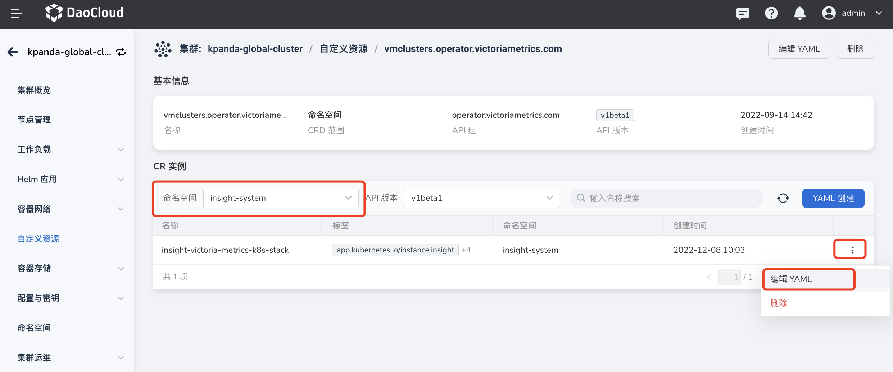
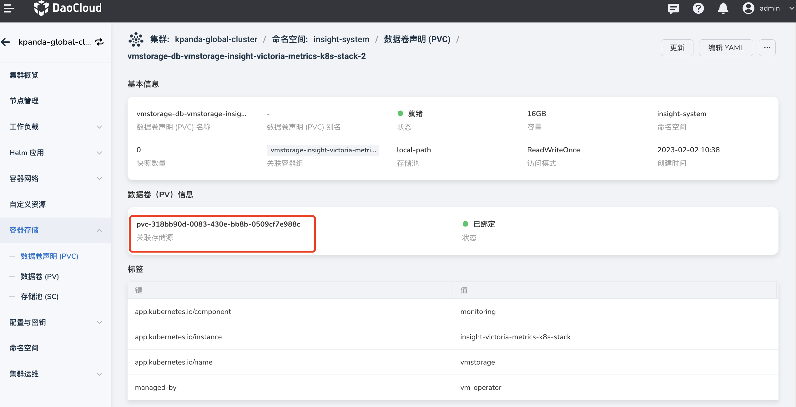

# vmstorge disk expansion

This article describes the method of vmstorge disk expansion,
Please refer to [vmstorage disk capacity planning](./vms-res-plan.md) for vmstorge disk specifications.

## Steps

### Enable storage pool expansion

1. Log in to the DCE 5.0 platform with the administrator privilege of the global service cluster,
    and enter the `kpanda-global-cluster` cluster details.

1. Select `Container Storage -> Data Volume Declaration (PVC)` in the left navigation,
    and find the data volume declaration bound to vmstorage.

    

1. Click a vmstorage PVC to enter the vmstorage data volume declaration details, and confirm the storage pool bound to the PVC.

    

1. Select the left navigation `Container Storage -> Storage Pool (SC)`, find `local-path`,
    click `⋮` on the right side of the target, and select `Edit` from the pop-up menu.

    

1. Enable `Expansion` and click `OK`.

    

### Change the disk capacity of vmstorage

1. Log in to the DCE 5.0 platform with the administrator privilege of the global service cluster,
    and enter the `kpanda-global-cluster` cluster details.
1. Select `Custom Resources` in the left navigation, and find `vmcluster` custom resources.

     

1. Click the vmcluster custom resource to enter the details page, switch to the `insight-system` namespace, and select `Edit YAML` from the right menu of `insight-victoria-metrics-k8s-stack`.

     

1. After modifying according to the legend, click `OK`.

    

1. Select `Container Storage -> Data Volume Declaration (PVC)` in the left navigation again,
    find the data volume declaration bound to vmstorage and confirm that the modification has taken effect.
    On a PVC details page, click the associated storage source (PV).

    

1. Open the data volume details page, and click the `Update` button in the upper right corner.

    

1. After modifying `Capacity`, click `OK`, and wait for a while until the expansion is successful.

    

### Clone storage volume

If the expansion of the storage volume fails, you can refer to the following methods to clone the storage volume.

1. Log in to the DCE 5.0 platform with the administrator privilege of the global service cluster,
    and enter the `kpanda-global-cluster` cluster details.

1. Select `Workload -> Stateful Load` in the left navigation, find `vmstorage` stateful load,
    click `⋮` on the right side of the target, and select `Status` -> `Stop` -> `OK` from the pop-up menu.

    

1. After logging in to the `master` node of the `kpanda-global-cluster` cluster on the command line,
    execute the following command to copy the vm-data directory in the vmstorage container to store the indicator information locally:

    ```bash
    kubectl cp -n insight-system vmstorage-insight-victoria-metrics-k8s-stack-1:vm-data ./vm-data
    ```

1. Log in to the DCE 5.0 platform and enter `kpanda-global-cluster` cluster details,
    select `Container Storage -> Data Volume (PV)` in the left navigation,
    click `Clone` in the upper right corner, and modify the capacity of the data volume.

    

    

1. Delete the previous data volume of vmstorage.

    

1. Wait for a while until the storage volume declaration is bound to the cloned data volume,
    execute the following command to import the data exported in step 3 into the corresponding container,
    and then start the previously suspended `vmstorage`.

    ```bash
    kubectl cp -n insight-system ./vm-data vmstorage-insight-victoria-metrics-k8s-stack-1:vm-data
    ```
