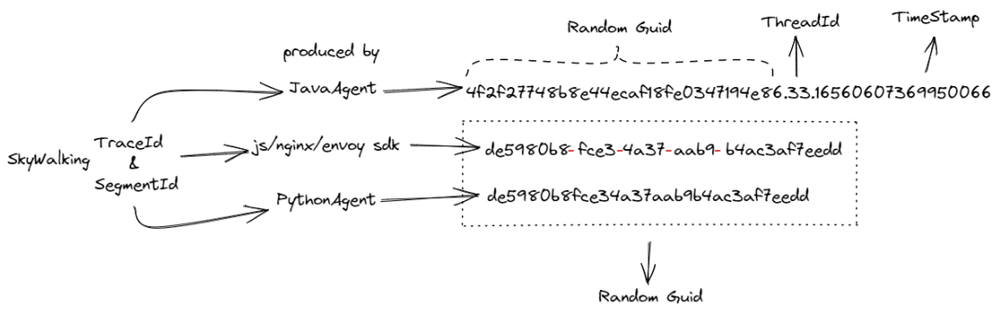
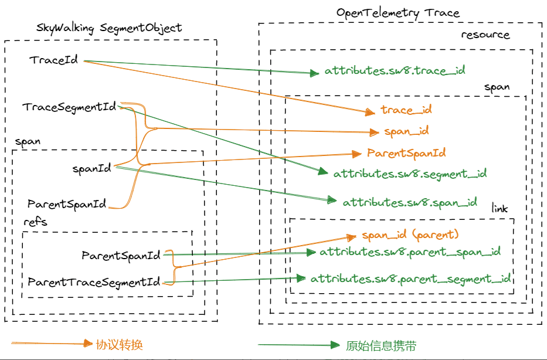
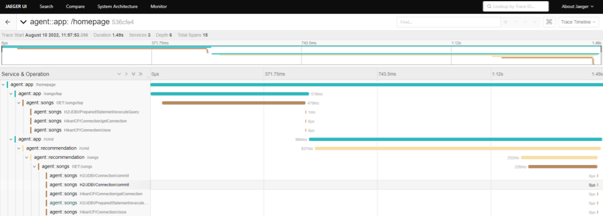
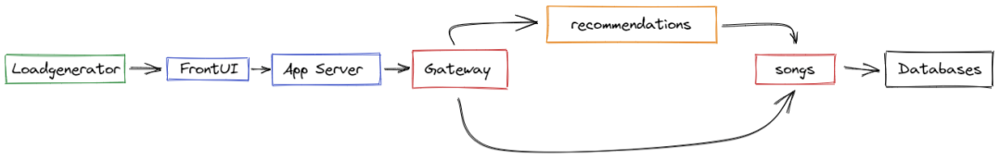

# Receive SkyWalking Trace Data with Zero Code using OpenTelemetry

Observable Insight reports application data through OpenTelemetry. If your application uses Skywalking to collect traces, you can refer to this article to transform the trace data into Insight with zero code modification.

## Code interpretation

In order to be compatible with different distributed tracing implementations, OpenTelemetry provides a way to implant components so that different vendors can standardize data processing and output to different backends. Jaeger and Zipkin in the community implement JaegerReceiver and ZipkinReceiver. We also contributed SkyWalkingReceiver to the community and continued to polish it. It now has the conditions for use in production environments without modifying any business code.

OpenTelemetry and SkyWalking have some similarities: both define a trace using Trace and mark the smallest granularity in the trace using Span. However, there are still differences in some details and implementations:

| - | Skywalking | OpenTelemetry |
| --- | ------- | ------------ |
| Data Structure  | `Span` -> `Segment` -> `Trace` | `Span` -> `Trace` |
| Attribute Information | `Tags` | `Attributes`|
| Application Time | `Logs` | `Events` |
| Reference Relationship | `References` | `Links` |

After clarifying these differences, we can start implementing the conversion of [SkyWalking Trace](https://skywalking.apache.org/docs/main/latest/en/protocols/trace-data-protocol-v3/) to [OpenTelemetry Trace](https://opentelemetry.io/docs/reference/specification/overview/). The main work includes:

1. How to construct OpenTelemetry's TraceId and SpanId
2. How to construct OpenTelemetry's ParentSpanId
3. How to retain SkyWalking's original TraceId, SegmentId, and SpanId in OpenTelemetry Span

First, let's look at how to construct OpenTelemetry's TraceId and SpanId. Both SkyWalking and OpenTelemetry use TraceId to link various distributed service calls and mark each Span using SpanId, but there are significant differences in implementation specifications:

> See GitHub for code implementation:
>
> 1. https://github.com/open-telemetry/opentelemetry-collector-contrib/blob/main/receiver/skywalkingreceiver/skywalkingproto_to_traces.go#L54
> 2. https://github.com/open-telemetry/opentelemetry-collector-contrib/pull/8107
> 3. https://github.com/open-telemetry/opentelemetry-collector-contrib/pull/8549

Specifically, all possible formats of SkyWalking TraceId and SegmentId are as follows:



In the OpenTelemetry protocol, Span is unique in all Traces. In SkyWalking, Span is only unique in each Segment. This means that SegmentId and SpanId must be combined to uniquely identify Span in SkyWalking and convert it to OpenTelemetry's SpanId.

> See GitHub for code implementation:
>
> 1. https://github.com/open-telemetry/opentelemetry-collector-contrib/blob/main/receiver/skywalkingreceiver/skywalkingproto_to_traces.go#L272
> 2. https://github.com/open-telemetry/opentelemetry-collector-contrib/pull/11562

Next, let's look at how to construct OpenTelemetry's ParentSpanId. Within a Segment, SkyWalking's ParentSpanId field can be used directly to construct OpenTelemetry's ParentSpanId field. However, when a Trace spans multiple Segments, SkyWalking uses the association information represented by ParentTraceSegmentId and ParentSpanId in Reference. Therefore, OpenTelemetry's ParentSpanId needs to be constructed through the information in Reference.

> See GitHub for code implementation: https://github.com/open-telemetry/opentelemetry-collector-contrib/blob/main/receiver/skywalkingreceiver/skywalkingproto_to_traces.go#L173

Finally, let's look at how to retain SkyWalking's original TraceId, SegmentId, and SpanId in OpenTelemetry Span. We carry this original information so that we can associate the OpenTelemetry TraceId and SpanId displayed by the distributed tracing backend with the SkyWalking TraceId, SegmentId, and SpanId in the application log, connecting tracing and logging. We choose to carry the original TraceId, SegmentId, and ParentSegmentId of SkyWalking to OpenTelemetry Attributes.

> See GitHub for code implementation:
>
> 1. https://github.com/open-telemetry/opentelemetry-collector-contrib/blob/main/receiver/skywalkingreceiver/skywalkingproto_to_traces.go#L201
> 2. https://github.com/open-telemetry/opentelemetry-collector-contrib/pull/12651

After this series of conversions, we have transformed the complete SkyWalking Segment Object into an OpenTelmetry Trace, as shown below:



# Deploying Demo

Below we will use a demo to demonstrate the complete process of using OpenTelemetry to collect and display SkyWalking tracing data.

First, after deploying the OpenTelemetry Agent, enable the following configuration to have compatibility with the SkyWalking protocol in OpenTelemetry:

```yaml
# otel-agent config
receivers:
  # add the following config
  skywalking:
    protocols:
      grpc:
        endpoint: 0.0.0.0:11800 # Receive trace data reported by the SkyWalking Agent
      http: 
        endpoint: 0.0.0.0:12800 # Receive trace data reported from the front-end / nginx or other HTTP protocols
service: 
  pipelines: 
    traces:      
      # add receiver `skywalking`
      receivers: [skywalking]
      
# otel-agent service yaml
spec:
  ports: 
    - name: sw-http
      port: 12800    
      protocol: TCP    
      targetPort: 12800 
    - name: sw-grpc     
      port: 11800 
      protocol: TCP  
      targetPort: 11800
```

Next, modify the SkyWalking OAP Service (e.g., oap:11800) that the business application is connected to, to the OpenTelemetry Agent Service (e.g., otel-agent:11800), and you can start using OpenTelemetry to receive trace data from the SkyWalking probe.

We use the SkyWalking-showcase Demo as an example to show the entire effect. It uses the SkyWalking Agent for tracing, and after standardized processing by OpenTelemetry, Jaeger is used to present the final effect:



From the architecture diagram of SkyWalking Showcase, we can see that the data of SkyWalking is still complete after being standardized by OpenTelemetry. In this trace, the request starts from app/homepage, then two requests /rcmd/ and/songs/top are initiated simultaneously in app, distributed to the recommendation/songs two services, and finally reach the database for querying, thus completing the entire request chain.



In addition, we can also view the original SkyWalking Id information from the Jaeger page, which is convenient for correlation with application logs:


