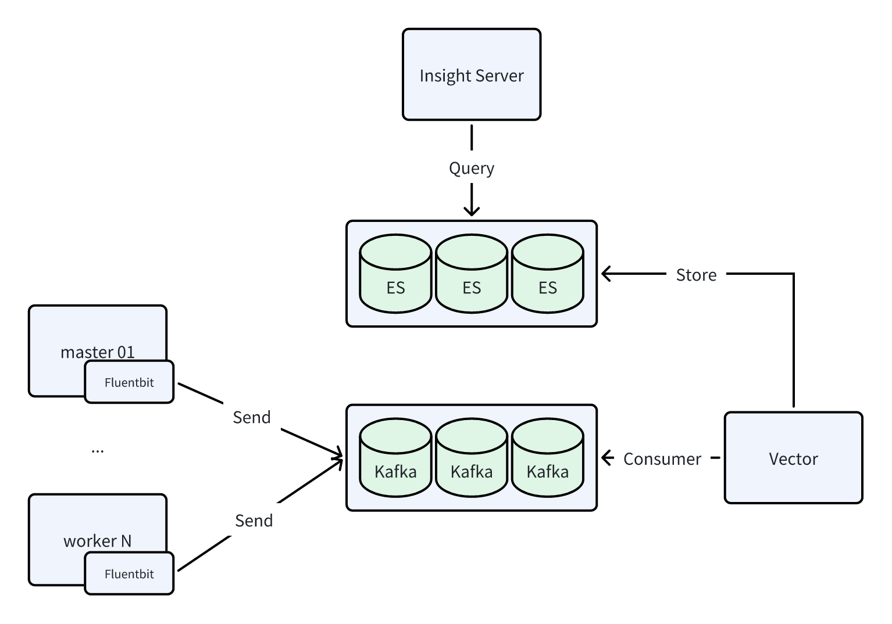
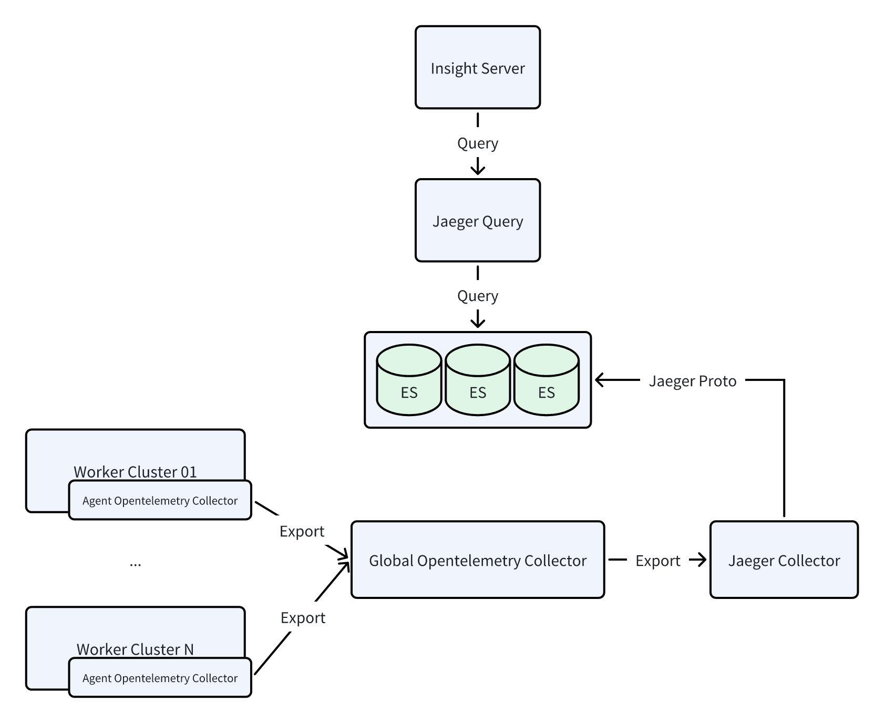
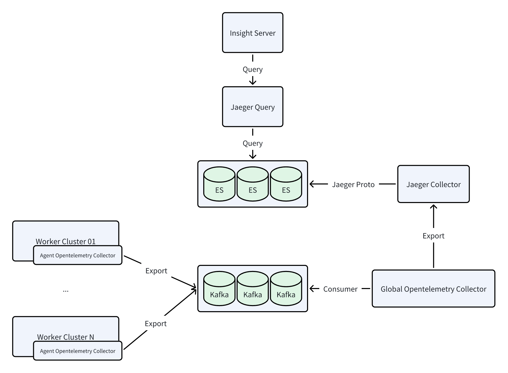

# Enable Big Log and Big Trace Modes

The Insight Module supports switching log to **Big Log** mode and trace to **Big Trace** mode, in order to 
enhance data writing capabilities in large-scale environments. 
This page introduces following methods for enabling these modes:

- Enable or upgrade to Big Log and Big Trace modes [through the installer](#enabling-via-installer) (controlled by the same parameter value in `manifest.yaml`)
- Manually enable Big Log and Big Trace modes [through Helm commands](#enabling-via-helm-commands)

## Logs

This section explains the differences between the normal log mode and the Big Log mode.

### Log Mode

Components: Fluentbit + Elasticsearch

This mode is referred to as the ES mode, and the data flow diagram is shown below:


### Big Log Mode

Components: Fluentbit + **Kafka** + **Vector** + Elasticsearch

This mode is referred to as the Kafka mode, and the data flow diagram is shown below:



## Traces

This section explains the differences between the normal trace mode and the Big Trace mode.

### Trace Mode

Components: Agent opentelemetry-collector + Global opentelemetry-collector + Jaeger-collector + Elasticsearch

This mode is referred to as the OTlp mode, and the data flow diagram is shown below:



### Big Trace Mode

Components: Agent opentelemetry-collector + Kafka + Global opentelemetry-collector + Jaeger-collector + Elasticsearch

This mode is referred to as the Kafka mode, and the data flow diagram is shown below:



## Enabling via Installer

When deploying/upgrading DCE 5.0 using the installer, the `manifest.yaml` file includes the `infrastructures.kafka` field. 
To enable observable Big Log and Big Trace modes, Kafka must be activated:

```yaml title="manifest.yaml"
apiVersion: manifest.daocloud.io/v1alpha1
kind: DCEManifest
...
infrastructures:
  ...
  kafka:
    enable: true # Default is false
    cpuLimit: 1
    memLimit: 2Gi
    pvcSize: 15Gi
```

### Enable

When using a `manifest.yaml` that enables `kafka` during installation, Kafka middleware will be installed by default, 
and Big Log and Big Trace modes will be enabled automatically. The installation command is:

```bash
./dce5-installer cluster-create -c clusterConfig.yaml -m manifest.yaml
```

### Upgrade

The upgrade also involves modifying the `kafka` field. However, note that since the old environment was installed 
with `kafka: false`, Kafka is not present in the environment. Therefore, you need to specify the upgrade 
for `middleware` to install Kafka middleware simultaneously. The upgrade command is:

```bash
./dce5-installer cluster-create -c clusterConfig.yaml -m manifest.yaml -u gproduct,middleware
```

!!! note

    After the upgrade is complete, you need to manually restart the following components:
    
    - insight-agent-fluent-bit
    - insight-agent-opentelemetry-collector
    - insight-opentelemetry-collector

## Enabling via Helm Commands

Prerequisites: Ensure that there is a **usable Kafka** and that the address is accessible.

Use the following commands to retrieve the values of the old versions of Insight and insight-agent (it's recommended to back them up):

```bash
helm get values insight -n insight-system -o yaml > insight.yaml
helm get values insight-agent -n insight-system -o yaml > insight-agent.yaml
```

### Enabling Big Log

There are several ways to enable or upgrade to Big Log mode:

=== "Use `--set` in the `helm upgrade` command"

    First, run the following Insight upgrade command, ensuring the Kafka brokers address is correct:

    ```bash
    helm upgrade insight insight-release/insight \
      -n insight-system \
      -f ./insight.yaml \
      --set global.kafka.brokers="10.6.216.111:30592" \
      --set global.kafka.enabled=true \
      --set vector.enabled=true \
      --version 0.30.1
    ```

    Then, run the following insight-agent upgrade command, ensuring the Kafka brokers address is correct:

    ```bash
    helm upgrade insight-agent insight-release/insight-agent \
      -n insight-system \
      -f ./insight-agent.yaml \
      --set global.exporters.logging.kafka.brokers="10.6.216.111:30592" \
      --set global.exporters.logging.output=kafka \
      --version 0.30.1
    ```

=== "Modify YAML and run helm upgrade"

    Follow these steps to modify the YAML and then run the `helm upgrade` command:

    1. Modify `insight.yaml`

        ```yaml title="insight.yaml"
        global:
          ...
          kafka:
            brokers: 10.6.216.111:30592
            enabled: true
        ...
        vector:
          enabled: true
        ```

    1. Upgrade the Insight component:

        ```bash
        helm upgrade insight insight-release/insight \
          -n insight-system \
          -f ./insight.yaml \
          --version 0.30.1
        ```

    1. Modify `insight-agent.yaml`

        ```yaml title="insight-agent.yaml"
        global:
          ...
          exporters:
            ...
            logging:
              ...
              kafka:
                brokers: 10.6.216.111:30592
              output: kafka
        ```

    1. Upgrade the insight-agent:

        ```bash
        helm upgrade insight-agent insight-release/insight-agent \
          -n insight-system \
          -f ./insight-agent.yaml \
          --version 0.30.1
        ```

=== "Upgrade via Container Management UI"

    In the Container Management module, find the cluster, select **Helm Apps** from the left navigation bar, 
    and find and update the insight-agent.

    In **Logging Settings**, select **kafka** for **output** and fill in the correct **brokers** address.

    Note that after the upgrade is complete, you need to manually restart the **insight-agent-fluent-bit** component.

### Enabling Big Trace

There are several ways to enable or upgrade to Big Trace mode:

=== "Using --set in the `helm upgrade` command"

    First, run the following Insight upgrade command, ensuring the Kafka brokers address is correct:

    ```bash
    helm upgrade insight insight-release/insight \
      -n insight-system \
      -f ./insight.yaml \
      --set global.kafka.brokers="10.6.216.111:30592" \
      --set global.kafka.enabled=true \
      --set global.tracing.kafkaReceiver.enabled=true \
      --version 0.30.1
    ```

    Then, run the following insight-agent upgrade command, ensuring the Kafka brokers address is correct:

    ```bash
    helm upgrade insight-agent insight-release/insight-agent \
      -n insight-system \
      -f ./insight-agent.yaml \
      --set global.exporters.trace.kafka.brokers="10.6.216.111:30592" \
      --set global.exporters.trace.output=kafka \
      --version 0.30.1
    ```

=== "Modify YAML and run helm upgrade"

    Follow these steps to modify the YAML and then run the `helm upgrade` command:

    1. Modify `insight.yaml`

        ```yaml title="insight.yaml"
        global:
          ...
          kafka:
            brokers: 10.6.216.111:30592
            enabled: true
        ...
        tracing:
          ...
          kafkaReceiver:
            enabled: true
        ```

    1. Upgrade the Insight component:

        ```bash
        helm upgrade insight insight-release/insight \
          -n insight-system \
          -f ./insight.yaml \
          --version 0.30.1
        ```

    1. Modify `insight-agent.yaml`

        ```yaml title="insight-agent.yaml"
        global:
          ...
          exporters:
            ...
            trace:
              ...
              kafka:
                brokers: 10.6.216.111:30592
              output: kafka
        ```

    1. Upgrade the insight-agent:

        ```bash
        helm upgrade insight-agent insight-release/insight-agent \
          -n insight-system \
          -f ./insight-agent.yaml \
          --version 0.30.1
        ```

=== "Upgrade via Container Management UI"

    In the Container Management module, find the cluster, select **Helm Apps** from the left navigation bar, 
    and find and update the insight-agent.

    In **Trace Settings**, select **kafka** for **output** and fill in the correct **brokers** address.

    Note that after the upgrade is complete, you need to manually **restart the insight-agent-opentelemetry-collector** and **insight-opentelemetry-collector** components.
