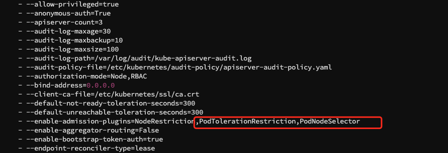

# Custom Insight Component Scheduling Policy

When deploying Insight to a Kubernetes environment, proper resource management and optimization are crucial.
Insight includes several core components such as Prometheus, OpenTelemetry, FluentBit, Vector, and Elasticsearch.
These components, during their operation, may negatively impact the performance of other pods within the cluster
due to resource consumption issues. To effectively manage resources and optimize cluster operations,
node affinity becomes an important option.

This page is about how to add [taints](#configure-dedicated-nodes-for-insight-using-taints)
and [node affinity](#use-node-labels-and-node-affinity-to-manage-component-scheduling) to ensure that each component
runs on the appropriate nodes, avoiding resource competition or contention, thereby guranttee the stability and efficiency
of the entire Kubernetes cluster.

## Configure dedicated nodes for Insight using taints

Since the Insight Agent includes DaemonSet components, the configuration method described in this section
is to have all components except the Insight DaemonSet run on dedicated nodes.

This is achieved by adding taints to the dedicated nodes and using tolerations to match them. More details can be
found in the [Kubernetes official documentation](https://kubernetes.io/docs/concepts/scheduling-eviction/taint-and-toleration/).

You can refer to the following commands to add and remove taints on nodes:

```bash
# Add taint
kubectl taint nodes worker1 node.daocloud.io=insight-only:NoSchedule

# Remove taint
kubectl taint nodes worker1 node.daocloud.io:NoSchedule-
```

There are two ways to schedule Insight components to dedicated nodes:

### 1. Add tolerations for each component

Configure the tolerations for the `insight-server` and `insight-agent` Charts respectively:

=== "insight-server Chart"

    ```yaml
    server:
      tolerations:
        - key: "node.daocloud.io"
          operator: "Equal"
          value: "insight-only"
          effect: "NoSchedule"
    
    ui:
      tolerations:
        - key: "node.daocloud.io"
          operator: "Equal"
          value: "insight-only"
          effect: "NoSchedule"
    
    runbook:
      tolerations:
        - key: "node.daocloud.io"
          operator: "Equal"
          value: "insight-only"
          effect: "NoSchedule"
    
    # mysql:
    victoria-metrics-k8s-stack:
      victoria-metrics-operator:
        tolerations:
          - key: "node.daocloud.io"
            operator: "Equal"
            value: "insight-only"
            effect: "NoSchedule"
      vmcluster:
        spec:
          vmstorage:
            tolerations:
              - key: "node.daocloud.io"
                operator: "Equal"
                value: "insight-only"
                effect: "NoSchedule"
          vmselect:
            tolerations:
              - key: "node.daocloud.io"
                operator: "Equal"
                value: "insight-only"
                effect: "NoSchedule"
          vminsert:
            tolerations:
              - key: "node.daocloud.io"
                operator: "Equal"
                value: "insight-only"
                effect: "NoSchedule"
      vmalert:
        spec:
          tolerations:
            - key: "node.daocloud.io"
              operator: "Equal"
              value: "insight-only"
              effect: "NoSchedule"
      alertmanager:
        spec:
          tolerations:
            - key: "node.daocloud.io"
              operator: "Equal"
              value: "insight-only"
              effect: "NoSchedule"
    
    jaeger:
      collector:
        tolerations:
          - key: "node.daocloud.io"
            operator: "Equal"
            value: "insight-only"
            effect: "NoSchedule"
      query:
        tolerations:
          - key: "node.daocloud.io"
            operator: "Equal"
            value: "insight-only"
            effect: "NoSchedule"
    
    opentelemetry-collector-aggregator:
      tolerations:
        - key: "node.daocloud.io"
          operator: "Equal"
          value: "insight-only"
          effect: "NoSchedule"
    
    opentelemetry-collector:
      tolerations:
        - key: "node.daocloud.io"
          operator: "Equal"
          value: "insight-only"
          effect: "NoSchedule"
    
    grafana-operator:
      operator:
        tolerations:
          - key: "node.daocloud.io"
            operator: "Equal"
            value: "insight-only"
            effect: "NoSchedule"
      grafana:
        tolerations:
          - key: "node.daocloud.io"
            operator: "Equal"
            value: "insight-only"
            effect: "NoSchedule"
    kibana:
      tolerations:
        - key: "node.daocloud.io"
          operator: "Equal"
          value: "insight-only"
          effect: "NoSchedule"
    
    elastic-alert:
      tolerations:
        - key: "node.daocloud.io"
          operator: "Equal"
          value: "insight-only"
          effect: "NoSchedule"
    
    vector:
      tolerations:
        - key: "node.daocloud.io"
          operator: "Equal"
          value: "insight-only"
          effect: "NoSchedule"
    ```

=== "insight-agent Chart"

    ```yaml
    kube-prometheus-stack:
      prometheus:
        prometheusSpec:
          tolerations:
            - key: "node.daocloud.io"
              operator: "Equal"
              value: "insight-only"
              effect: "NoSchedule"
      prometheus-node-exporter:
        tolerations:
          - effect: NoSchedule
            operator: Exists
      prometheusOperator:
        tolerations:
          - key: "node.daocloud.io"
            operator: "Equal"
            value: "insight-only"
            effect: "NoSchedule"
    
    kube-state-metrics:
      tolerations:
        - key: "node.daocloud.io"
          operator: "Equal"
          value: "insight-only"
          effect: "NoSchedule"
    opentelemetry-operator:
      tolerations:
        - key: "node.daocloud.io"
          operator: "Equal"
          value: "insight-only"
          effect: "NoSchedule"
    opentelemetry-collector:
      tolerations:
        - key: "node.daocloud.io"
          operator: "Equal"
          value: "insight-only"
          effect: "NoSchedule"
    tailing-sidecar-operator:
      operator:
        tolerations:
        - key: "node.daocloud.io"
          operator: "Equal"
          value: "insight-only"
          effect: "NoSchedule"
    opentelemetry-kubernetes-collector:
      tolerations:
        - key: "node.daocloud.io"
          operator: "Equal"
          value: "insight-only"
          effect: "NoSchedule"
    prometheus-blackbox-exporter:
      tolerations:
        - key: "node.daocloud.io"
          operator: "Equal"
          value: "insight-only"
          effect: "NoSchedule"
    etcd-exporter:
      tolerations:
        - key: "node.daocloud.io"
          operator: "Equal"
          value: "insight-only"
          effect: "NoSchedule" 
    ```

### 2. Configure at the namespace level

Allow pods in the `insight-system` namespace to tolerate the `node.daocloud.io=insight-only` taint.

1. Adjust the `apiserver` configuration file `/etc/kubernetes/manifests/kube-apiserver.yaml` to include
   `PodTolerationRestriction,PodNodeSelector`. See the following picture:

    

2. Add an annotation to the `insight-system` namespace:

    ```yaml
    apiVersion: v1
    kind: Namespace
    metadata:
      name: insight-system
      annotations:
        scheduler.alpha.kubernetes.io/defaultTolerations: '[{"operator": "Equal", "effect": "NoSchedule", "key": "node.daocloud.io", "value": "insight-only"}]'
    ```

Restart the components under the insight-system namespace to allow normal scheduling of pods under the insight-system.

## Use node labels and node affinity to manage component scheduling

!!! info

    Node affinity is conceptually similar to `nodeSelector`, allowing you to constrain
    which nodes a pod can be scheduled on based on **labels** on the nodes.
    There are two types of node affinity:
    
    1. requiredDuringSchedulingIgnoredDuringExecution: The scheduler will only schedule the pod
       if the rules are met. This feature is similar to nodeSelector but has more expressive syntax.
    2. preferredDuringSchedulingIgnoredDuringExecution: The scheduler will try to find nodes that
       meet the rules. If no matching nodes are found, the scheduler will still schedule the Pod.

    For more details, please refer to the [Kubernetes official documentation](https://kubernetes.io/docs/concepts/scheduling-eviction/assign-pod-node/#affinity-and-anti-affinity).

To meet different user needs for scheduling Insight components, Insight provides fine-grained labels for
different components' scheduling policies. Below is a description of the labels and their associated components:

| Label Key | Label Value | Description |
| --- | ------- | ------------ |
| `node.daocloud.io/insight-any` | Any value, recommended to use `true` | Represents that all Insight components prefer nodes with this label |
| `node.daocloud.io/insight-prometheus`  | Any value, recommended to use `true` | Specifically for Prometheus components |
| `node.daocloud.io/insight-vmstorage` | Any value, recommended to use `true` | Specifically for VictoriaMetrics vmstorage components |
| `node.daocloud.io/insight-vector` | Any value, recommended to use `true` | Specifically for Vector components |
| `node.daocloud.io/insight-otel-col` | Any value, recommended to use `true` | Specifically for OpenTelemetry components |

You can refer to the following commands to add and remove labels on nodes:

```bash
# Add label to node8, prioritizing scheduling insight-prometheus to node8 
kubectl label nodes node8 node.daocloud.io/insight-prometheus=true

# Remove the node.daocloud.io/insight-prometheus label from node8
kubectl label nodes node8 node.daocloud.io/insight-prometheus-
```

Below is the default affinity preference for the insight-prometheus component during deployment:

```yaml
affinity:
  nodeAffinity:
    preferredDuringSchedulingIgnoredDuringExecution:
    - preference:
        matchExpressions:
        - key: node-role.kubernetes.io/control-plane
          operator: DoesNotExist
      weight: 1
    - preference:
        matchExpressions:
        - key: node.daocloud.io/insight-prometheus # (1)!
          operator: Exists
      weight: 2
    - preference:
        matchExpressions:
        - key: node.daocloud.io/insight-any
          operator: Exists
      weight: 3
    podAntiAffinity:
      preferredDuringSchedulingIgnoredDuringExecution:
        - weight: 1
          podAffinityTerm:
            topologyKey: kubernetes.io/hostname
            labelSelector:
              matchExpressions:
                - key: app.kubernetes.io/instance
                  operator: In
                  values:
                    - insight-agent-kube-prometh-prometheus
```

1. Prioritize scheduling insight-prometheus to nodes with the node.daocloud.io/insight-prometheus label
