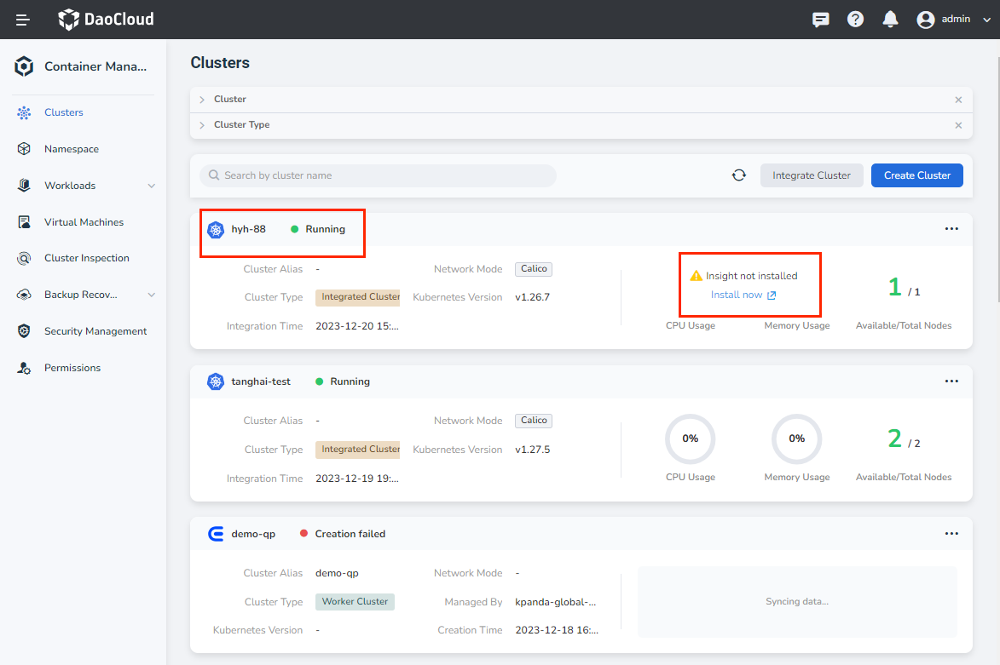
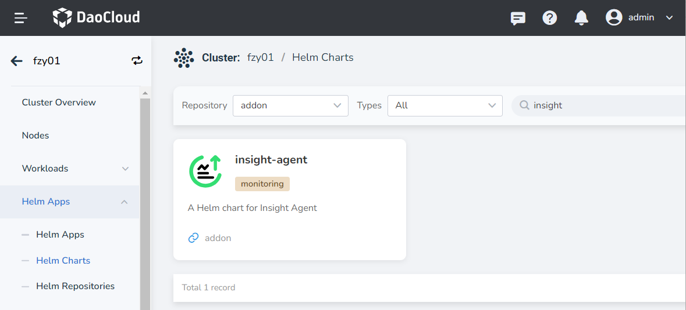
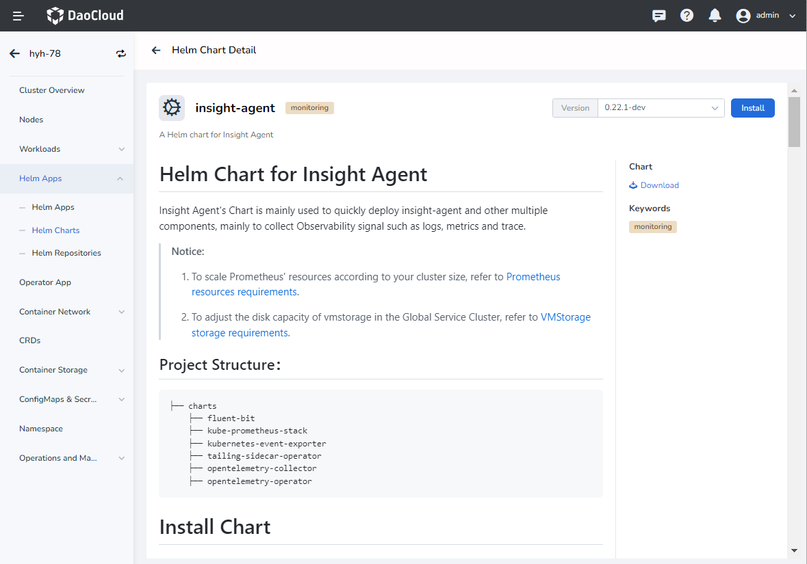
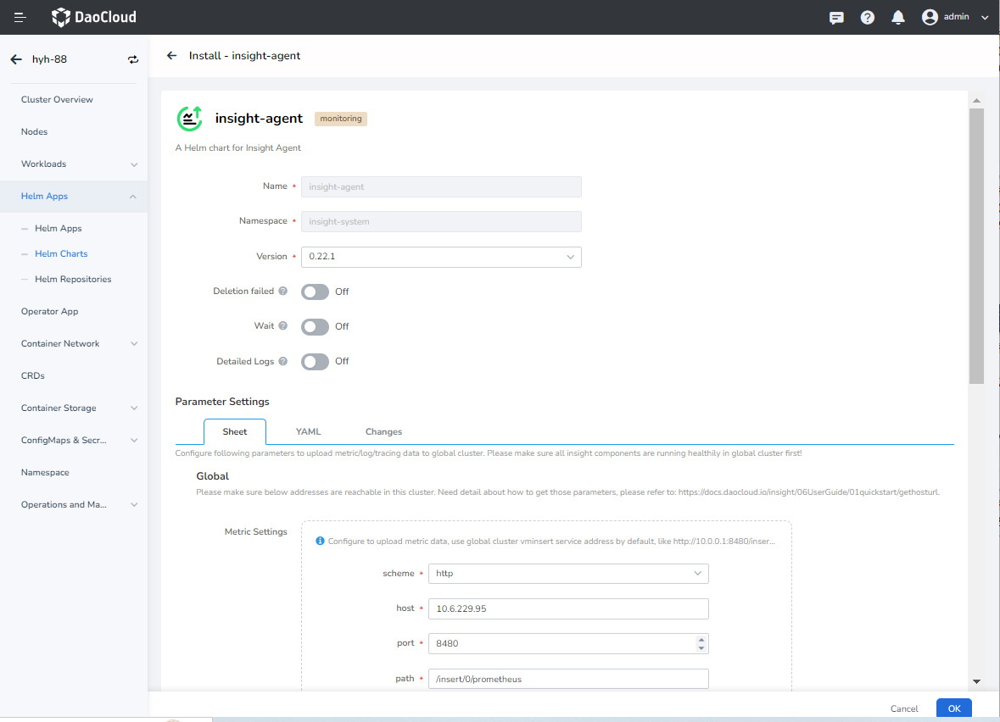
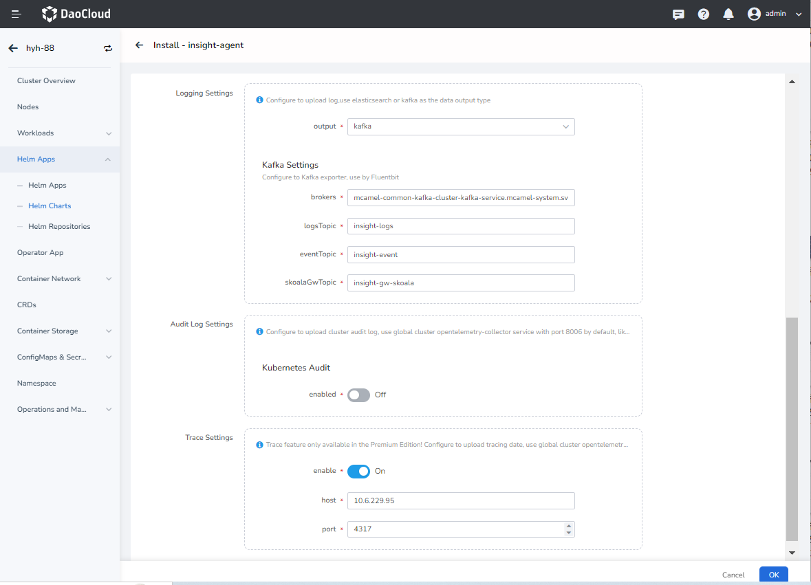
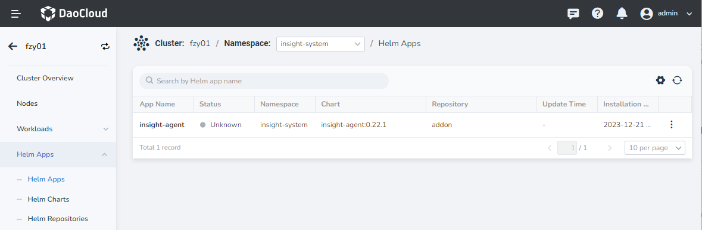

# Install insight-agent

insight-agent is a plugin for collecting insight data, supporting unified observation of metrics, links, and log data. This article describes how to install insight-agent in an online environment for the accessed cluster.

## Prerequisites

Please confirm that your cluster has successfully connected to the `container management` platform. You can refer to [Integrate Clusters](../../../kpanda/user-guide/clusters/integrate-cluster.md) for details.

## Steps

1. Enter `Container Management` from the left navigation bar, and enter `Clusters`. Find the cluster where you want to install insight-agent.

    

1. Choose `Install now` to jump, or click on the cluster and click on `Helm Applications` -> `Helm Templates` in the left navigation bar, search for `insight-agent` in the search box, and click it for details.

    

1. Select the appropriate version and click `Install`.

    

1. Fill in the name, select the namespace and version, and fill in the addresses of logging, metric, audit, and trace reporting data in the yaml file. The system has filled in the address of the component for data reporting by default, please check it before clicking `OK` to install.

    If you need to modify the data reporting address, please refer to [Get Data Reporting Address](./gethosturl.md).

    

    

1. The system will automatically return to `Helm Apps`. When the application status changes from `Unknown` to `Deployed`, it means that insight-agent is installed successfully.

    

    !!! note

        - Click `⋮` on the far right, and you can perform more operations such as `Update`, `View YAML` and `Delete` in the pop-up menu.
        - For a practical installation demo, watch [Video demo of installing insight-agent](../../../videos/insight.md#install-insight-agent)
