# vmstorage Disk Expansion

This article describes the method for expanding the vmstorage disk. Please refer to the [vmstorage disk capacity planning](../res-plan/vms-res-plan.md) for the specifications of the vmstorage disk.

## Procedure

### Enable StorageClass expansion

1. Log in to the DCE 5.0 platform as a global service cluster administrator. Click `Container Management` -> `Clusters` and go to the details of the `kpanda-global-cluster` cluster.

2. Select the left navigation menu `Container Storage` -> `PVCs` and find the PVC bound to the vmstorage.

    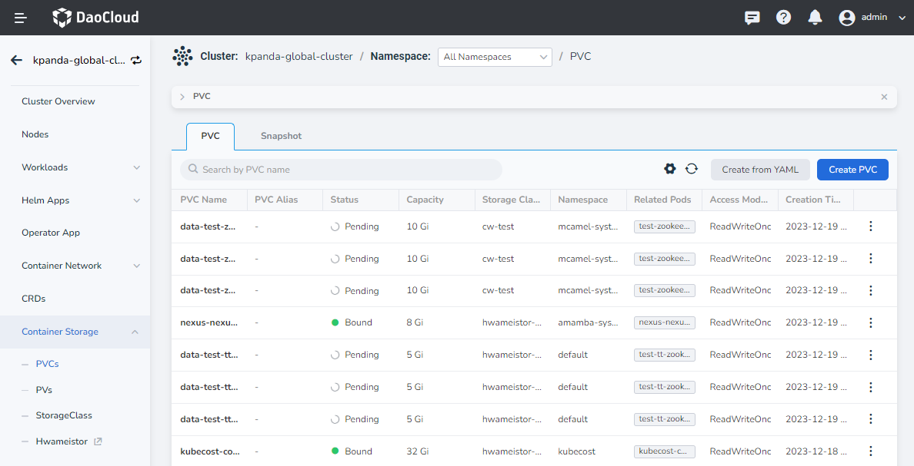

3. Click a vmstorage PVC to enter the details of the volume claim for vmstorage and confirm the StorageClass that the PVC is bound to.

    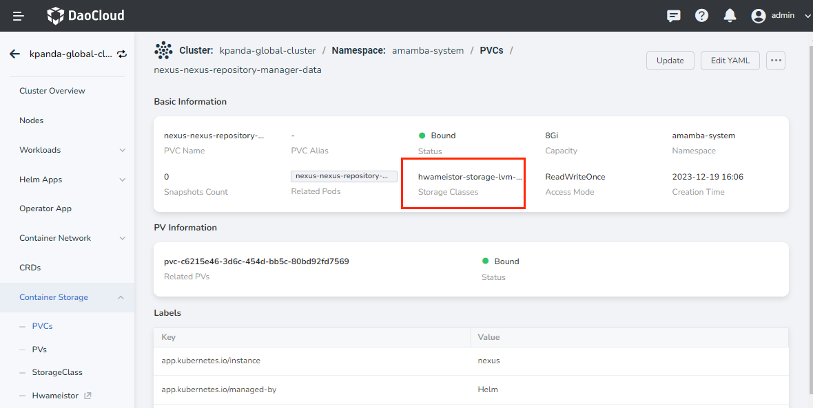

4. Select the left navigation menu `Container Storage` -> `Storage Class` and find `local-path`. Click the `⋮` on the right side of the target and select `Edit` in the popup menu.

    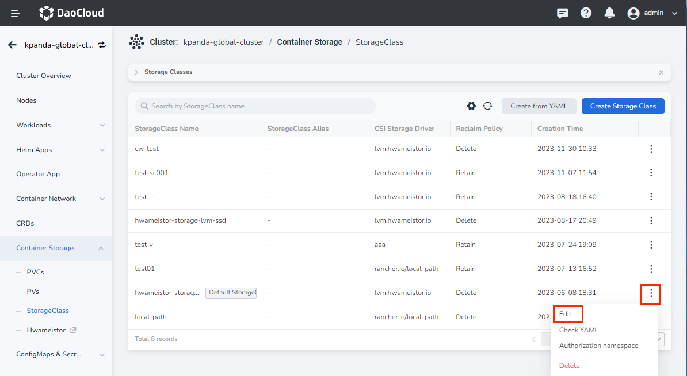

5. Enable `Scale Up` and click `OK`.

    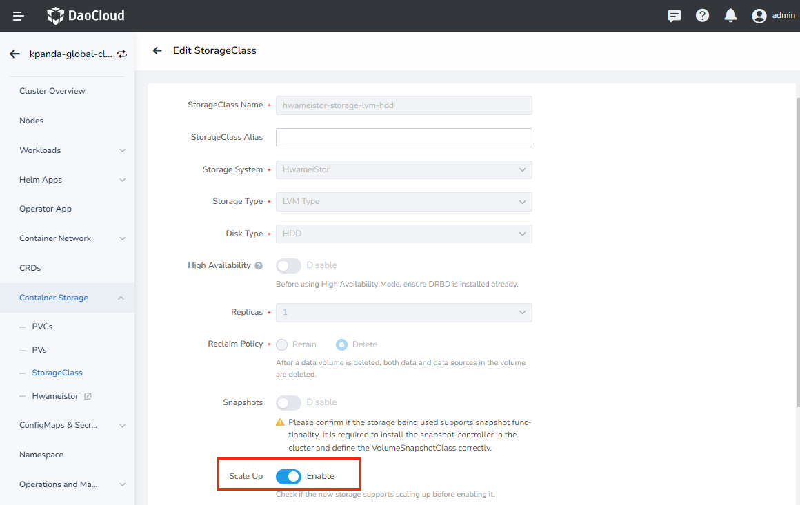

### Modify the disk capacity of vmstorage

1. Log in to the DCE 5.0 platform as a global service cluster administrator and go to the details of the `kpanda-global-cluster` cluster.

2. Select the left navigation menu `CRDs` and find the custom resource for `vmcluster`.

    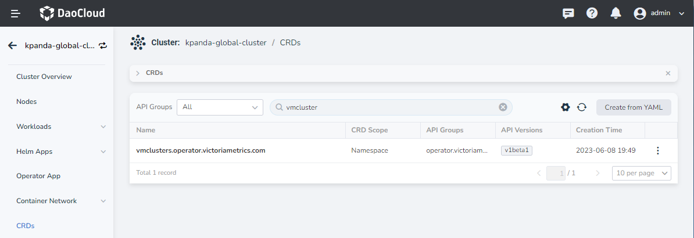

3. Click the custom resource for vmcluster to enter the details page, switch to the `insight-system` namespace, and select `Edit YAML` from the right menu of `insight-victoria-metrics-k8s-stack`.

    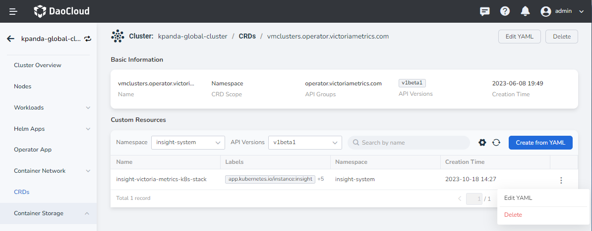

4. Modify according to the legend and click `OK`.

    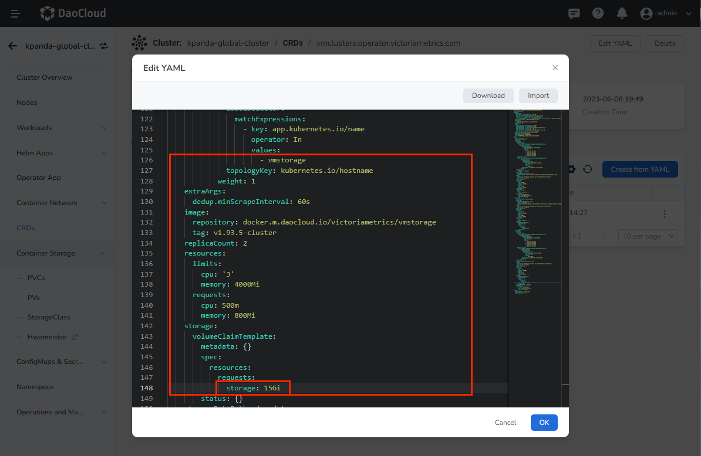

5. Select the left navigation menu `Container Storage` -> `PVCs` again and find the volume claim bound to vmstorage. Confirm that the modification has taken effect. In the details page of a PVC, click the associated storage source (PV).

    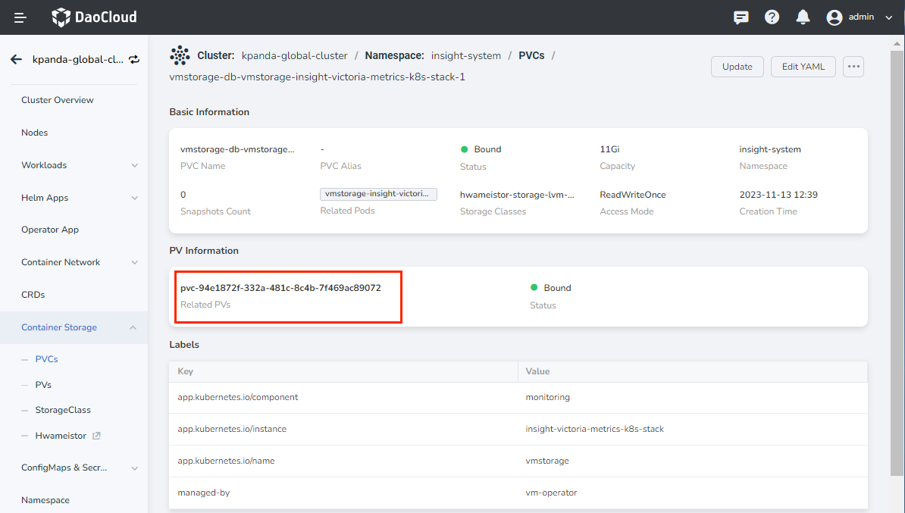

6. Open the volume details page and click the `Update` button in the upper right corner.

    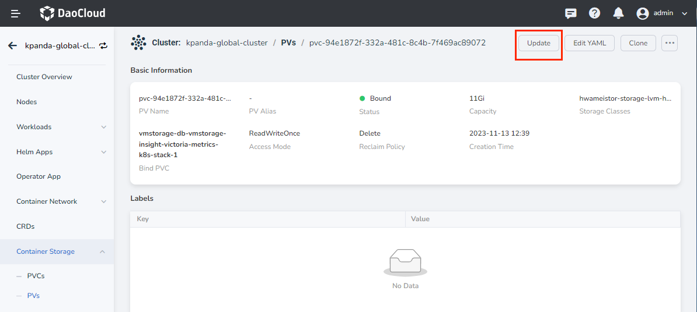

7. After modifying the `Capacity`, click `OK` and wait for a moment until the expansion is successful.

    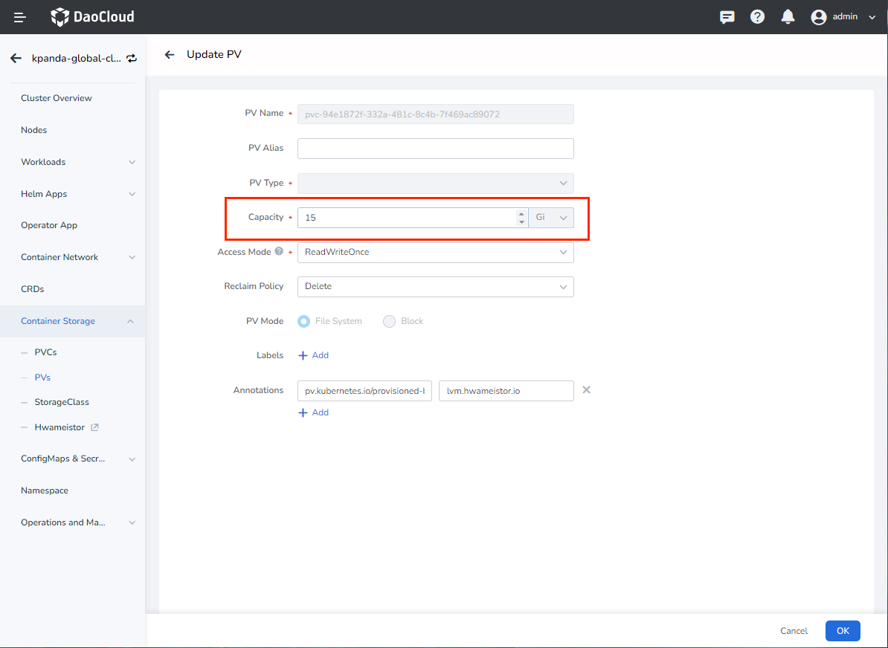

### Clone the storage volume

If the storage volume expansion fails, you can refer to the following method to clone the storage volume.

1. Log in to the DCE 5.0 platform as a global service cluster administrator and go to the details of the `kpanda-global-cluster` cluster.

2. Select the left navigation menu `Workloads` -> `StatefulSets` and find the stateful set for `vmstorage`. Click the `⋮` on the right side of the target and select `Status` -> `Stop` -> `OK` in the popup menu.

    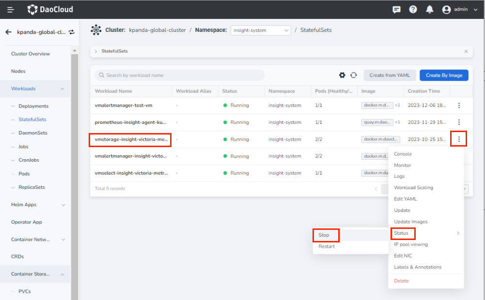

3. After logging into the `master` node of the `kpanda-global-cluster` cluster in the command line, run the following command to copy the vm-data directory in the vmstorage container to store the metric information locally:

    ```bash
    kubectl cp -n insight-system vmstorage-insight-victoria-metrics-k8s-stack-1:vm-data ./vm-data
    ```

4. Log in to the DCE 5.0 platform and go to the details of the `kpanda-global-cluster` cluster. Select the left navigation menu `Container Storage` -> `PVs`, click `Clone` in the upper right corner, and modify the capacity of the volume.

    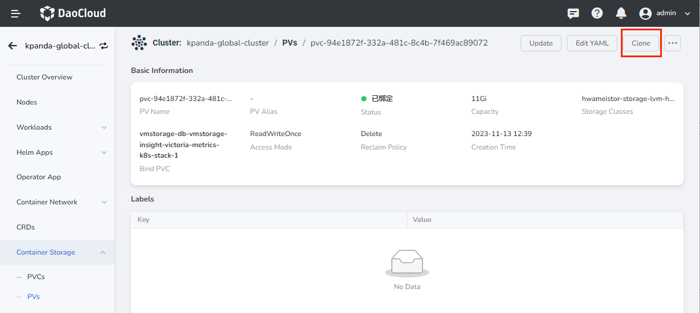

    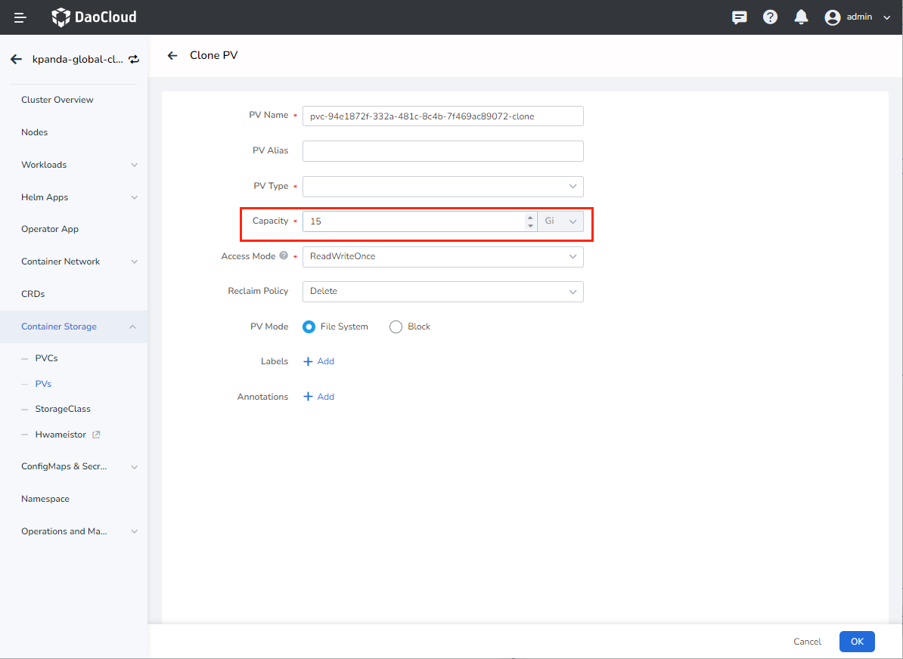

5. Delete the previous data volume of vmstorage.

    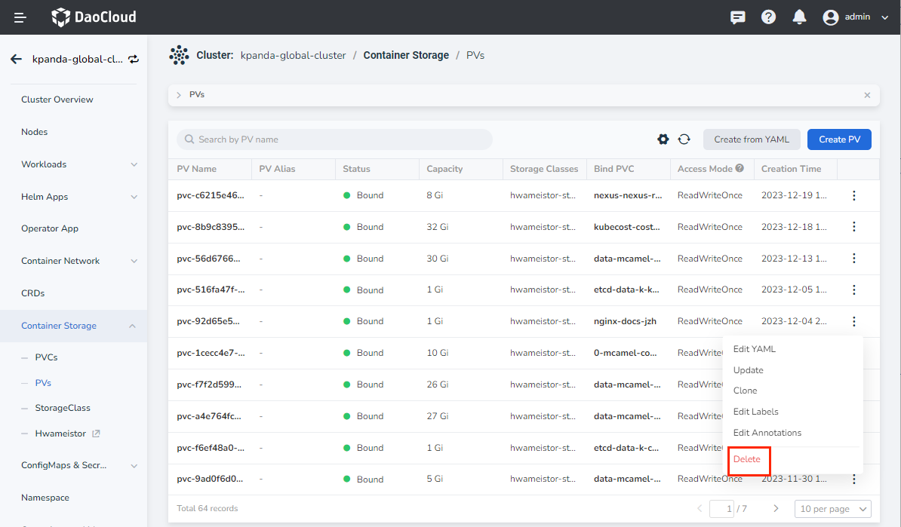

6. Wait for a moment until the volume claim is bound to the cloned data volume, then run the following command to import the exported data from step 3 into the corresponding container, and then start the previously paused `vmstorage`.

    ```bash
    kubectl cp -n insight-system ./vm-data vmstorage-insight-victoria-metrics-k8s-stack-1:vm-data
    ```
