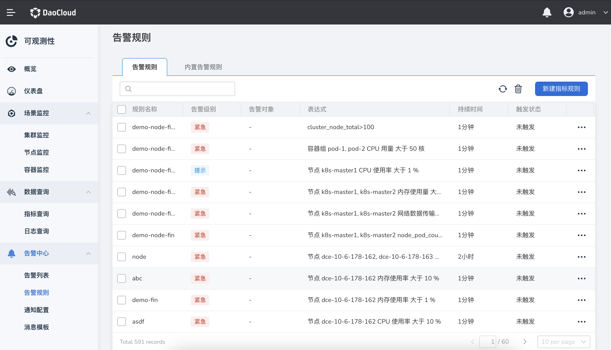

# Alert rules

When the indicator data of the resource meets the threshold condition, an alarm event will be generated, and the system will report the automatically triggered alarm to the `alarm list`.

## Create alert rules

1. After entering `Observability`, in the left navigation bar, select `Alert Center` -> `Alarm Rules`, and click the `New Indicator Rule` button.

    

2. On the `Create Alert Rule` page, fill in the basic information, select indicators, trigger conditions and other information.

    

    - select indicator
  
        Two types of indicators, rule template and PromQL rule, are supported:
    
        - PromQL rule: Enter a PromQL expression, please [Query Prometheus Expression](https://prometheus.io/docs/prometheus/latest/querying/basics/) for details.
      
        - Rule template: The basic indicators are predefined, and the indicators to be monitored can be set according to nodes and workloads.

    - Trigger conditions: set the threshold, trigger time, alarm level, etc. for the indicator.

- Trigger time: After the alarm is triggered and the duration reaches the set value, the alarm rule will become in the triggering state.

- Alarm level: It includes three levels: emergency, warning, and prompt.

    - Alarm notification: The object that receives the alarm message supports four receiving methods: email, DingTalk, WeChat, and Webhook, see [Notification Configuration](message.md).

3. After the configuration is complete, click the `Confirm` button to return to the list of alarm rules.

!!! tip

    The newly created alarm rule is in the state of `not triggered`. Once the threshold condition and duration in the rule are met, it will become `Triggering` status.

## Other operations

Click `...` on the right side of the list, and select `Edit`, `Copy` or `Delete` in the pop-up menu to modify, copy or delete the alarm rule.

!!! warning

    The deleted alert rule will disappear completely, please operate with caution.