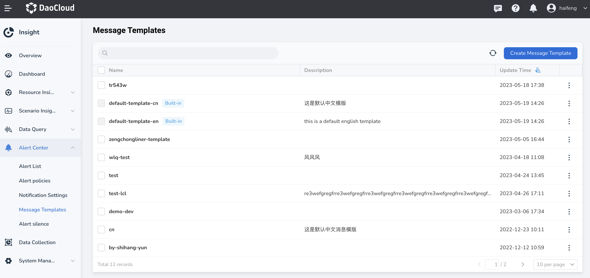
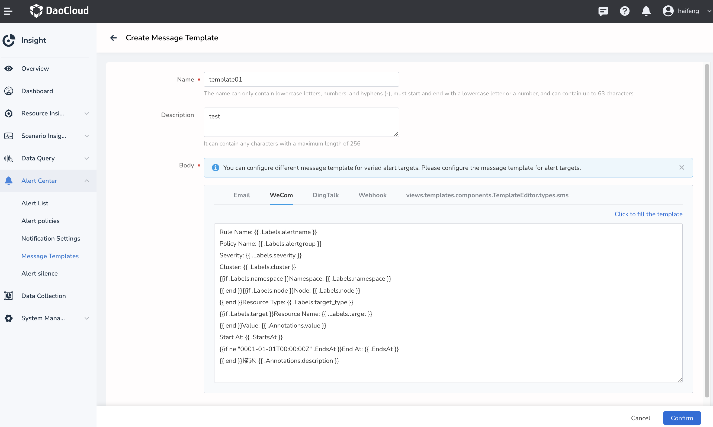

# message template

The message template function supports customizing the content of the message template, and can notify the specified object in the form of email, WeChat, DingTalk, and Webhook.

## Create a message template

1. In the left navigation bar, select `Alarm Center` -> `Message Template`, and click the `New Message Template` button.

    

2. Fill in the template content.

    

## Edit or delete message templates

Click `...` on the right side of the list, and select `Edit` or `Delete` in the pop-up menu to modify or delete the message template.

!!! warning

    Note that templates cannot be recovered after deletion, so please proceed with caution.