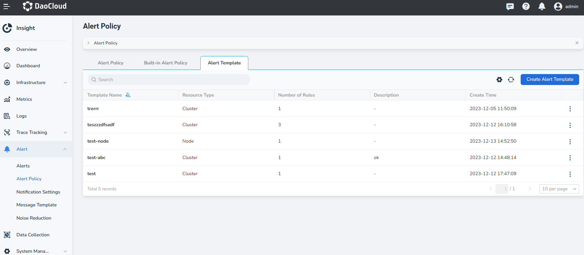
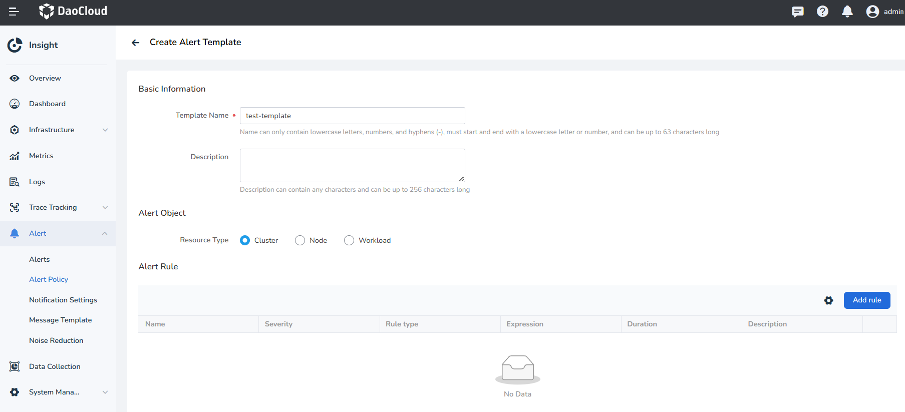
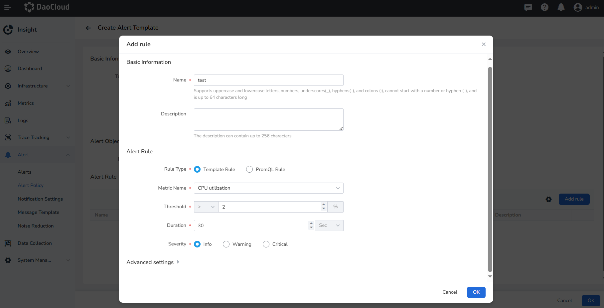
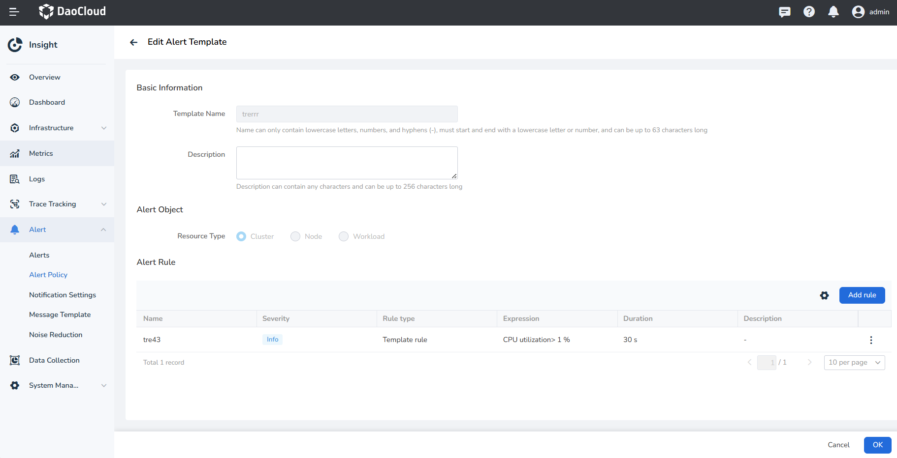
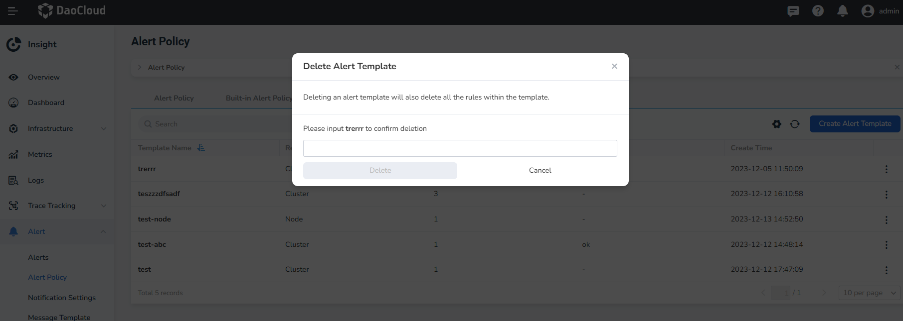

# Alert Template

The Alert template allows platform administrators to create Alert templates and rules, and
business units can directly use Alert templates to create Alert policies. This feature can
reduce the management of Alert rules by business personnel and allow for modification of
Alert thresholds based on actual environment conditions.

## Create Alert Template

1. In the navigation bar, select **Alert** -> **Alert Policy**, and click **Alert Template** at the top.

    { width=1000px}

2. Click **Create Alert Template**, and set the name, description, and other information for the Alert template.

    { width=1000px}

    { width=1000px}

    | Parameter | Description |
    | ---- | ---- |
    | Template Name | The name can only contain lowercase letters, numbers, and hyphens (-), must start and end with a lowercase letter or number, and can be up to 63 characters long. |
    | Description | The description can contain any characters and can be up to 256 characters long. |
    | Resource Type | Used to specify the matching type of the Alert template. |
    | Alert Rule | Supports pre-defined multiple Alert rules, including template rules and PromQL rules. |

3. Click **OK** to complete the creation and return to the Alert template list. Click the template name 
   to view the template details.

## Edit Alert Template

Click **⋮** next to the target rule, then click **Edit** to enter the editing page for the suppression rule.

    { width=1000px}

## Delete Alert Template

Click **⋮** next to the target template, then click **Delete**. Enter the name of the Alert template 
in the input box to confirm deletion.

    { width=1000px}
