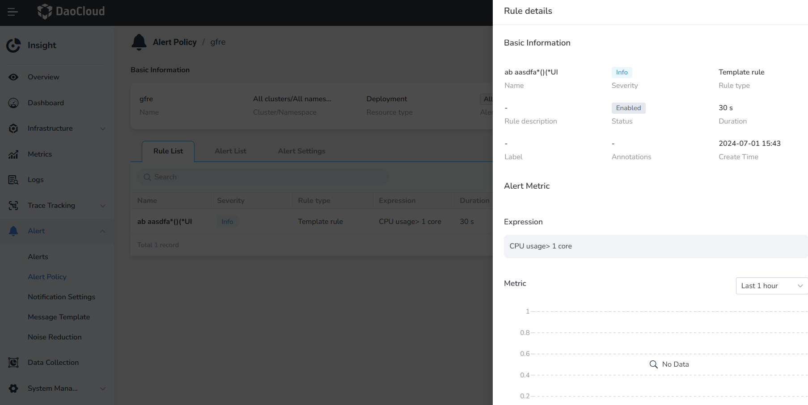
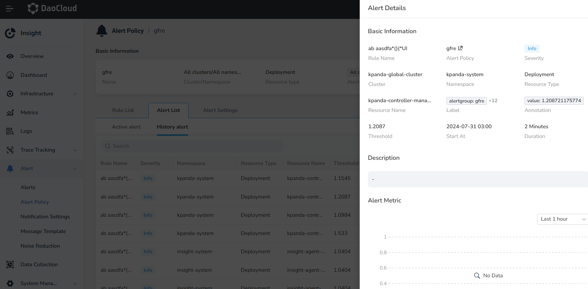

# Alert Inhibition

Alert Inhibition is mainly a mechanism for temporarily hiding or reducing the priority of alerts that do not need 
immediate attention. The purpose of this feature is to reduce unnecessary alert information that may disturb 
operations personnel, allowing them to focus on more critical issues.

Alert inhibition recognizes and ignores certain alerts by defining a set of rules to deal with specific conditions. 
There are mainly the following conditions:

- Parent-child inhibition: when a parent alert (for example, a crash on a node) is triggered, all child alerts aroused by 
  it (for example, a crash on a container running on that node) are inhibited.
- Similar alert inhibition: When alerts have the same characteristics (for example, the same problem on the same instance), 
  multiple alerts are inhibited.

## Create Inhibition

1. In the left navigation bar, select **Alert** -> **Noise Reduction**, and click **Inhibition** at the top.

    { width=1000px}

2. Click **Create Inhibition**, and set the name and rules for the inhibition.

    !!! note

        The problem of avoiding multiple similar or related alerts that may be triggered by the same issue is achieved 
        by defining a set of rules to identify and ignore certain alerts through [Rule Details](#view-rule-details) 
        and [Alert Details](#view-alert-details).

    { width=1000px}

    | Parameter | Description |
    | ---- | ---- |
    | Name | The name can only contain lowercase letters, numbers, and hyphens (-), must start and end with a lowercase letter or number, and can be up to 63 characters long. |
    | Description | The description can contain any characters and can be up to 256 characters long. |
    | Cluster | The cluster where the inhibition rule applies. |
    | Namespace | The namespace where the inhibition rule applies. |
    | Source Alert | Matching alerts by label conditions. It compares alerts that meet all label conditions with those that meet inhibition conditions, and alerts that do not meet inhibition conditions will be sent to the user as usual.   Value range explanation:  - **Alert Level**: The level of metric or event alerts, can be set as: Critical, Major, Minor.  - **Resource Type**: The resource type specific for the alert object, can be set as: Cluster, Node, StatefulSet, Deployment, DaemonSet, Pod.   - **Labels**: Alert identification attributes, consisting of label name and label value, supports user-defined values. |
    | Inhibition | Specifies the matching conditions for the target alert (the alert to be inhibited). Alerts that meet all the conditions will no longer be sent to the user. |
    | Equal | Specifies the list of labels to compare to determine if the source alert and target alert match. Inhibition is triggered only when the values of the labels specified in `equal` are exactly the same in the source and target alerts. The `equal` field is optional. If the `equal` field is omitted, all labels are used for matching. |

3. Click **OK** to complete the creation and return to Inhibition list. Click the inhibition rule name to view the rule details.

### View Rule Details

In the left navigation bar, select **Alert** -> **Alert Policy**, and click the policy name to view the rule details.

  

    !!! note

        You can add cuntom tags when adding rules.

### View Alert Details

In the left navigation bar, select **Alert** -> **Alerts**, and click the policy name to view details.

  

    !!! note

        Alert details show information and settings for creating inhibitions.

## Edit Inhibition Rule

Click **┇** next to the target rule, then click **Edit** to enter the editing page for the inhibition rule.

{ width=1000px}

## Delete Inhibition Rule

Click **┇** next to the target rule, then click **Delete**. Enter the name of the inhibition rule in the input box 
to confirm deletion.

{ width=1000px}
