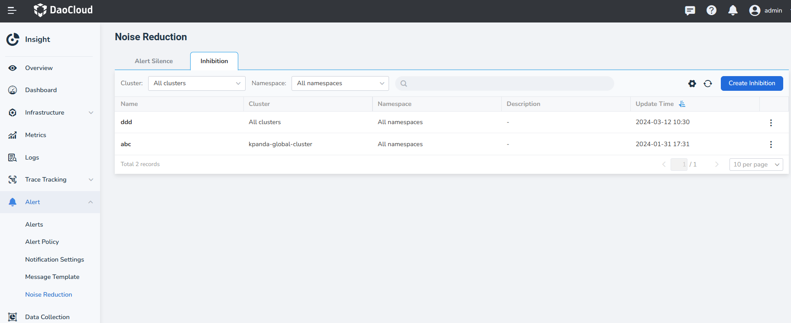
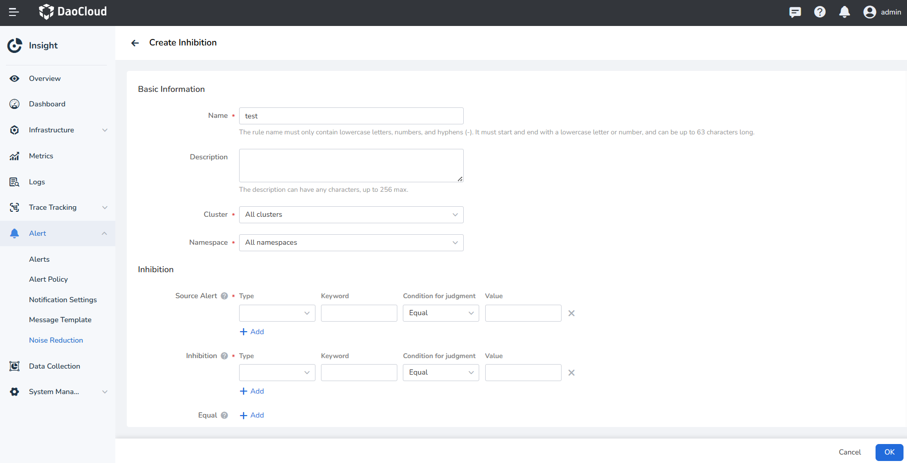
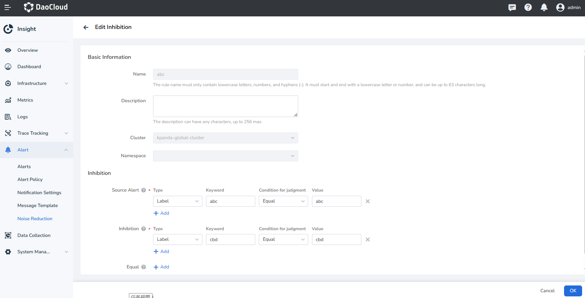
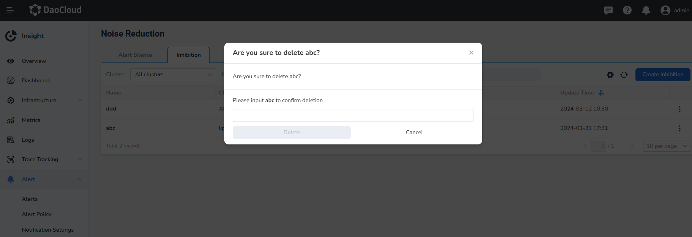

# Alert Inhibition

Alert Inhibition is mainly a mechanism for temporarily hiding or reducing the priority of Alerts that do not need 
immediate attention. The purpose of this feature is to reduce unnecessary Alert information that may disturb 
operations personnel, allowing them to focus on more critical issues.

## Create Inhibition

1. In the left navigation bar, select **Alert** -> **Noise Reduction**, and click **Inhibition** at the top.

    { width=1000px}

2. Click **Create Inhibition**, and set the name and rules for the inhibition.

    { width=1000px}

    | Parameter | Description |
    | ---- | ---- |
    | Name | The name can only contain lowercase letters, numbers, and hyphens (-), must start and end with a lowercase letter or number, and can be up to 63 characters long. |
    | Description | The description can contain any characters and can be up to 256 characters long. |
    | Cluster | The cluster where the inhibition rule applies. |
    | Namespace | The namespace where the inhibition rule applies. |
    | Source Alert | Specifies the matching conditions for the source Alert (the Alert that triggers the inhibition). Value range explanation:  - Alert Level: The level of metric or event Alerts, can be set as: Critical, Major, Minor.  - Resource Type: The resource type corresponding to the Alert object, can be set as: Cluster, Node, StatefulSet, Deployment, DaemonSet, Pod.   - Labels: Alert identification attributes, consisting of label name and label value, supports user-defined values. |
    | Inhibition | Specifies the matching conditions for the target Alert (the Alert to be suppressed). |
    | Equal | Specifies the list of labels to compare to determine if the source Alert and target Alert match. Inhibition is triggered only when the values of the labels specified in `equal` are exactly the same in the source and target Alerts. The `equal` field is optional. If the `equal` field is omitted, all labels are used for matching. |

3. Click **OK** to complete the creation and return to Inhibition list. Click the inhibition rule name to view the rule details.

## Edit Inhibition Rule

Click **⋮** next to the target rule, then click **Edit** to enter the editing page for the inhibition rule.

    { width=1000px}

## Delete Inhibition Rule

Click **⋮** next to the target rule, then click **Delete**. Enter the name of the inhibition rule in the input box 
to confirm deletion.

    { width=1000px}
