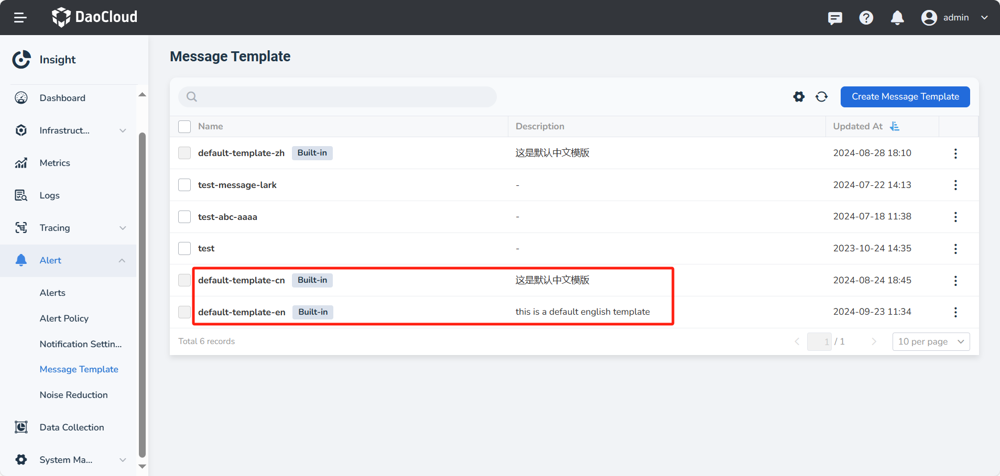
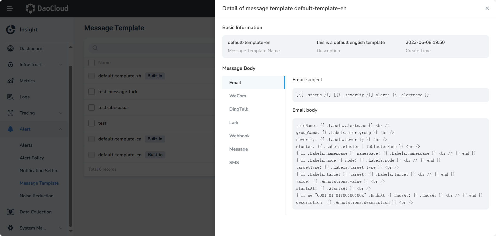

# Message Templates

The message template feature supports customizing the content of message templates and can notify specified objects in the form of email, WeCom, DingTalk, Webhook, and SMS.

## Creating a Message Template

1. In the left navigation bar, select __Alert__ -> __Message Template__ .

    Insight comes with two default built-in templates in both Chinese and English for user convenience.

    

2. Fill in the template content.

    

!!! info

    Observability comes with predefined message templates. If you need to define the content of the templates, refer to [Configure Notification Templates](../../reference/notify-helper.md).

## Message Template Details

Click the name of a message template to view the details of the message template in the right slider.

| Parameters | Variable | Description |
|------------|----------|-------------|
| ruleName | {{ .Labels.alertname }} | The name of the rule that triggered the alert |
| groupName | {{ .Labels.alertgroup }} | The name of the alert policy to which the alert rule belongs |
| severity | {{ .Labels.severity }} | The level of the alert that was triggered |
| cluster | {{ .Labels.cluster }} | The cluster where the resource that triggered the alert is located |
| namespace | {{ .Labels.namespace }} | The namespace where the resource that triggered the alert is located |
| node | {{ .Labels.node }} | The node where the resource that triggered the alert is located |
| targetType | {{ .Labels.target_type }} | The resource type of the alert target |
| target | {{ .Labels.target }} | The name of the object that triggered the alert |
|  value | {{ .Annotations.value }} | The metric value at the time the alert notification was triggered |
| startsAt | {{ .StartsAt }} | The time when the alert started to occur |
| endsAt | {{ .EndsAt }} | The time when the alert ended |
| description | {{ .Annotations.description }} | A detailed description of the alert |
| labels | {{ for .labels }} {{ end }} | All labels of the alert use the `for` function to iterate through the labels list to get all label contents. |

## Editing or Deleting a Message Template

Click __┇__ on the right side of the list and select __Edit__ or __Delete__ from the pop-up menu to modify or delete the message template.

!!! warning

    Once a template is deleted, it cannot be recovered, so please use caution when deleting templates.
