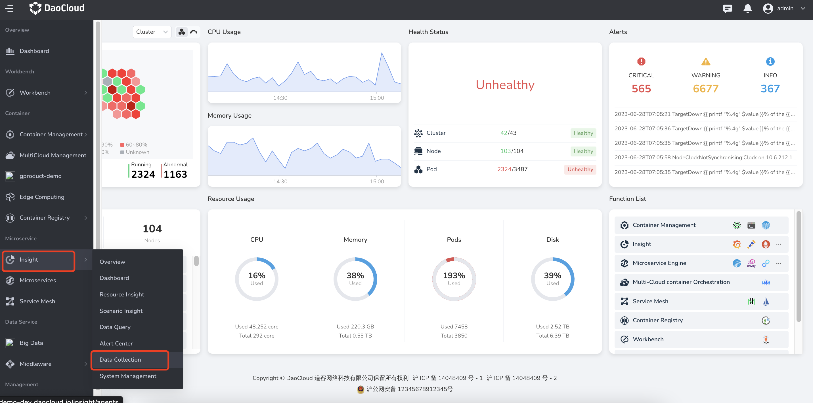
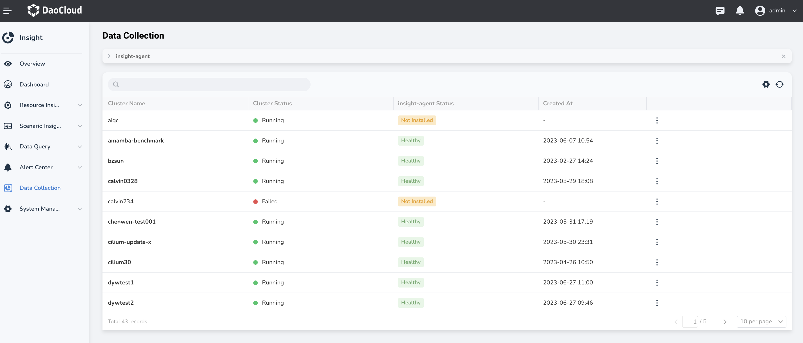

---
hide:
  - toc
---

# Data Collection

`Data Collection` is mainly to centrally manage and display the entrance of the
cluster installation collection plug-in `insight-agent`, which helps users quickly
view the health status of the cluster collection plug-in, and provides a quick entry
to configure collection rules.

The specific operation steps are as follows:

1. Click in the upper left corner and select `Insight` -> `Data Collection`.

    

2. You can view the status of all cluster collection plug-ins.

    

3. When the cluster is connected to `insight-agent` and is running, click a cluster name
   to enter the details。

    

4. In the `Service Monitor` tab, click the shortcut link to jump to `Container Management` -> `CRD`
   to add service discovery rules.

    
