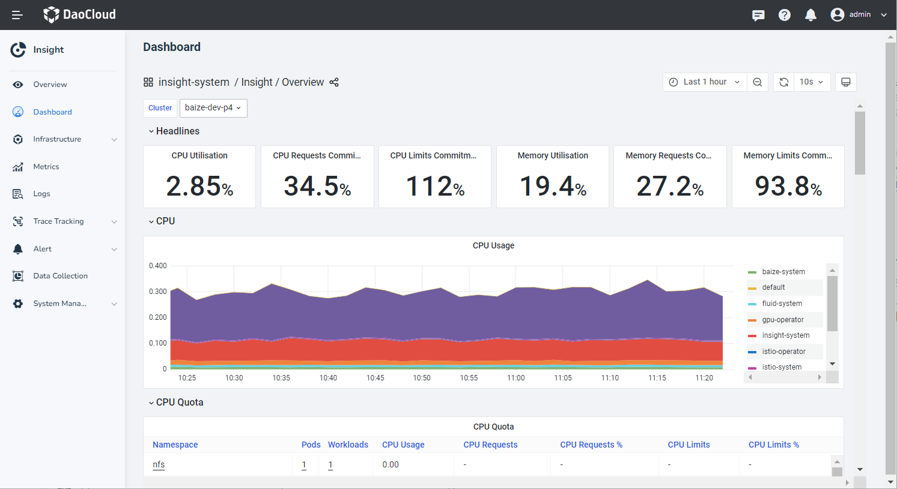
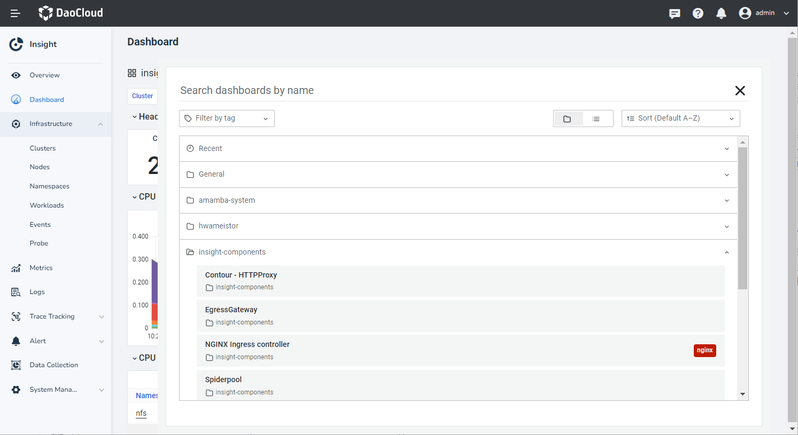

---
hide:
   - toc
---

# Dashboard

Grafana is a cross-platform open source visual analysis tool. Insight uses open source Grafana
to provide monitoring services, and supports viewing resource consumption from multiple dimensions
such as clusters, nodes, and namespaces.

For more information on open source Grafana, see
[Grafana Official Documentation](https://grafana.com/docs/grafana/latest/getting-started/?spm=a2c4g.11186623.0.0.1f34de53ksAH9a).

## Steps

1. Select __Dashboard__ from the left navigation bar .

    - In the __Insight / Overview__ dashboard, you can view the resource usage of multiple clusters and analyze resource usage, network, storage, and more based on dimensions such as namespaces and Pods.

    - Click the dropdown menu in the upper-left corner of the dashboard to switch between clusters.

    - Click the lower-right corner of the dashboard to switch the time range for queries.

    

2. Insight provides several recommended dashboards that allow monitoring from different dimensions
   such as nodes, namespaces, and workloads. Switch between dashboards by clicking the
   __insight-system / Insight / Overview__ section.

    

!!! note

    1. To import a custom dashboard, refer to [Import Custom Dashboard](./import-dashboard.md).
    2. If you need to create a custom dashboard through the Grafana UI, you must
       first configure [Grafana Persistent Storage](../../best-practice/grafana-use-db.md).

## Others

### Accessing the Grafana UI

1. The system-generated Grafana login password is automatically created by the Grafana Operator. You can find the login password by decrypting the `grafana-admin-credentials` secret in the `insight-system` namespace.
2. Access the Grafana UI through your browser at `http://ip:port/ui/insight-grafana/login` and log in using the username `admin` and the decrypted secret as the password.

### Customizing Grafana Admin Password

#### Option 1: Manual Configuration

Set the `spec.config.security.admin_password` field in the Grafana CR `grafana` to the desired password.

```diff
apiVersion: grafana.integreatly.org/v1beta1
kind: Grafana
spec:
  config:
    security:
      admin_user: admin
+     admin_password: admin
      allow_embedding: true
      disable_gravatar: false
```

#### Option 2: Auto-Generate Password

Remove the `security.admin_password` field from the Grafana CR `grafana`. The `GrafanaOperator` will automatically generate a new admin password for the Grafana instance.

```diff
apiVersion: grafana.integreatly.org/v1beta1
kind: Grafana
spec:
  config:
    security:
      admin_user: admin
-     admin_password: admin
      allow_embedding: true
      disable_gravatar: false
```

#### Option 3: Configure via Secret

Delete the `spec.config.security.admin_password` field from the CR. Then, set the `GF_SECURITY_ADMIN_PASSWORD` field in the `grafana-admin-credentials` secret under the `insight-system` namespace to the new password.
