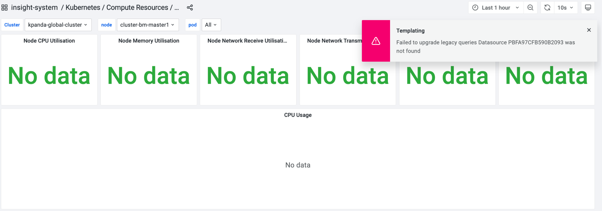

# Import Custom Dashboards

By using Grafana CRD, you can incorporate the management and deployment of dashboards into the lifecycle management of Kubernetes.
This enables version control, automated deployment, and cluster-level management of dashboards.
This page describes how to import custom dashboards using CRD and ConfigMaps.

Insight v0.40.0 now supports importing dashboards using the latest GrafanaDashboard (v1beta1) CRD from the Grafana community.

## Using v1beta1 CRD

1. Log in to the DCE 5.0 platform and go to __Container Management__ . Select the __kpanda-global-cluster__ from the cluster list.

2. Choose __Custom Resources__ from the left navigation bar. Look for the __grafana.integreatly.org__ 
   file in the list and click it to view the details.

3. Click __YAML Create__ and use the following template. Replace the dashboard JSON in the __Json__ field.

    - __metadata.name__ ：Provide a name for the dashboard.
    - __metadata.namespace__ ：Specify the target namespace.
    - __metadata.labels__ ：Mandatory， __operator.insight.io/managed-by: insight__ .
    - __spec.allowCrossNamespaceImport__ ：Mandatory, __true__ .
    - __spec.instanceSelector.matchLabels__ ：Mandatory，__operator.insight.io/managed-by: insight__ .

    ```yaml
    apiVersion: grafana.integreatly.org/v1beta1
    kind: GrafanaDashboard
    metadata:
      labels:
        operator.insight.io/managed-by: insight
      name: sample-dashboard
      namespace: insight-system
    spec:
      allowCrossNamespaceImport: true
      instanceSelector:
        matchLabels:
          operator.insight.io/managed-by: insight
      json: >
        {
          "id": null,
          "title": "Simple Dashboard",
          "tags": [],
          "style": "dark",
          "timezone": "browser",
          "editable": true,
          "hideControls": false,
          "graphTooltip": 1,
          "panels": [],
          "time": {
            "from": "now-6h",
            "to": "now"
          },
          "timepicker": {
            "time_options": [],
            "refresh_intervals": []
          },
          "templating": {
            "list": []
          },
          "annotations": {
            "list": []
          },
          "refresh": "5s",
          "schemaVersion": 17,
          "version": 0,
          "links": []
        }
    ```

4. After clicking __OK__ , wait for a while to view the newly imported dashboard in __Dashboard__ .

## Using v1alpha1 CRD

Currently, users can still import dashboards using the old version of CRD：

- __namespace__ : Specify the target namespace.
- __name__ : Provide a name for the dashboard.
- __label__ : Mandatory. Set the label as __operator.insight.io/managed-by: insight__ .

 ```yaml
 apiVersion: integreatly.org/v1alpha1
 kind: GrafanaDashboard
 metadata:
   labels:
     app: insight-grafana-operator
     operator.insight.io/managed-by: insight
   name: sample-dashboard
   namespace: insight-system
 spec:
   json: >
     {
       "id": null,
       "title": "Simple Dashboard",
       "tags": [],
       "style": "dark",
       "timezone": "browser",
       "editable": true,
       "hideControls": false,
       "graphTooltip": 1,
       "panels": [],
       "time": {
         "from": "now-6h",
         "to": "now"
       },
       "timepicker": {
         "time_options": [],
         "refresh_intervals": []
       },
       "templating": {
         "list": []
       },
       "annotations": {
         "list": []
       },
       "refresh": "5s",
       "schemaVersion": 17,
       "version": 0,
       "links": []
     }
 ```

The Grafana Deployment in Insight v0.40.x will include a [dashboard-discover](https://github.com/openinsight-proj/dashboard-discover) sidecar,
which is used to load GrafanaDashboard(v1alpha1) resources and ConfigMaps into the directory specified by the Grafana dashboard provider (/var/lib/grafana/plugins/dashboards).

The architecture diagram of dashboard-discover is as follows:


The watched resources require the labels below:

1. GrafanaDashboard(v1alpha1)

    The dashboard-discover sidecar will watch for GrafanaDashboard(v1alpha1) resources across all namespaces in the cluster that
    have the label: `operator.insight.io/managed-by=insight`, and write their JSON content into the `/var/lib/grafana/plugins/dashboards`
    directory of the Grafana container.

2. ConfigMap

    The dashboard-discover sidecar will watch for ConfigMaps across all namespaces in the cluster that have the labels:
    `operator.insight.io/managed-by=insight,operator.insight.io/dashboard=true`, and write all content under their data field
    into the `/var/lib/grafana/plugins/dashboards` directory of the Grafana container.

    ```yaml
    apiVersion: v1
    kind: ConfigMap
    metadata:
      labels:
        operator.insight.io/managed-by: 'insight'
        operator.insight.io/dashboard: 'true'
        operator.insight.io/dashboard-folder: 'you-folder'
      name: sample-dashboard
      namespace: default
    data:
      sample-dashboard.json: >
        {
          "id": null,
          "title": "Simple Dashboard",
          "tags": [],
          "style": "dark",
          "timezone": "browser",
          "editable": true,
          "hideControls": false,
          "graphTooltip": 1,
          "panels": [],
          "time": {
            "from": "now-6h",
            "to": "now"
          },
          "timepicker": {
            "time_options": [],
            "refresh_intervals": []
          },
          "templating": {
            "list": []
          },
          "annotations": {
            "list": []
          },
          "refresh": "5s",
          "schemaVersion": 17,
          "version": 0,
          "links": []
        }
    ```

> If you need to store JSON files in a specific folder, you can add the following label to the corresponding resource:
> `operator.insight.io/dashboard-folder=your-folder`

!!! info

    If you need to customize the dashboard, refer to
    [Add Dashboard Panel](https://grafana.com/docs/grafana/latest/dashboards/add-organize-panels/).


## Notice

In version v0.40.0, Grafana has been upgraded from 9.3.14 to 12.1.3. Grafana 12.1.3 has completely removed support for
AngularJS and prioritized React instead. For details, refer to the [community announcement](https://grafana.com/blog/2025/04/03/angularjs-support-will-be-removed-in-grafana-12-what-you-need-to-know).

Dashboards maintained by Insight and other gproduct have been automatically migrated and are ready to use out of the box.
For customer-maintained dashboards, Grafana 12.1.3 provides automatic migration support for some core pre-installed AngularJS panels.
When a customer opens a custom dashboard in Grafana 12.1.3 for the first time, Grafana will automatically trigger the migration.
**After migration is complete, be sure to click the 「Save」 button on the dashboard to save changes, preventing repeated migrations on each load.**

If AngularJS panel migration is not completed, the following issues will occur in Grafana 12.1.3 and later versions:

1. Plugins dependent on AngularJS will fail to load and will not display as installed in the plugin directory.
2. Configured AngularJS data sources will not appear in the data source list.
3. Original AngularJS panels in the dashboard will show error messages such as `Error loading: plugin_name` or `Panel plugin not found: plugin_name`; see the figure below:

    

    Similar panels or plugins can be manually replaced.

4. Original data sources in the dashboard will be lost, with errors such as `Datasource XXX was not found`; see the figure below:

    

    You can manually create a `Datasource variable`:

    

    Then apply it in the panel:

    