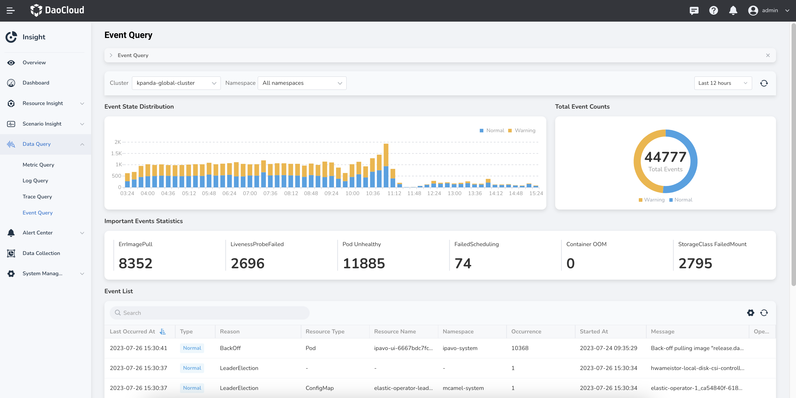
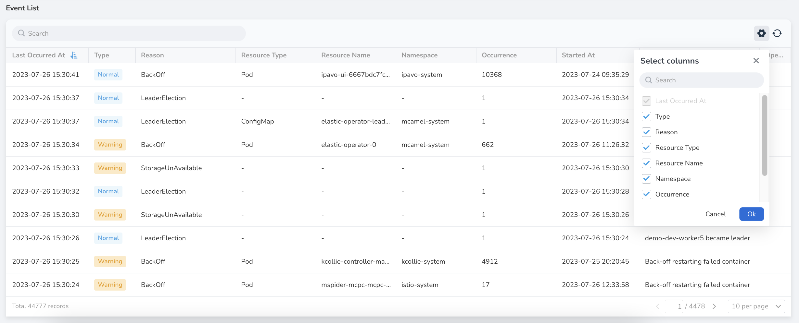

# Event Query

DCE 5.0 Insight supports event querying by cluster and namespace.

## Event Status Distribution

By default, the events that occurred within the last 12 hours are displayed.
You can select a different time range in the upper right corner to view longer or shorter periods.
You can also customize the sampling interval from 1 minute to 5 hours.

The event status distribution chart provides a visual representation of the intensity and dispersion of events.
This helps in evaluating and preparing for subsequent cluster operations and maintenance tasks.
If events are densely concentrated during specific time periods, you may need to allocate more resources or take corresponding measures to ensure cluster stability and high availability.
On the other hand, if events are dispersed, you can effectively schedule other maintenance tasks such as system optimization, upgrades, or handling other tasks during this period.

By considering the event status distribution chart and the selected time range, you can better plan and manage your cluster operations and maintenance work, ensuring system stability and reliability.

## Event Count and Statistics

Through important event statistics, you can easily understand the number of image pull failures, health check failures, container group (Pod) execution failures, Pod scheduling failures, container OOM (Out-of-Memory) occurrences, volume mounting failures, and the total count of all events. These events are typically categorized as "Warning" and "Normal".

## Event List

The event list is presented chronologically based on time. You can sort the events by `Last Occurrend At` and `Type`.

By clicking on the ⚙️ icon on the right side, you can customize the displayed columns according to your preferences and needs.

Additionally, you can click the refresh icon to update the current event list when needed.

For detailed meanings of the built-in Events in the system, refer to the
[Kubernetes API Event List](https://kubernetes.io/docs/reference/kubernetes-api/cluster-resources/event-v1/).
