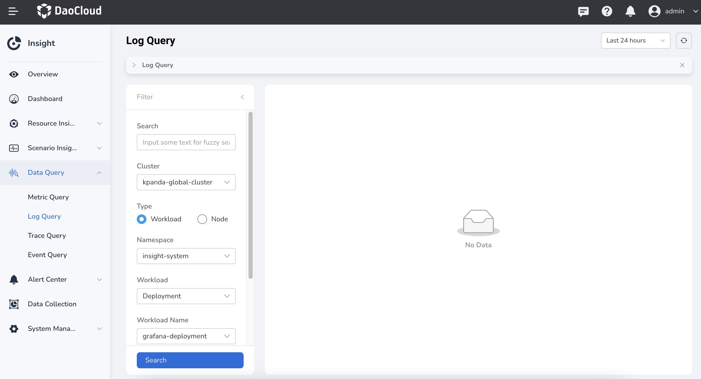
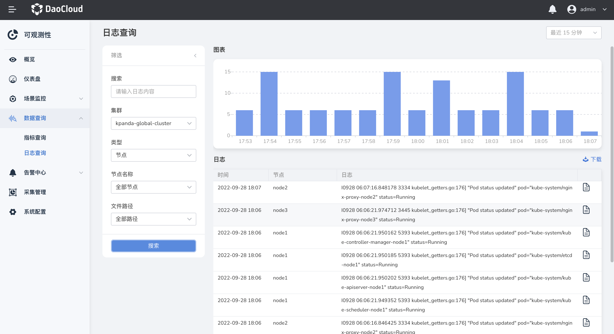
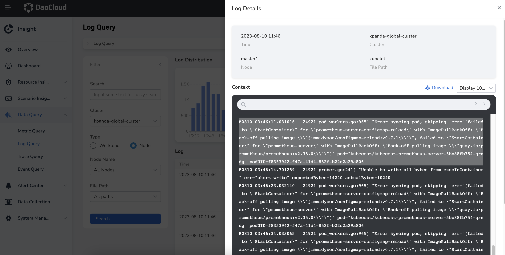
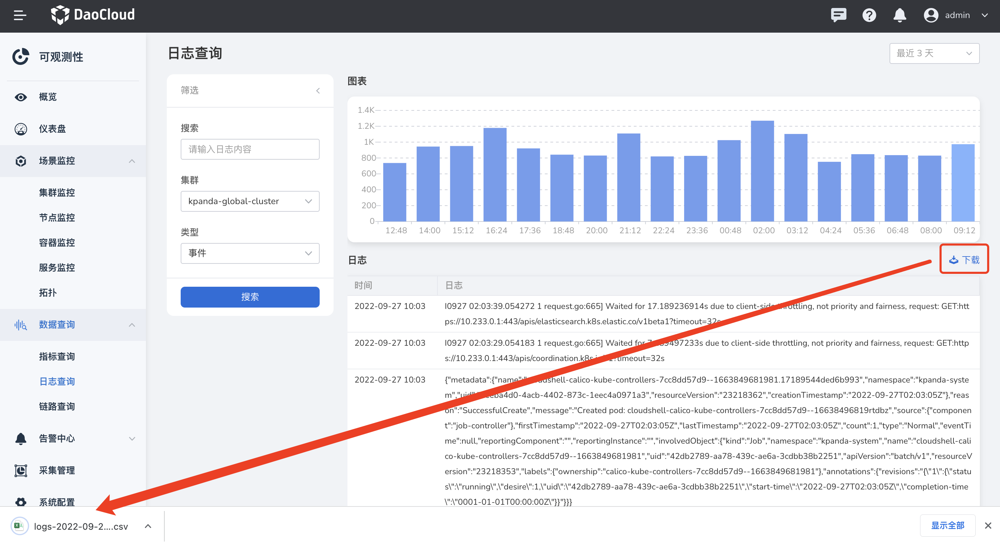

# Log query

By default, Insight collects node logs, container logs, and Kubernetes audit logs.
In the log query page, you can search for standard output (stdout) logs within the permissions
of your login account. This includes node logs, product logs, Kubernetes audit logs, etc.
You can quickly find the desired logs among a large volume of logs. Additionally, you can
use the source information and contextual raw data of the logs to assist in troubleshooting and issue resolution.

## Prerequisites

The cluster has [insight-agent installed](../../quickstart/install/install-agent.md)
and the application is in `running` state.

## Query log

1. In the left navigation bar, select `Data Query` -> `Log Query`.

    

2. After selecting the query criteria, click `Search`, and the log records in the form of graphs will be displayed. The most recent logs are displayed on top.

    

3. In the `Filter` panel, switch `Type` and select `Node` to check the logs of all nodes in the cluster.

    

4. In the `Filter` panel, switch `Type` and select `Event` to view the logs generated by all Kubernetes events in the cluster.

**Lucene Syntax Explanation:**

1. Use logical operators (AND, OR, NOT, "") to query multiple keywords. For example: keyword1 AND (keyword2 OR keyword3) NOT keyword4.
2. Use a tilde (~) for fuzzy queries. You can optionally specify a parameter after the "~" to control the similarity of the fuzzy query. If not specified, it defaults to 0.5. For example: error~.
3. Use wildcards (*, ?) as single-character placeholders to match any character.
4. Use square brackets [ ] or curly braces { } for range queries. Square brackets [ ] represent a closed interval and include the boundary values. Curly braces { } represent an open interval and exclude the boundary values. Range queries are applicable only to fields that can be sorted, such as numeric fields, date fields, etc. For example: timestamp:[2022-01-01 TO 2022-01-31].
5. For more information, please refer to the [Lucene Syntax Explanation](../../faq/lucene.md).

## View log context

Clicking on the button next to a log will slide out a panel on the right side where you can view the
default 100 lines of context for that log. You can switch the `Display Rows` option to view more contextual content.

## Export log

Click on the download button located in the upper right corner of the list.

- You can configure the exported log fields. The available fields may vary depending on the log type,
  with the `Log Content` field being mandatory.
- You can export the log query results in **.txt** or **.csv** format.

