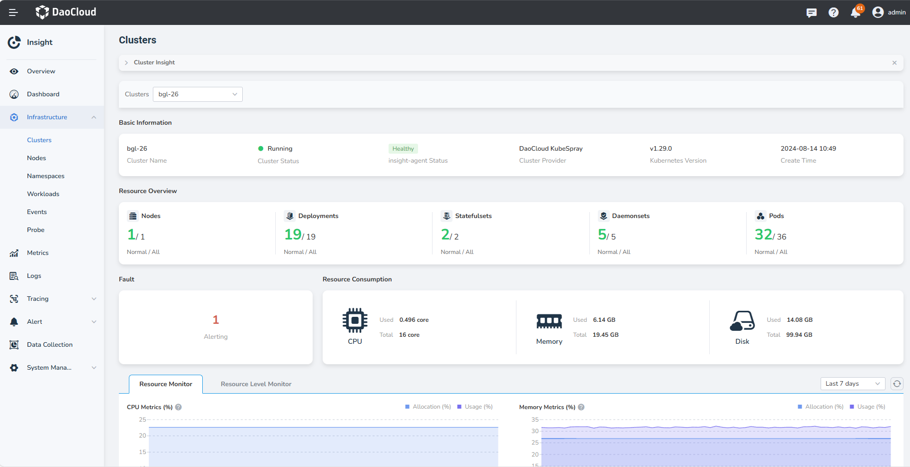

# Cluster Monitoring

Through cluster monitoring, you can view the basic information of the cluster, the resource consumption  
and the trend of resource consumption over a period of time.

## Prerequisites

The cluster has [insight-agent installed](../../quickstart/install/install-agent.md) and the application 
is in __running__ state.

## Steps

1. Go to the __Insight__ product module.

2. Select __Infrastructure__ > __Clusters__ from the left navigation bar. On this page, you can view 
   the following information:

    - **Resource Overview**: Provides statistics on the number of normal/all nodes and workloads across multiple clusters.
    - **Fault**: Displays the number of alerts generated in the current cluster.
    - **Resource Consumption**: Shows the actual usage and total capacity of CPU, memory, and disk for the selected cluster.
    - **Metric Explanations**: Describes the trends in CPU, memory, disk I/O, and network bandwidth.

    { width="1000"}

3. Click __Resource Level Monitor__, you can view more metrics of the current cluster.

### Metric Explanations

| Metric Name | Description |
| -- | -- |
| CPU Usage | The ratio of the actual CPU usage of all pod resources in the cluster to the total CPU capacity of all nodes.|
| CPU Allocation | The ratio of the sum of CPU requests of all pods in the cluster to the total CPU capacity of all nodes.|
| Memory Usage | The ratio of the actual memory usage of all pod resources in the cluster to the total memory capacity of all nodes.|
| Memory Allocation | The ratio of the sum of memory requests of all pods in the cluster to the total memory capacity of all nodes.|
