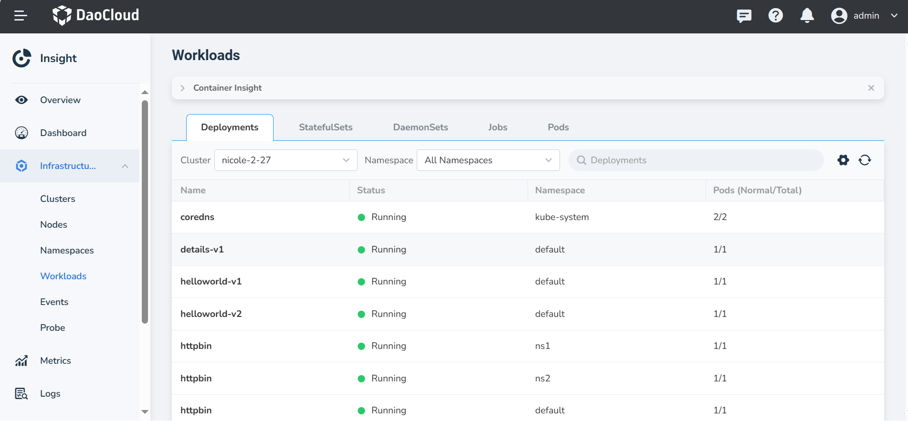
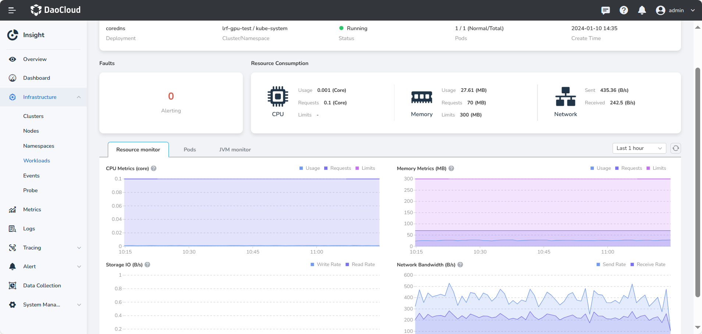
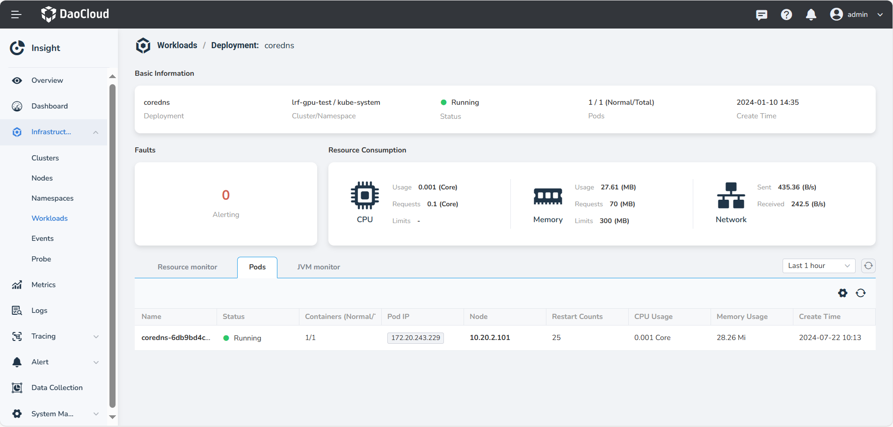

# Container Insight

Container insight is the process of monitoring workloads in cluster management. In the list,
you can view basic information and status of workloads. On the Workloads details page, you can
see the number of active alerts and the trend of resource consumption such as CPU and memory.

## Prerequisites

- The cluster has insight-agent installed, and all pods are in the __Running__ state.

- To install insight-agent, please refer to: [Installing insight-agent online](../../quickstart/install/install-agent.md) or [Offline upgrade of insight-agent](../../quickstart/install/offline-install.md).

## Steps

Follow these steps to view service monitoring metrics:

1. Go to the __Insight__ product module.

2. Select __Infrastructure__ > __Workloads__ from the left navigation bar.

3. Switch between tabs at the top to view data for different types of workloads.

    { width="1000"}

4. Click the target workload name to view the details.

    1. Faults: Displays the total number of active alerts for the workload.
    2. Resource Consumption: Shows the CPU, memory, and network usage of the workload.
    3. Monitoring Metrics: Provides the trends of CPU, Memory, Network, and disk usage for the workload over the past hour.

    { width="1000"}

5. Switch to the __Pods__ tab to view the status of various pods for the workload, including their nodes, restart counts, and other information.

    { width="1000"}

6. Switch to the __JVM monitor__ tab to view the JVM metrics for each pods

    <!-- add images later -->

    !!! note

        1. The JVM monitoring feature only supports the Java language.
        2. To enable the JVM monitoring feature, refer to [Getting Started with Monitoring Java Applications](../../quickstart/otel/java/index.md).

### Metric Explanations

| **Metric Name** | **Description** |
| -- | -- |
| CPU Usage | The sum of CPU usage for all pods under the workload.|
| CPU Requests | The sum of CPU requests for all pods under the workload.|
| CPU Limits | The sum of CPU limits for all pods under the workload.|
| Memory Usage | The sum of memory usage for all pods under the workload.|
| Memory Requests | The sum of memory requests for all pods under the workload.|
| Memory Limits | The sum of memory limits for all pods under the workload.|
| Disk Read/Write Rate | The total number of continuous disk reads and writes per second within the specified time range, representing a performance measure of the number of read and write operations per second on the disk.|
| Network Send/Receive Rate | The incoming and outgoing rates of network traffic, aggregated by workload, within the specified time range.|
