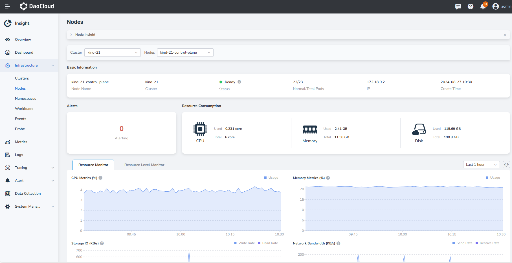

# Node Monitoring

Through node monitoring, you can get an overview of the current health status of the nodes in the selected cluster 
and the number of abnormal pod; on the current node details page, you can view the number of alerts and 
the trend of resource consumption such as CPU, memory, and disk.

## Prerequisites

- The cluster has [insight-agent installed](../../quickstart/install/install-agent.md) and the application is in __running__ state.

## Steps

1. Go to the __Insight__ product module.

2. Select __Infrastructure__ -> __Nodes__ from the left navigation bar. On this page, you can view the following information:

    - **Cluster**: Uses the dropdown at the top to switch between clusters.
    - **Nodes**: Shows a list of nodes within the selected cluster. Click a specific node to view detailed information.
    - **Alert**: Displays the number of alerts generated in the current cluster.
    - **Resource Consumption**: Shows the actual usage and total capacity of CPU, memory, and disk for the selected node.
    - **Metric Explanations**: Describes the trends in CPU, memory, disk I/O, and network traffic for the selected node.

    { width="1000"}

3. Click __Resource Level Monitor__, you can view more metrics of the current cluster.
