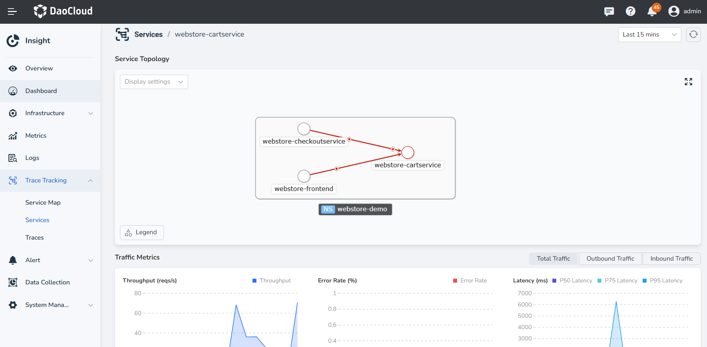

# Service Insight

In __Insight__ , a service refers to a group of workloads that provide the same behavior for incoming requests. Service insight helps observe the performance and status of applications during the operation process by using the OpenTelemetry SDK.

For how to use OpenTelemetry, please refer to: [Using OTel to give your application insight](https://docs.daocloud.io/en/insight/user-guide/quickstart/otel/otel/).

## Glossary

- **Service**: A service represents a group of workloads that provide the same behavior for incoming requests. You can define the service name when using the OpenTelemetry SDK or use the name defined in Istio.
- **Operation**: An operation refers to a specific request or action handled by a service. Each span has an operation name.
- **Outbound Traffic**: Outbound traffic refers to all the traffic generated by the current service when making requests.
- **Inbound Traffic**: Inbound traffic refers to all the traffic initiated by the upstream service targeting the current service.

## Steps

The Services List page displays key metrics such as throughput rate, error rate, and request latency for all services that have been instrumented with distributed tracing. You can filter services based on clusters or namespaces and sort the list by throughput rate, error rate, or request latency. By default, the data displayed in the list is for the last hour, but you can customize the time range.

Follow these steps to view service insight metrics:

1. Go to the __Insight__ product module.

2. Select __Trace Tracking__ > __Services__ from the left navigation pane.

    { width="1000"}

!!! attention

    1. If the namespace of a service in the list is ___unknown__ , it means that the service has not been properly instrumented. We recommend reconfiguring the instrumentation.
    2. If multiple services have the same name and none of them have the correct __Namespace__ environment variable configured, the metrics displayed in the list and service details page will be aggregated for all those services.

3. Click a service name (e.g., __opentelemetry-demo__ ) to view the detailed metrics and operation metrics for that service.

   1. In the Traffic Metrics section, you can view the monitoring metrics for all requests to the service within the past hour (including inbound and outbound traffic).
   2. You can use the time selector in the upper right corner to quickly select a time range or specify a custom time range.
   3. Sorting is available for throughput, error rate, and request latency in the operation metrics.
   4. Clicking on the icon next to an individual operation will take you to the __Traces__ page to quickly search for related traces.

    {: width="1000px"}

### Service Metric Explanations

| Metric | Description |
| ------ | ----------- |
| Throughput Rate | The number of requests processed within a unit of time. |
| Error Rate | The ratio of erroneous requests to the total number of requests within the specified time range. |
| Request Latency | The average response time of service requests within a unit of time. |
