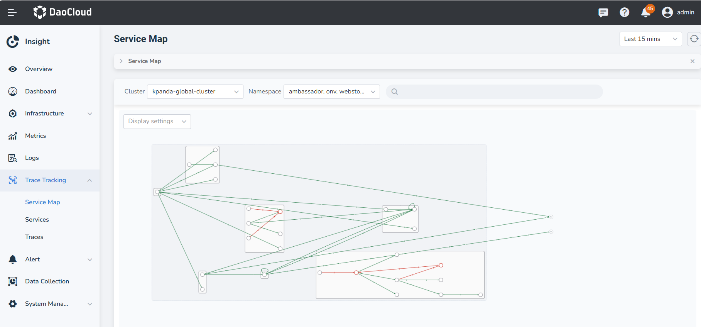
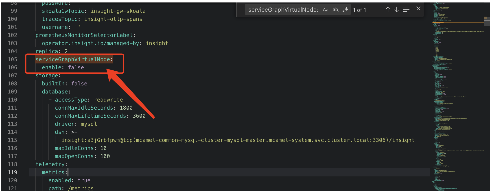

# Service Map

Service map is a visual representation of the connections, communication, and dependencies between services. 
It provides insights into the service-to-service interactions, allowing you to view the calls and performance of 
services within a specified time range. The connections between nodes in the topology map represent the existence of 
service-to-service calls during the queried time period.

## Prerequisites

1. Insight Agent is [installed](../../quickstart/install/install-agent.md) in the cluster and the applications are in the __Running__ state.
2. Services have been instrumented for distributed tracing using
   [Operator](../../quickstart/otel/operator.md) or [OpenTelemetry SDK](../../quickstart/otel/golang/golang.md).

## Steps

1. Go to the __Insight__ product module.

2. Select __Tracing__ -> __Service Map__ from the left navigation bar.

3. In the Service Map, you can perform the following actions:

    - Click a node to slide out the details of the service on the right side. Here,
      you can view metrics such as request latency, throughput, and error rate for the service.
      Clicking on the service name takes you to the service details page.
    - Hover over the connections to view the traffic metrics between the two services.
    - Click __Display Settings__ , you can configure the display elements in the service map.

    

4. In the search box, you can filter the topology data based on **service name**, **node error rate range**, and **node latency range**.

5. Click the __Legend__ button in the bottom-right corner to modify the rendering thresholds defined in the current topology through a __temporary configuration__. Exiting or closing this page will discard the configuration.

    The threshold values must be greater than 0. The value entered first must be smaller than the one entered later. All entered values must fall within the maximum and minimum range.

### Other Nodes

In the Service Map, there can be nodes that are not part of the cluster. These external nodes can be categorized into three types:

- Database
- Message Queue
- Virtual Node

1. If a service makes a request to a Database or Message Queue, these two types of nodes will be displayed 
   by default in the topology map. However, Virtual Nodes represent nodes outside the cluster or services 
   not integrated into the trace, and they will not be displayed by default in the map.

2. When a service makes a request to MySQL, PostgreSQL, or Oracle Database, the detailed database type 
   can be seen in the map.

#### Enabling Virtual Nodes

1. Update the `insight-server` chart values, locate the parameter shown in the image below, and change `false` to `true`.

   

2. In the display settings of the service map, check the **Virtual Services** option to enable it.
