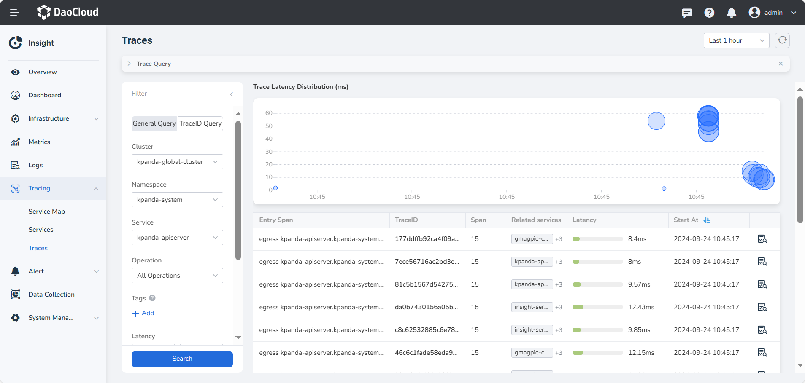
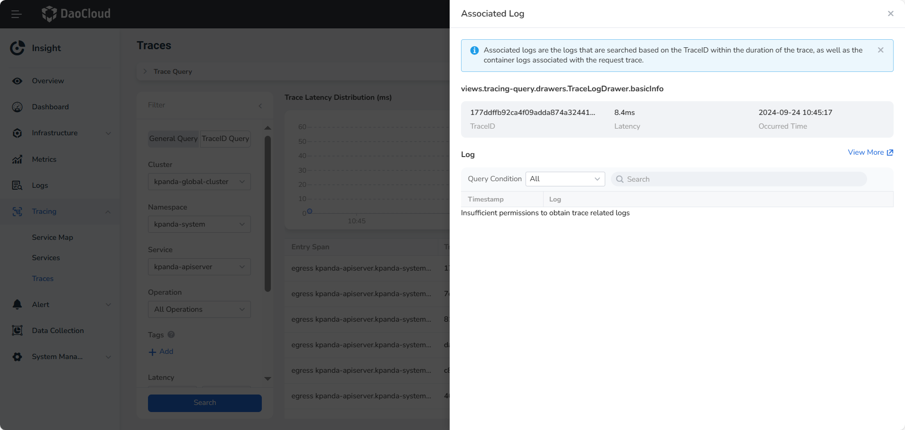

# Trace Query

After completing [Enhancing Application Observability with OTel](https://docs.daocloud.io/insight/quickstart/otel/otel.html),  
Insight will automatically collect application trace data.  
In the **Call Chain** section, you can view trace data from two dimensions: **All Spans** and **Traces**.

- On the **All Spans** page, users can view detailed data for each Span that meets the query conditions.  
- On the **Traces** page, users can view detailed data for each trace’s top-level Span.

## Prerequisites

- The `insight-agent` plugin has been installed in the cluster, the agent is **running**, and the `trace` feature is enabled.  
- The workload has successfully integrated with the tracing system through the **OpenTelemetry Operator** or **SDK**.

## Terminology

1. **TraceID:** A unique identifier used to trace and identify a complete request chain. It helps developers and operators correlate requests between different services in a distributed system for monitoring and troubleshooting.  
2. **Operation:** Refers to the specific task or event performed within a Span. Each Span represents the execution process of an operation, usually associated with a service function or business logic.  
3. **Entry Span:** The first Span in a request trace, marking the starting point of the request. It typically corresponds to the moment an external request is received.  
4. **Latency:** The total time elapsed from receiving a request to completing a response. It’s a key performance indicator for identifying bottlenecks and optimization opportunities.  
5. **Span:** A single unit of operation in a trace, representing an action executed within a specific time frame. A complete request trace may consist of multiple Spans, each recording its start time, end time, duration, and contextual information.  
6. **Start Time:** The specific timestamp when the trace started, usually marking when the request was received. It is used to calculate latency and analyze request processing.  
7. **Tag:** A set of key-value pairs that annotate a Span with additional context. Each Span can have multiple tags that provide more details about the operation and its state.

## Viewing All Spans

1. Go to the **Observability** module.  
2. In the left navigation panel, select **Trace Tracking → Call Chain**.  
   The page will display **All Spans** by default.

    - Click the time control in the upper-right corner to adjust the time range for querying Spans.  
      By default, it queries Span data reported by all services in the last 15 minutes.  
    - Click the filter button to search based on fields such as cluster, namespace, service, or operation.  
      You can also filter by Span tags and latency in the detailed view.  
    - The Span list is sorted by **Start Time** by default, and can also be sorted by **Request Latency** .  
    - Use the selector in the upper-right corner of the list to filter out error Spans within the selected time range.

    !!! note

        **Error Spans** are Spans that contain the tag `error=true` in their details.  
        These indicate that an error or exception occurred during execution, often representing failures or issues in the trace request process.

    

### Viewing Span Details

Click the operation name of the target Span to view a waterfall chart of the trace containing that Span.

## Viewing Traces (Top-Level Spans)

Please follow these steps to search for a trace:

1. Go to the __Insight__ product module.
2. Select __Tracing__ -> __Traces__ from the left navigation bar.

    

    !!! note

        Sorting by Span, Latency, and Start At is supported in the list.

3. Click the __TraceID Query__ in the filter bar to switch to TraceID search.

   - To search using TraceID, please enter the complete TraceID.

    <!-- add image later -->

## Other Operations

### View Trace Details

1. Click the TraceID of a trace in the trace list to view its detailed call information.

    

### Associated Logs

1. Click the icon on the right side of the trace data to search for associated logs.

    - By default, it queries the log data within the duration of the trace and one minute after its completion.
    - The queried logs include those with the trace's TraceID in their log text and container logs related to the trace invocation process.
  
2. Click __View More__ to jump to the __Associated Log__ page with conditions.
3. By default, all logs are searched, but you can filter by the TraceID or the relevant container logs from the trace call process using the dropdown.

    

    !!! note

        Since trace may span across clusters or namespaces, if the user does not have sufficient permissions, they will be unable to query the associated logs for that trace.
