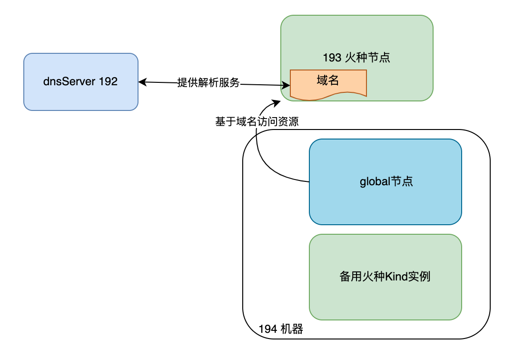
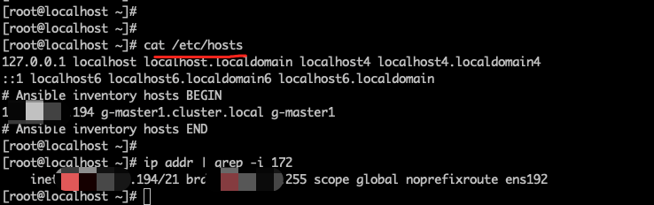
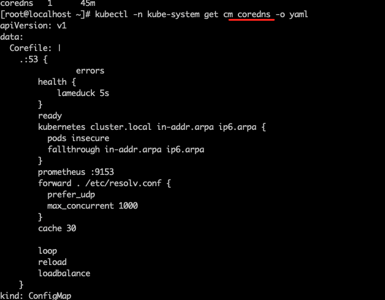
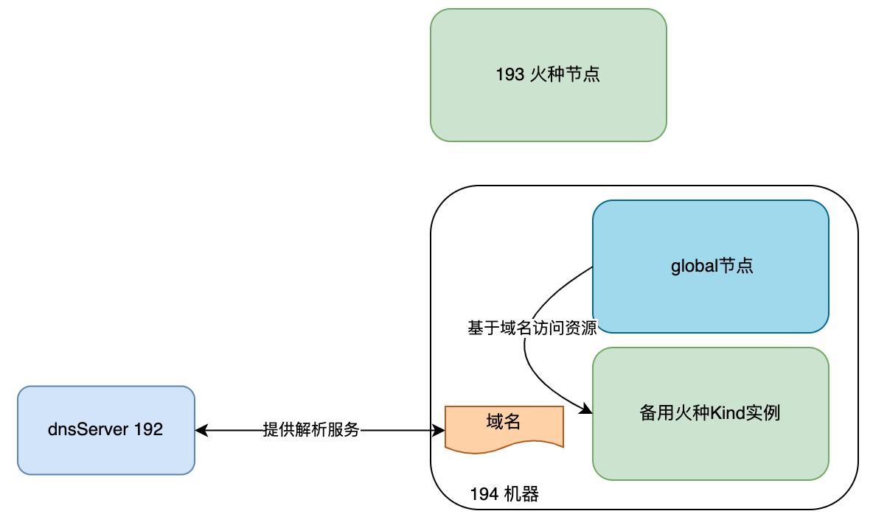
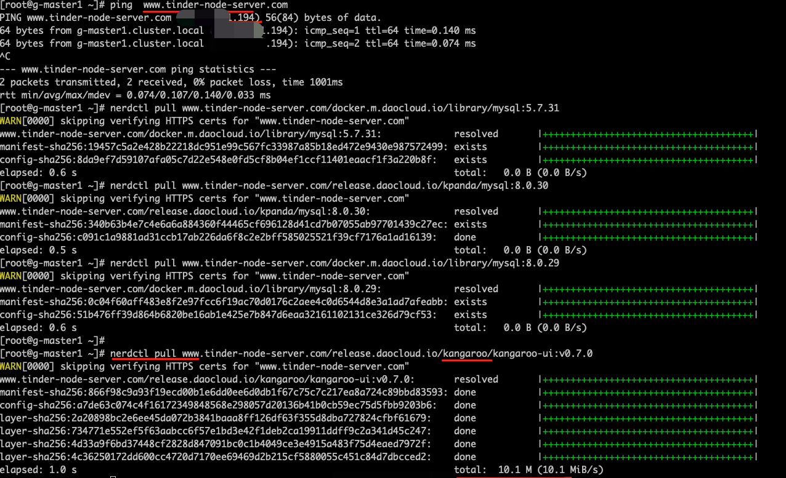

# High Availability Solution for Bootstrap Nodes

Introduce the concept of "backup bootstrap node", which is essentially a virtual machine that performs the same tasks as the bootstrap node, but is only used temporarily when the original bootstrap node encounters a problem. Once the node is repaired, it should immediately switch back to the original bootstrap node. The high availability of the bootstrap service can be achieved through pre-set DNS or HAProxy+KeepAlived or nginx reverse proxy. This article focuses on the pre-set DNS method.

Overall solution architecture:



## Environment Preparation

- Bootstrap node: Operating system centos7.9, IP `xxx.xx.xx.193`
- Global single cluster: Operating system centos7.9, IP `xxx.xx.xx.194`, CRI containerd
- Backup bootstrap node: Operating system centos7.9, IP `xxx.xx.xx.194`, the backup bootstrap node can be colocated with the master node of the global cluster.
- dnsServer: IP `xxx.xx.xx.192`
- Domain name: <www.tinder-node-server.com> (Initially resolved to the bootstrap node `xxx.xx.xx.193`)

## Steps

### Simulating dnsServer and Configuring According to the Actual Situation

Set up dnsServer information on the machine `xxx.xx.xx.192`. The following configuration information is for demonstration purposes only:

1. Configure `/etc/named.conf`

    ```shell
    zone "tinder-node-server.com" IN {
        type master;
        file "tinder-node-server.com.zone";
        allow-update { none; };
    };
    
    zone "41.30.172.in-addr.arpa" IN {
        type master;
        file "tinder-node-server.com.local";
        allow-update { none; };
    };
    ```

1. Configure `/var/named/tinder-node-server.com.zone`

    ```shell
    $TTL 1D
    @   IN SOA  tinder-node-server.com. rname.invalid. (
                        0   ; serial
                        1D  ; refresh
                        1H  ; retry
                        1W  ; expire
                        3H )    ; minimum
        NS  @
        A   127.0.0.1
        AAAA    ::1
        NS  ns.tinder-node-server.com.
    ns  IN A    xxx.xx.xx.193
    www IN A    xxx.xx.xx.193
    email   IN A    xxx.xx.xx.193
    ```

1. Configure `/var/named/tinder-node-server.com.local`

    ```shell
    $TTL 1D
    @   IN SOA  tinder-node-server.com. rname.invalid. (
                        0   ; serial
                        1D  ; refresh
                        1H  ; retry
                        1W  ; expire
                        3H )    ; minimum
        NS  @
        A   127.0.0.1
        AAAA    ::1
        PTR localhost.
        NS  ns.tinder-node-server.com.
    ns  A   xxx.xx.xx.193
    201 PTR www.tinder-node-server.com.
    201 PTR email.tinder-node-server.com.
    ```

1. Configure DNS machine `/etc/resolv.conf`

    ```shell
    # Generated by NetworkManager
    search default.svc.cluster.local svc.cluster.local
    nameserver xxx.xx.xx.192
    nameserver 223.6.6.6
    options ndots:2 timeout:2 attempts:2
    ```

1. Verify if dnsServer resolution is correct

    ```bash
    nslookup www.tinder-node-server.com xxx.xx.xx.192
    ```
  
    

!!! note

    - If an external DNS service is used to resolve the domain name, make sure that the /etc/hosts file of each node, including the bootstrap node, does not contain the domain name configuration.
    - You can use the nslookup command to check the domain name resolution status. Make sure that each node, including the bootstrap node, can use nslookup to check the resolution status.

### Installing DCE 5.0 Based on External Domain Name Mode

Overall architecture:


1. Refer to the installation process in [Offline Installation of DCE 5.0 Commercial Edition](../commercial/start-install.md)

1. Example of a well-defined clusterConfig file:

    ```yaml title="clusterConfig.yaml"
    apiVersion: provision.daocloud.io/v1alpha3
    kind: ClusterConfig
    metadata:
      creationTimestamp: null
    spec:
      clusterName: my-cluster
      bootstrapNode: www.tinder-node-server.com ## Based on external domain name mode
    
      masterNodes:
        - nodeName: "g-master1"
          ip: xxx.xx.xx.194
          ansibleUser: "root"
          ansiblePass: "admin"
    
      fullPackagePath: "/home/offline-fix-dns"
      osRepos:
        type: builtin
        isoPath: "/home/CentOS-79-x86_64-DVD-2009.iso"
        osPackagePath: "/home/os-pkgs-centos7-v0.4.8.tar.gz"
    
      imagesAndCharts:
        type: builtin
        additionalSSLSubjectAltName: "xxx.xx.xx.193" ## Domain name resolved by the dns service
    
      addonPackage:
      binaries:
        type: builtin
    ```

1. Start the installation

    ```bash
    ./dce5-installer cluster-create -c sample/clusterConfig.yaml -m sample/manifest.yaml
    ```

1. After the cluster is successfully installed, check the pod image addresses

    

1. Check the hosts file of the global node and the configuration of the coredns pod. There should be no additional domain name configurations

    ```bash
    cat /etc/hostes
    ```
  
    
  
    ```bash
    kubectl -n kube-system get cm coredns -o yaml
    ```
  
    

### Simulating the Activation of the Backup Bootstrap Node

1. Ensure that the backup bootstrap node has installed the necessary dependencies, refer to [Install Tools](../install-tools.md),

1. SCP the offline package of the bootstrap node to the backup bootstrap node

1. Example of a well-defined clusterConfig file: Start the installation of the bootstrap node using IP mode (bootstrapNode is set to auto or the specific IP address of the bootstrap node)

    ```yaml title="clusterConfig.yaml"
    apiVersion: provision.daocloud.io/v1alpha3
    kind: ClusterConfig
    metadata:
      creationTimestamp: null
    spec:
      clusterName: my-cluster
      bootstrapNode: 172.30.41.194 ## IP-based mode
    
      masterNodes:
        - nodeName: "g-master1"
          ip: xxx.xx.xx.194
          ansibleUser: "root"
          ansiblePass: "admin"
    
      fullPackagePath: "/home/offline-fix-dns"
      osRepos:
        type: builtin
        isoPath: "/home/CentOS-79-x86_64-DVD-2009.iso"
        osPackagePath: "/home/os-pkgs-centos7-v0.4.8.tar.gz"
    
      imagesAndCharts:
        type: builtin
        additionalSSLSubjectAltName: "www.tinder-node-server.com" ## Domain name resolved by the dns service
      addonPackage:
      binaries:
        type: builtin
    ```

1. Run specific steps `1,2,3,4,5` on the backup bootstrap node

    ```bash
    ./dce5-installer cluster-create -c sample/clusterConfig.yaml -m sample/manifest.yaml -j 1,2,3,4,5
    ```

    !!! note
    
        The -j parameter is necessary here, it only installs on the bootstrap node itself.

### Testing the High Availability of the Bootstrap Node Based on DNS Resolution

Prerequisite: Update dnsServer to switch DNS resolution to the backup bootstrap node and perform verification after the switch




1. Verify that file downloads are normal

    

1. Verify that image pulls are normal

    

1. Verify that the source bootstrap node and the backup node have normal images

    

1. Verify that the charts repository is normal

    

## FAQs

### Configuration of bootstrapNode and AdditionalSubjectAltName Fields

Explanation of the configuration of bootstrapNode and imagesAndCharts.additionalSSLSubjectAltName in clusterConfig.yaml for the bootstrap node and the backup bootstrap node:

| Node | SubjectAltName(bootstrapNode) | AdditionalSubjectAltName |
| --- | ------------------------ | ---------------------------- |
| Original bootstrap node 193   | www.tinder-node-server.com | 172.30.41.193  |
| Backup bootstrap node 194 | 172.30.41.194 | www.tinder-node-server.com |

### How to Synchronize the Upgrade of the Backup Bootstrap Node in an Upgrade Scenario

Prerequisites:

- Restore the dns resolution to its original state, i.e., the domain name points to the original bootstrap node `xxx.xx.xx.193`

    !!! note
  
        Why restore the resolution to its original state? Because without modifying the clusterConfig, when starting or updating the bootstrap node in domain name mode, there is a code check logic:
        Check if the given domain name is resolved to the IP address of the current node. If it is, do nothing; if not, update the hosts file of the bootstrap node to support the domain name mode.
        So if the resolution is not restored to its original state, the hosts file of the bootstrap node will be modified unnecessarily.

- The bootstrap node and the backup bootstrap node have downloaded the offline upgrade package

    1. Run the command to upgrade the bootstrap node on both the bootstrap node and the backup bootstrap node, to upgrade the image, minio files, and charts versions
    
        ```bash
        ./dce5-installer cluster-create -c sample/clusterConfig.yaml -m sample/manifest.yaml -u tinder
        ```

        Modify the fullPackagePath to point to the offline upgrade package address.
    
    1. After the upgrade, check if the images, files, and charts repositories of the bootstrap node and the backup node can be downloaded normally.
