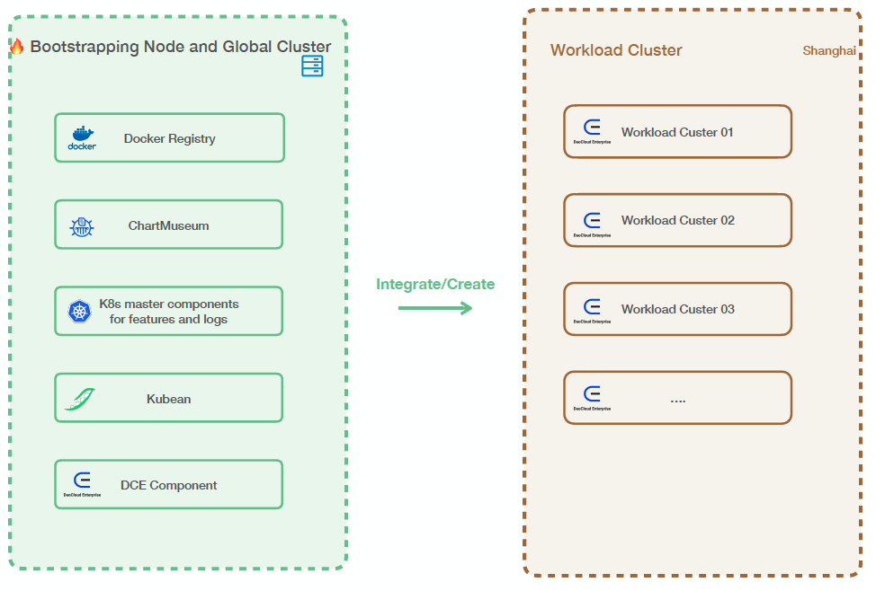
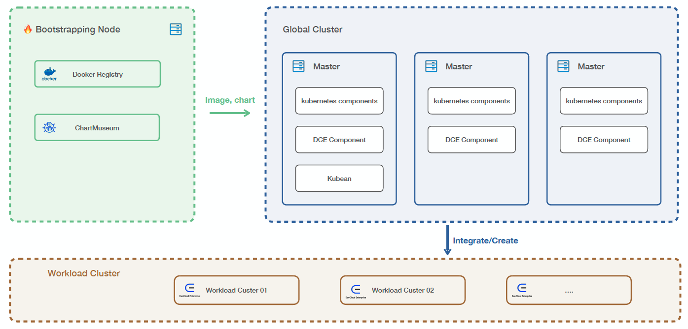

# Deployment Architecture

DCE 5.0 offers three deployment architectures: beginner mode, 4-nodes, and 7-nodes.

The following table provides an overview of the terms used in the architecture:

| Name                  | Introduction                                                                                                                 |
| --------------------- | --------------------------------------------------------------------------------------------------------------------------- |
| Bootstrapping Node    | The bootstrapping node, also known as the bootstrap node, installs and executes the deployment program. It runs the container registry and chart museum required by the platform. |
| Global Service Cluster| This cluster is responsible for deploying all components of DCE 5.0 and utilizes [Kubean](https://github.com/kubean-io/kubean) to manage the cluster's lifecycle.                                |
| Workload Cluster      | The workload cluster supports business applications and services. It should be deployed after successfully installing DCE.     |
| DCE Component         | All components of DCE 5.0, including product modules such as global management, container management, observability, Workbench, Multicloud Management, container registry, microservice engine, service mesh, and middleware.          |

## Beginner Mode

The beginner mode is suitable for individual customers and requires only one host. However, it is recommended to use this mode minimally by adding the `-z` parameter after the installation command when installing DCE 5.0.

## 4-Node Mode

The 4-node mode consists of one bootstrapping node and three master nodes within the cluster. It is recommended for PoC or test environments.

## 7-Node Mode (1 + 6)

The 7-node mode includes one bootstrapping node, three master nodes within the cluster, and three worker nodes exclusively dedicated to the Elasticsearch component. This mode is recommended for production environments.

