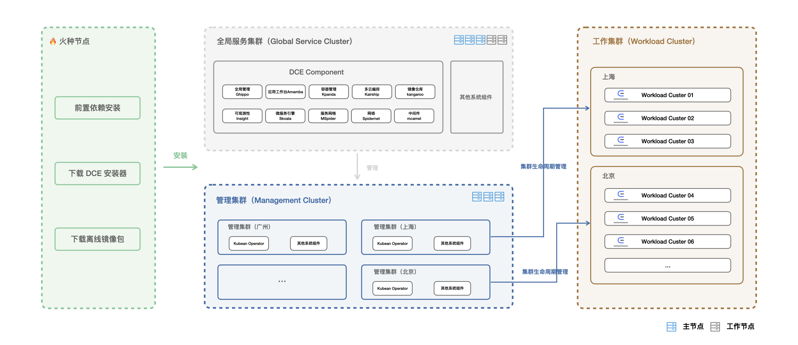
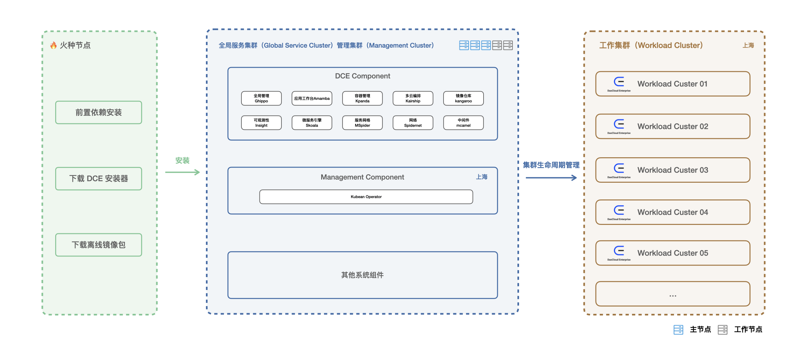

# Deployment planning

DCE 5.0 Commercial Edition provides two modes: classic mode and minimalist mode.

## Classic Mode

The classic mode is suitable for multi-data centers across networks and regions, and its deployment mode is:

- [Global Service Cluster](../../kpanda/07UserGuide/Clusters/ClusterRole.md#_1) Deploy all components of DCE 5.0: global management, container management, observability, application workbench, multicloud orchestration, image registrys, microservice engines, service meshes, middleware, networks, and more.
- [Manage Cluster](../../kpanda/07UserGuide/Clusters/ClusterRole.md#_2) Deploy the Operator of [Kubean](https://github.com/kubean-io/kubean)
- [Working cluster](../../kpanda/07UserGuide/Clusters/ClusterRole.md#_3) supports business applications and services (deploy the working cluster after successfully installing DCE)

The deployment architecture diagram of the classic mode is as follows:

## Minimalistic mode

Deploy the global service cluster and the management cluster in one cluster, and keep the others unchanged. This mode is suitable for a single data center that does not need to cross networks or regions.

The deployment architecture diagram of the simple mode is as follows:

The global service cluster and the management cluster are deployed together. This mode can achieve the purpose of saving resources and is suitable for single data centers of enterprises.
There is no need to manage the lifecycle of different clusters and communicate across networks. If there are multiple data center scenarios in the enterprise production environment, it is recommended to use the classic mode.

## Node Requirements

No matter which mode you choose, installing the commercial version of DCE 5.0 first requires a temporary bootstrapping node.

### Bootstrapping node

On bootstrapping nodes, you can deploy global service clusters and manage clusters by starting the kind cluster and performing a series of automated installation processes.

**System and Hardware Requirements for a bootstrapping node**

| Resource Entry | Requirements | Recommended Values ​​|
| :------------ | :------------ | :----------- |
| Available CPU Cores | 4 Core | 8 Core |
| Available memory | 8 GB | 16 GB |
| Free disk space | > 100 GB | 200 GB |
| Operating System | Linux, macOS | Linux, macOS |

### Classic Mode Resource Planning

**Test environment**

| Cluster type | Method 1 | Method 2 |
| :----------- | :----------------------------------- -------------------------------------------------- -------------------------------- | :---------------- -------------------------------------------------- --- |
| Global Service Cluster| **3 Master + 2 Worker**  Master node: 4C8G; system disk 100G  Worker node: 8C16G; system disk 100G + unpartitioned disk 200G | **3 Master* * Master node: 10C20G; system disk 100G + unpartitioned disk 200G |
| Manage Cluster | **3 Master**  Master node: 4C4G; system disk 100G | **3 Master**  Master node: 4C4G; system disk 100G |
| Operating System | CentOS 7.9 | CentOS 7.9 |

**Production Environment**

| Cluster type | Method 1 | Method 2 |
| :----------- | :----------------------------------- -------------------------------------------------- ---------------------------------- | :-------------- -------------------------------------------------- ----- |
| Global Service Cluster| **3 Master + 2 Worker**  Master node: 6C10G; system disk 100G  Worker node: 8C16G; system disk 100G + unpartitioned disk 200G | **3 Master* * Master node: 10C20G; system disk 100G + unpartitioned disk 200G |
| Manage Cluster | **3 Master**  Master node: 4C4G; system disk 100G | **3 Master**  Master node: 4C4G; system disk 100G |
| Operating System | CentOS 7.9 | CentOS 7.9 |

### Simple Mode Resource Planning

**Test environment**

| Cluster type | Method 1 | Method 2 |
| :-------------------- | :------------------------- -------------------------------------------------- -------------------------------------------- | :------- -------------------------------------------------- ------------ |
| Global service cluster + management cluster | **3 Master + 2 Worker**  Master node: 4C8G; system disk 100G  Worker node: 8C16G; system disk 100G + unpartitioned disk 200G | ** 3 Master** Master node: 10C20G; system disk 100G + unpartitioned disk 200G |
| Operating System | CentOS 7.9 | CentOS 7.9 |

**Production Environment**

| Cluster type | Size |
| :-------------------- | :------------------------- -------------------------------------------------- -------------------------------------------------- ------------ |
| Global service cluster + management cluster | **3 Master + 2 Worker**  Master node: 6C10G; system disk 100G + unpartitioned disk 200G  Worker node: 8C16G; system disk 100G + unpartitioned Disk 200G |
| Operating System | CentOS 7.9 |