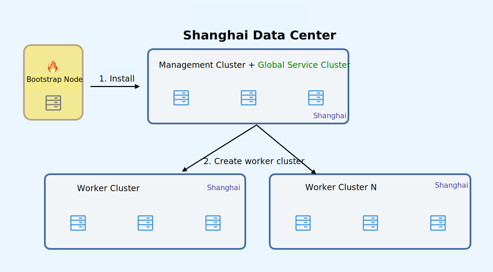
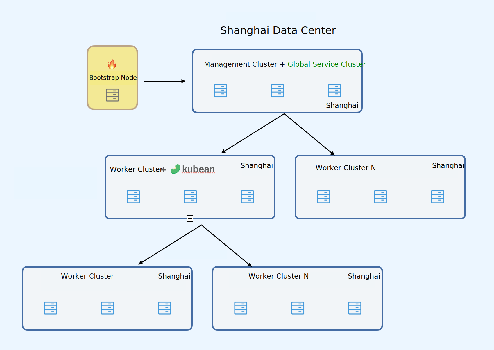
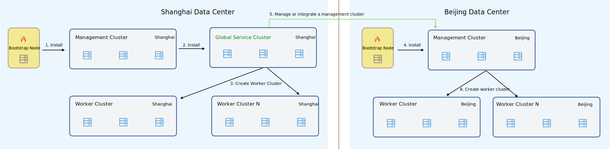

# Cluster Deployment Mode Usage Scenarios

DCE 5.0 provides [four cluster roles](../../kpanda/user-guide/clusters/cluster-role.md) to meet
different usage scenarios. You can freely combine different cluster deployment combinations based
on your business characteristics and infrastructure scenarios.

This article will explain several common usage scenarios.

## Single Data Center Scenario

When most of the business is concentrated in a single data center region, there is no need for cross-networking,
and the data disaster recovery requirements are low. It is recommended to use the simple mode. That is, only one
cluster is needed to run platform-related components (global service cluster + management cluster combined),
and multiple clusters are deployed to run business workloads (worker clusters). The number of nodes in a single
cluster is determined by the specific business scenario. It is recommended to use 3 master nodes for each cluster
to achieve high availability.

Specific deployment schemes depend on your business needs, refer to the following deployment process:

## Single Data Center Single Management Cluster

Prerequisite: Prepare a node, the operating system and architecture of the node should be consistent
with the nodes to be created in the cluster.

1. Deploy the installer on a seed node and use the installer to install a cluster with
   two cluster roles:, global service cluster, and management cluster.

1. Based on the management cluster in the platform, create one or more worker clusters as needed.

## Single Data Center Multiple Management Clusters

When you need to add a management cluster within the current single data center to manage the lifecycle
of new business clusters, there is no need to install the seed node again. Just install the kubean Operator
component on an already created work cluster to give this cluster the ability and role of a management cluster.
As shown in the figure below:

Prerequisite: The deployment of a single data center single management cluster has been completed in the previous step.

1. Use [helm templates](../../kpanda/user-guide/helm/README.md) to install kubean on a work cluster details page,
   wait for the kubean status to change to running.

1. After kubean is installed on the current work cluster, the cluster role will automatically change
   to a management cluster. Based on the management cluster in the platform, create one or more worker clusters as needed.

## Multi Data Center Scenario

When you have multiple data centers, or different data center networks are isolated,
such as in a disaster recovery scenario with two sites and three centers, you have
lifecycle management requirements for clusters in different regions and data centers.
It is recommended to use the classic mode. At this time, a management cluster can be
deployed in different data centers or regions, and all management clusters can be
connected to the global service cluster for unified management of the lifecycle of
clusters within different regions.

### Multi Data Center Multiple Management Clusters

Prerequisite: Prepare a node, the operating system and architecture of the node
should be consistent with the nodes to be created in the cluster.

#### Shanghai Data Center

1. Deploy the installer on a seed node and use the installer to install a management cluster.

1. After the management cluster is installed, it will automatically create a global service cluster
   based on the [clusterConfig file](./cluster-config.md).

1. Based on the management cluster in the platform, create one or more worker clusters as needed.

In cross-regional and network isolation scenarios, to unify the lifecycle management of
clusters in other data centers, please refer to the following configuration process.

#### Beijing Data Center

Prerequisite: Prepare a node in the Beijing data center, the operating system and architecture
of the node should be consistent with the nodes to be created in the cluster.

1. Deploy the installer on a seed node in the Beijing data center and use the installer to install a management cluster.

1. Connect the container management module in the platform (running in the Shanghai data center)
   to the newly installed management cluster in the Beijing data center.

1. Based on the platform (running in the Shanghai data center), create one or more worker clusters
   based on the Beijing data center management cluster as needed.
