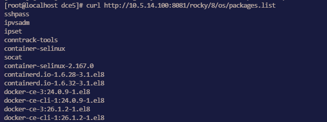
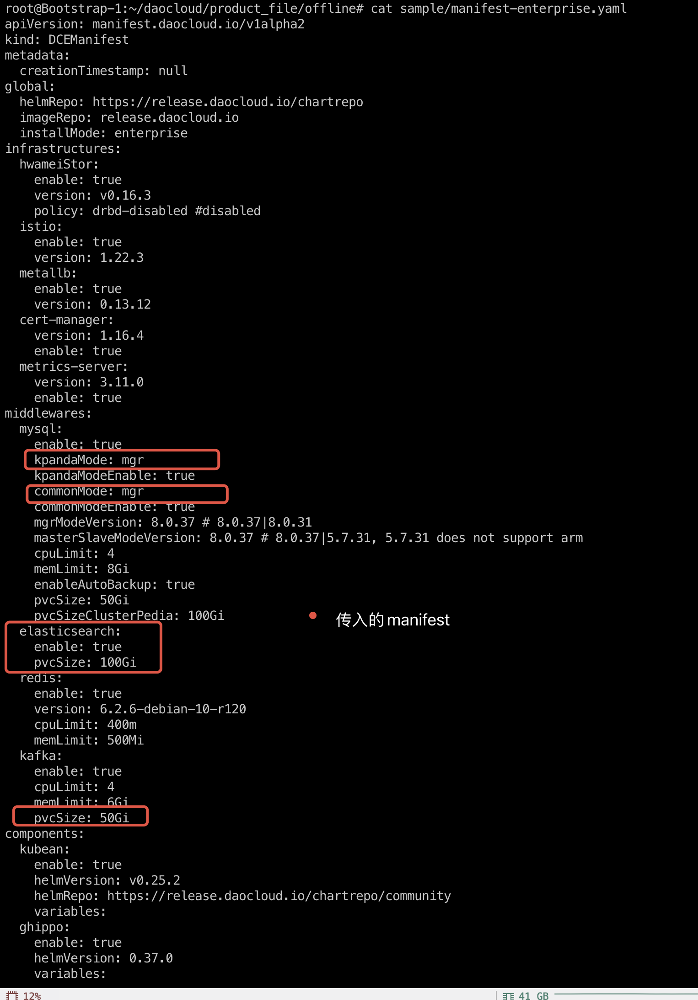

# Installation Troubleshooting

This page summarizes common installation issues and troubleshooting solutions,
making it easier for users to quickly resolve issues encountered during installation and operation.

## UI Issues

### Troubleshoot DCE 5.0 UI issues with diag.sh

Since [installer v0.12.0](./release-notes.md#v0120),the diag.sh script has been added
to help users quickly troubleshoot the DCE 5.0 UI issues.

Run the command:

```bash
./offline/diag.sh
```

Example of execution results:


### VIP access issues when using Metallb preventing the DCE login page from opening

1. Check if the VIP address is in the same subnet as the host. In Metallb L2 mode, it is necessary to ensure they are in the same subnet.
2. If a network card was added to the control node in a Global cluster causing access issues, L2Advertisement needs to be configured manually.

    Refer to the [Metallb documentation on this issue](https://metallb.universe.tf/configuration/_advanced_l2_configuration/#specify-network-interfaces-that-lb-ip-can-be-announced-from).

## Bootstrap Node Issues

### After shutting down and restarting the bootstrap node, the kind cluster cannot restart properly

After shutting down and restarting the bootstrap node, the kind cluster cannot start properly
due to the lack of auto-start configuration during deployment on the openEuler 22.03 LTS SP2 operating system.

You need to run the following command to start it:

```bash
podman restart $(podman ps | grep installer-control-plane | awk '{print $1}') 
```

!!! note

    If this scenario occurs in other environments, you can also run this command to restart.

### Missing ip6tables when deploying Ubuntu 20.04 as a bootstrap node

Deploying Ubuntu 20.04 as a bootstrap node may cause errors during the deployment process due to the absence of ip6tables.

Refer to the [Podman known issues](https://github.com/containers/podman/issues/3655).

Temporary solution: Manually install iptables, refer to [Install and Use iptables on Ubuntu 22.04](https://orcacore.com/install-use-iptables-ubuntu-22-04/).

### After disabling IPv6 during installation, Podman on the bootstrap node cannot create containers

The error message is as follows:

```text
ERROR: failed to create cluster: command "podman run --name kind-control-plane...
```

Solution: Re-enable IPv6 or update the bootstrap node base to Docker.

Refer to the related Podman issue:
[podman 4.0 hangs indefinitely if ipv6 is disabled on system](https://github.com/containers/podman/issues/13388)

### After restarting the kind container on the bootstrap node, the kubelet service cannot start

After the kind container restarts, the kubelet service cannot start and reports the following error:

```text
failed to initialize top level QOS containers: root container [kubelet kubepods] doesn't exist
```

Solutions:

- Solution 1: Restart and run the command `podman restart [kind] --time 120`. Do not interrupt this task with Ctrl+C during execution.

- Solution 2: Run `podman exec` to enter the kind container and run the following command:

    ```bash
    for i in $(systemctl list-unit-files --no-legend --no-pager -l | grep --color=never -o .*.slice | grep kubepod);
    do systemctl stop $i;
    done
    ```

### How to uninstall data from the bootstrap node

After deploying the commercial version, if you want to uninstall, in addition to the
cluster nodes themselves, you also need to reset the bootstrap node. The reset steps are as follows:

You need to use the `sudo rm -rf` command to delete these three directories:

- /tmp
- /var/lib/dce5/
- /home/kind/etcd

## Certificate Issues

### The kubeconfig of the Global cluster needs to be updated on the bootstrap's replica

Prior to v0.20.0, the kubeconfig of the Global cluster stored on the
bootstrap node does not automatically update. v0.20.0 supports automatic updates, run once a month.

In previous versions, you need to update the dce5-installer to v0.20.0 and then run:

```bash
dce5-installer cluster-create -c clusterconfig.yaml -m mainfest.yaml --update-global-kubeconf
```

### Updating the certificates and kubeconfig of the kind cluster on the bootstrap node itself

Prior to v0.20.0, the kubeconfig of the kind cluster stored on the bootstrap node
does not automatically update. v0.20.0 supports automatic updates, run once a month.

In previous versions, you need to update the dce5-installer to v0.20.0 and then run:

```bash
dce5-installer cluster-create -c clusterconfig.yaml -m mainfest.yaml --update-kind-certs
```

### After installing Contour, the default certificate validity period is only one year and will not auto-renew, leading to continuous restarts of the Contour-Envoy component

For versions prior to v0.21.0, there was support for enabling the installation of the Contour component. Subsequent versions will no longer support this. Customers who have installed Contour in previous versions need to execute the `helm upgrade` command to update the certificate validity period:

```bash
helm upgrade -n contour-system contour --reuse-values --set contour.contour.certgen.certificateLifetime=36500
```

## Operating System Related Issues

### Error during installation on CentOS 7.6


Executing `modprobe br_netfilter` on each node where the global service cluster is installed
will resolve the issue by loading `br_netfilter`.

### CentOS Environment Preparation Issues

An error occurs when running `yum install docker`:

```text
Failed to set locale, defaulting to C.UTF-8
CentOS Linux 8 - AppStream                                                                    93  B/s |  38  B     00:00    
Error: Failed to download metadata for repo 'appstream': Cannot prepare internal mirrorlist: No URLs in mirrorlist
```

You can try the following methods to resolve it:

- Install `glibc-langpack-en`

    ```bash
    sudo yum install -y glibc-langpack-en
    ```

- If the issue persists, try:

    ```bash
    sed -i 's/mirrorlist/#mirrorlist/g' /etc/yum.repos.d/CentOS-*
    sed -i 's|#baseurl=http://mirror.centos.org|baseurl=http://vault.centos.org|g' /etc/yum.repos.d/CentOS-*
    sudo yum update -y
    ```

### `osRepos` External Mode `externalRepoURLs` Check Failure  

The `clusterConfig.yaml` is as follows:  

```yaml
  osRepos:
    type: external
    externalRepoType: rocky
    externalRepoURLs:
      - http://10.5.14.100:8081/rocky/\$releasever/os/\$basearch
      - http://10.5.14.100:8081/rocky-iso/\$releasever/os/\$basearch/AppStream
      - http://10.5.14.100:8081/rocky-iso/\$releasever/os/\$basearch/BaseOS
```

Error message:  

```
[root@localhost dce5]# ./dist/dce5-installer cluster-create -c ./sample/clusterConfig.yaml -m ./sample/manifest.yaml --max-tasks 2
[Error]:[Error] invalid ClusterConfig: maybe the binaries.externalRepoURLs http://10.5.14.100:8081/rocky/$releasever/os/$basearch cannot be connected, return code: 404
```

The configuration is actually correct, and `externalRepoURLs` can be accessed normally. However, during validation, the variables are not properly parsed, resulting in a `404` error.  

  

**Impact:** Clusters using `osRepos` in external mode cannot be created successfully.  

**Workaround:** Retry using a new binary file.

### Manifest setting for enabling MySQL MGR mode not effective

**Issue:**

Since `dce5-installer` v0.30, enabling MySQL MGR through the Manifest has no effect.  
Other parameters such as `pvcSize` are also ineffective, and only the `enable` parameter works.



**Solution:**

1. Run the installer command with the `--dry-run` parameter to output the execution script to `installer.sh`:

    ```shell
    ./dce5-installer cluster-create -c clusterConfig.yml -m manifest-enterprise.yaml -z --dry-run > installer.sh
    ```

2. At the beginning of the `installer.sh` script file, add the following line:

    ```script title="installer.sh"
    ManifestFile=/root/data/manifest-enterprise.yaml
    ```

3. Add the `-s` parameter and re-run `installer.sh`:

    ```shell
    ./dce5-installer cluster-create -c clusterConfig.yml -m manifest-enterprise.yaml -z -s installer.sh
    ```

## Community Package Issues

### Redis hanging during DCE 5.0 reinstallation of the kind cluster

Issue: The Redis Pod has been stuck at 0/4 running for a long time, indicating: `primary ClusterIP can not unset`

1. Delete rfs-mcamel-common-redis in the `mcamel-system` namespace

    ```shell
    kubectl delete svc rfs-mcamel-common-redis -n mcamel-system
    ```

2. Then re-run the installation command.

### fluent-bit installation failure

Error message:

```text
DaemonSet is not ready: insight-system/insight-agent-fluent-bit. 0 out of 2 expected pods are ready
```

Check the Pod logs for the following key information:

```text
[warn] [net] getaddrinfo(host='mcamel-common-es-cluster-masters-es-http.mcamel-system.svc.cluster.local',errt11):Could not contact DNS servers
```

The above issue is a bug in fluent-bit. You can refer to an issue in aws/aws-for-fluent-bit:
[Seeing `Timeout while contacting DNS servers` with latest v2.19.1](https://github.com/aws/aws-for-fluent-bit/issues/233)
