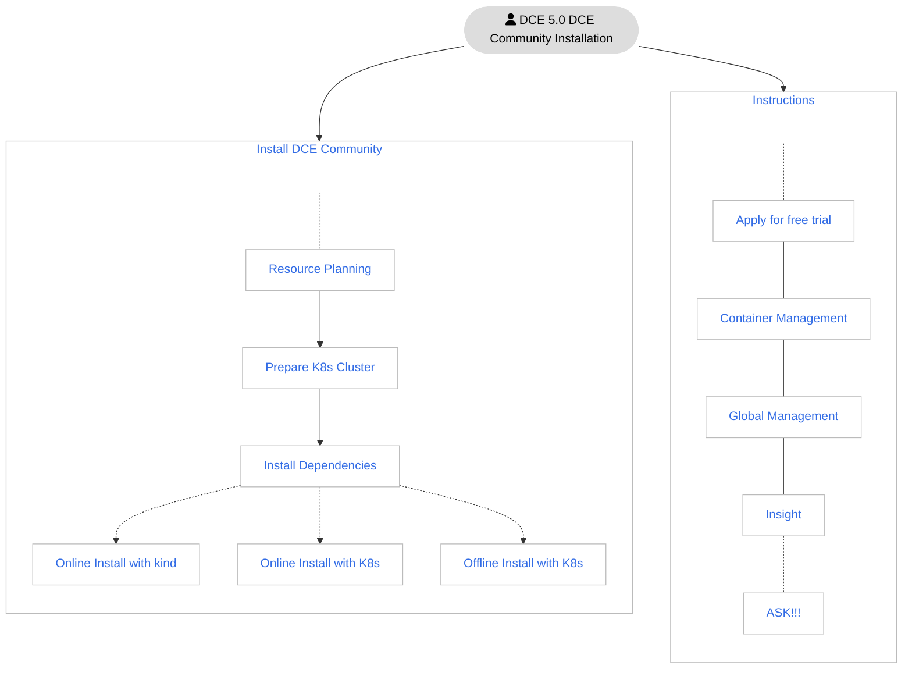
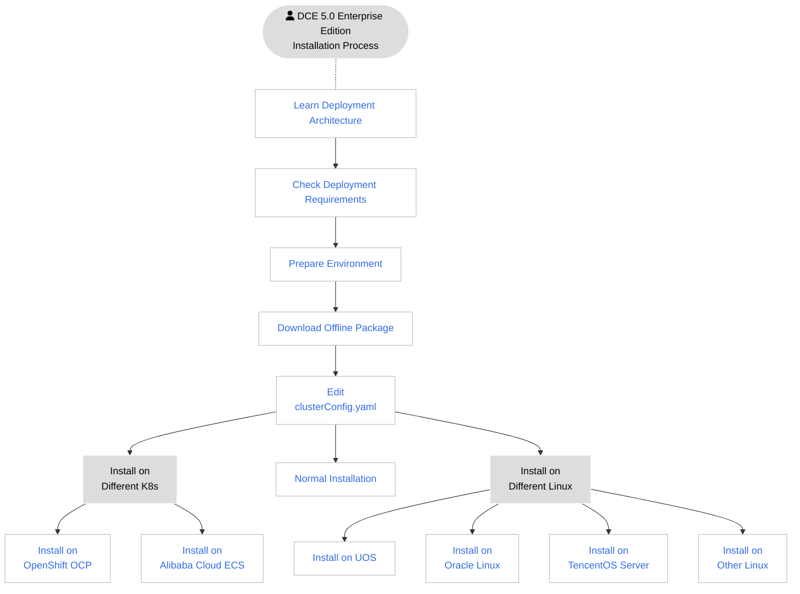

# Overview

DCE 5.0 has two versions: DCE Community and DCE 5.0 Enterprise.

The DCE Community includes Container Management, Global Management, and Insight modules,
which can be used for free permanently.

DCE 5.0 Enterprise can be purchased on demand with advanced modules such as Service Mesh,
Microservice Engine, MultiCloud Management, Data Middleware, Container Registry, etc. in addtion to
those modules contained in the DCE Community. It has more comprehensive features and can better
meet the needs of production environments.

<table>
  <thead>
    <tr>
      <th>Version</th>
      <th>Included Modules</th>
      <th>Description</th>
    </tr>
  </thead>
  <tbody>
    <tr>
      <td>DCE Community</td>
      <td>
        <ul>
          <li><a href="https://docs.daocloud.io/en/ghippo/intro/index.html">Global Management</a></li>
          <li><a href="https://docs.daocloud.io/en/kpanda/intro/index.html">Container Management</a></li>
          <li><a href="https://docs.daocloud.io/en/insight/intro/index.html">Insight</a></li>
        </ul>
      </td>
      <td>
        <a href="https://docs.daocloud.io/en/dce/license0.html">Permanently free license</a>, the 3 modules will receive continuous updates, and you can <a href="https://docs.daocloud.io/en/download/index.html#_3">download offline packages for sub-modules</a> anytime.
      </td>
    </tr>
    <tr>
      <td>DCE 5.0 Enterprise</td>
      <td> 
On top of the Community Edition, more modules are added:

        <ul>
          <li><a href="https://docs.daocloud.io/en/amamba/intro/index.html">Workbench</a></li>
          <li><a href="https://docs.daocloud.io/en/kairship/intro/index.html">MultiCloud Management</a></li>
          <li><a href="https://docs.daocloud.io/en/skoala/intro/index.html">Microservice Engine</a></li>
          <li><a href="https://docs.daocloud.io/en/mspider/intro/index.html">Service Mesh</a></li>
          <li><a href="https://docs.daocloud.io/en/middleware/index.html">Middleware</a></li>
          <li><a href="https://docs.daocloud.io/en/kangaroo/index.html">Container Registry</a></li>
          <li><a href="https://docs.daocloud.io/en/kant/intro/index.html">Cloud Edge Collaboration</a></li>
          <li><a href="https://docs.daocloud.io/en/virtnest/intro/index.html">Containerized VM</a></li>
        </ul>
      </td>
      <td>
        Contact us for licensing: email info@daocloud.io or call 400 002 6898. You can freely combine the modules as needed, and <a href="https://docs.daocloud.io/en/download/index.html#download-modules">download offline packages for sub-modules</a> anytime.
      </td>
    </tr>
  </tbody>
</table>

## Install DCE Community

The installation process of DCE 5.0 DCE Community is as follows:

!!! tip

    Click the blue text in the diagram, you can go to the corresponding page for details.

## Install DCE 5.0 Enterprise

The installation process of DCE 5.0 Enterprise is as follows:

## Contact us

DaoCloud Enterprise 5.0 is still in the early stage of release, and the installation guide may change.
Please bookmark this page and pay attention to the update dynamics.

- If you have any installation or usage problems, please
  [give us a feedback](https://github.com/DaoCloud/DaoCloud-docs/issues).

- Scan the QR code and communicate with developers freely:

    

[Download DCE 5.0](../download/index.md){ .md-button .md-button--primary }
[Free Try](../dce/license0.md){ .md-button .md-button--primary }
