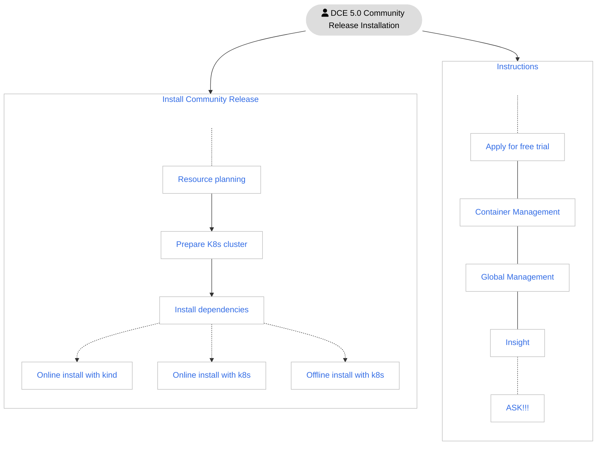
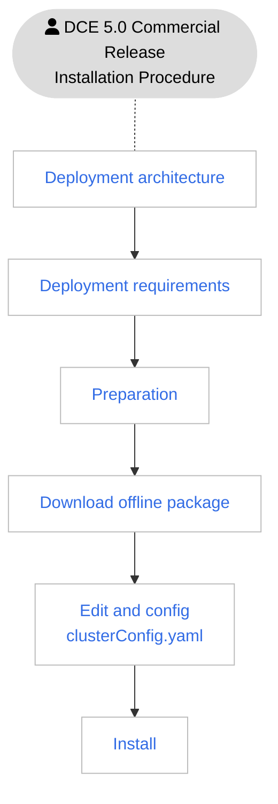

# Introduction to installation

There are two editions of DCE 5.0: Community Release and Commercial Release.

| Version | Included Modules | Description |
| ------ | ------------------------------------------ ------------------ | ------------------------------- ------------------- |
| Community Release| [Global Management](../ghippo/intro/what.md) [Container Management](../kpanda/intro/what.md) [Observability](../insight/intro/what.md) | [Permanent free license](../dce/license0.md), the 3 modules will be updated continuously, and you can [download offline packages of submodules](../download/dce5.md) |
| Commercial | [Global Management](../ghippo/intro/what.md) [Container Management](../kpanda/intro/what.md) [Observability]( ../insight/intro/what.md) [Workbench](../amamba/intro/what.md) [Multicloud Management](../kairship/intro/what.md) [Microservice Engine](../skoala/intro/what.md) [Service Mesh](../mspider/intro/what.md) [Refined Middleware](../middleware/what.md) [container registry](../kangaroo/what.md) | Contact us for authorization: email info@daocloud.io or call 400 002 6898, each module can be freely combined as needed, and you can [download the offline package of submodules](../download/dce5.md) at any time |

## Community Release installation process

The installation process of DCE 5.0 Community Release is as follows:

!!! tip

     The blue text in the picture above can be clicked to jump

## Commercial version installation process

The installation process of DCE 5.0 Commercial Release is as follows:

## Contact us

DaoCloud Enterprise 5.0 is still in the early stages of release, and the installation process may change. Please bookmark this page and pay attention to the update dynamics, and more operation documents are also being produced.

- If you have any installation or usage problems, please [give feedback](https://github.com/DaoCloud/DaoCloud-docs/issues).

- Welcome to scan the QR code and communicate with developers freely:

     

[Download DCE 5.0](../download/dce5.md){ .md-button .md-button--primary }
[Free Trial Now](../dce/license0.md){ .md-button .md-button--primary }
