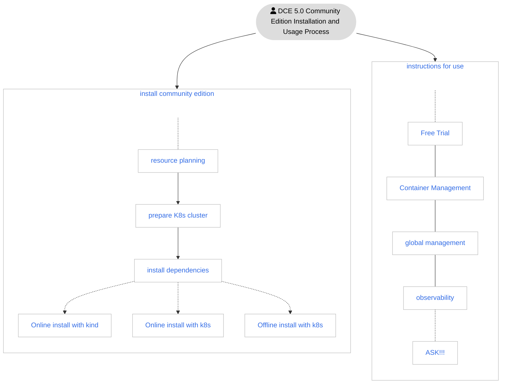
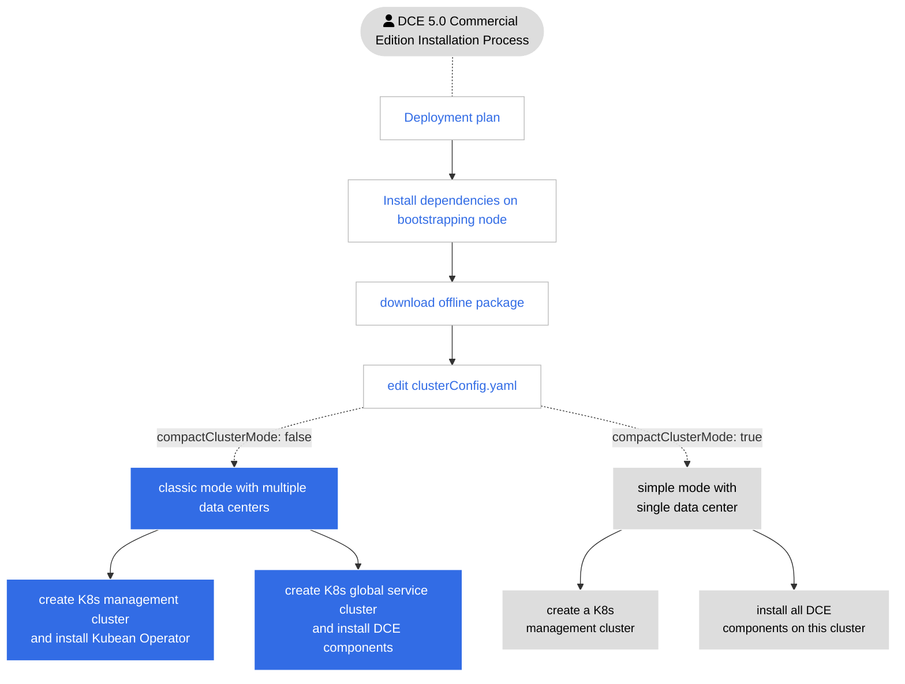

---
hide:
  - toc
---

# Introduction to installation

There are two editions of DCE 5.0: Community Edition and Commercial Edition.

| Version | Included Modules | Description |
| ------ | ------------------------------------------ ------------------ | ------------------------------- ------------------- |
| Community Edition| [Global Management](../ghippo/01ProductBrief/WhatisGhippo.md) [Container Management](../kpanda/03ProductBrief/WhatisKPanda.md) [Observability]( ../insight/03ProductBrief/WhatisInsight.md) | [Permanent free license](../dce/license0.md), the 3 modules will be updated continuously, and you can [download offline packages of submodules](../ download/dce5.md) |
| Commercial | [Global Management](../ghippo/01ProductBrief/WhatisGhippo.md) [Container Management](../kpanda/03ProductBrief/WhatisKPanda.md) [Observability]( ../insight/03ProductBrief/WhatisInsight.md) [Application Workbench](../amamba/01ProductBrief/WhatisAmamba.md) [Multicloud Orchestration](../kairship/01product/whatiskairship. md) [Microservice Engine](../skoala/intro/features.md) [Service Mesh](../mspider/01Intro/WhatismSpider.md) [Fine Choose Middleware](../middleware/midware.md) [Cloud Native Network](../network/intro/what-is-net.md) [Cloud Native Storage](. ./hwameistor/intro/what.md) [Mirror Warehouse](../kangaroo/intro.md) | [Genuine Authorization](https://qingflow.com/f/e3291647), each module can Free combination on demand, you can [download the offline package of the submodule](../download/dce5.md) at any time |

## Community Edition Installation Process

The installation process of DCE 5.0 Community Edition is as follows:

!!! tip

    - The blue text in the picture above can be clicked to jump
    - Refer to [Nanny Install DCE 5.0](../blogs/dce5-install1209.md)

## Commercial Edition Installation Process

The installation process of DCE 5.0 Commercial Edition is as follows:

### contact us

DaoCloud Enterprise 5.0 is still in the early stages of release, and the installation process may change. Please bookmark this page and pay attention to the update dynamics, and more operation documents are also being produced.

- If you have any installation or usage problems, please [give feedback](https://github.com/DaoCloud/DaoCloud-docs/issues).

- Welcome to scan the QR code and communicate with developers freely:

    

[Download DCE 5.0](../download/dce5.md){ .md-button .md-button--primary }
[Apply for community free experience](../dce/license0.md){ .md-button .md-button--primary }