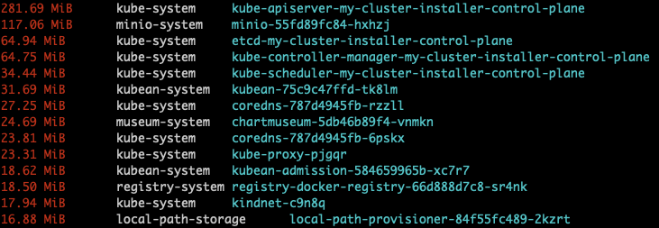
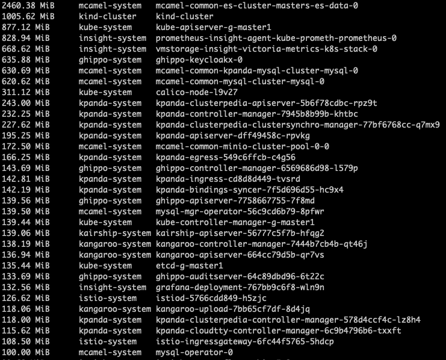
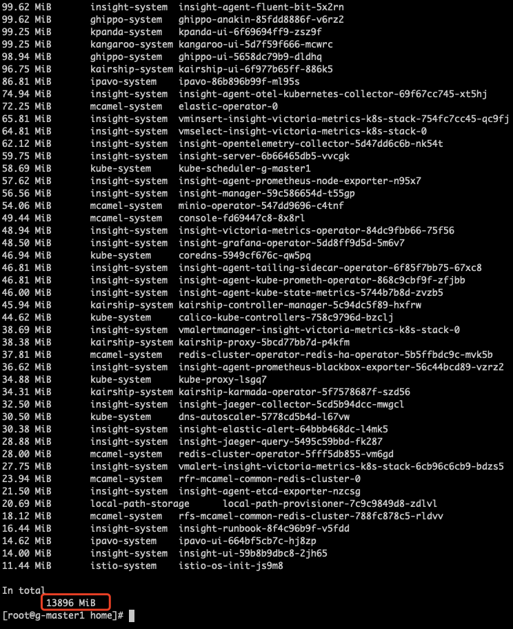
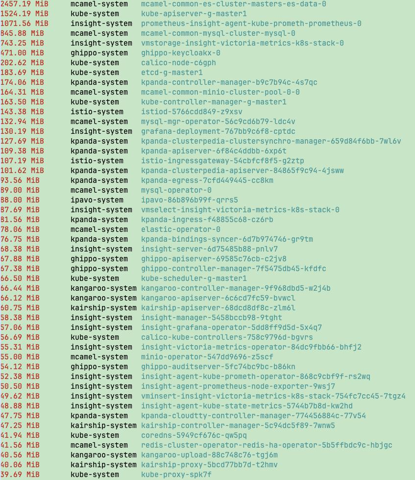
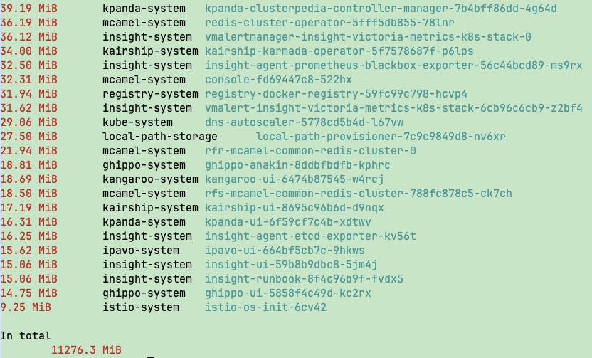
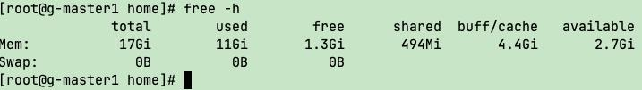
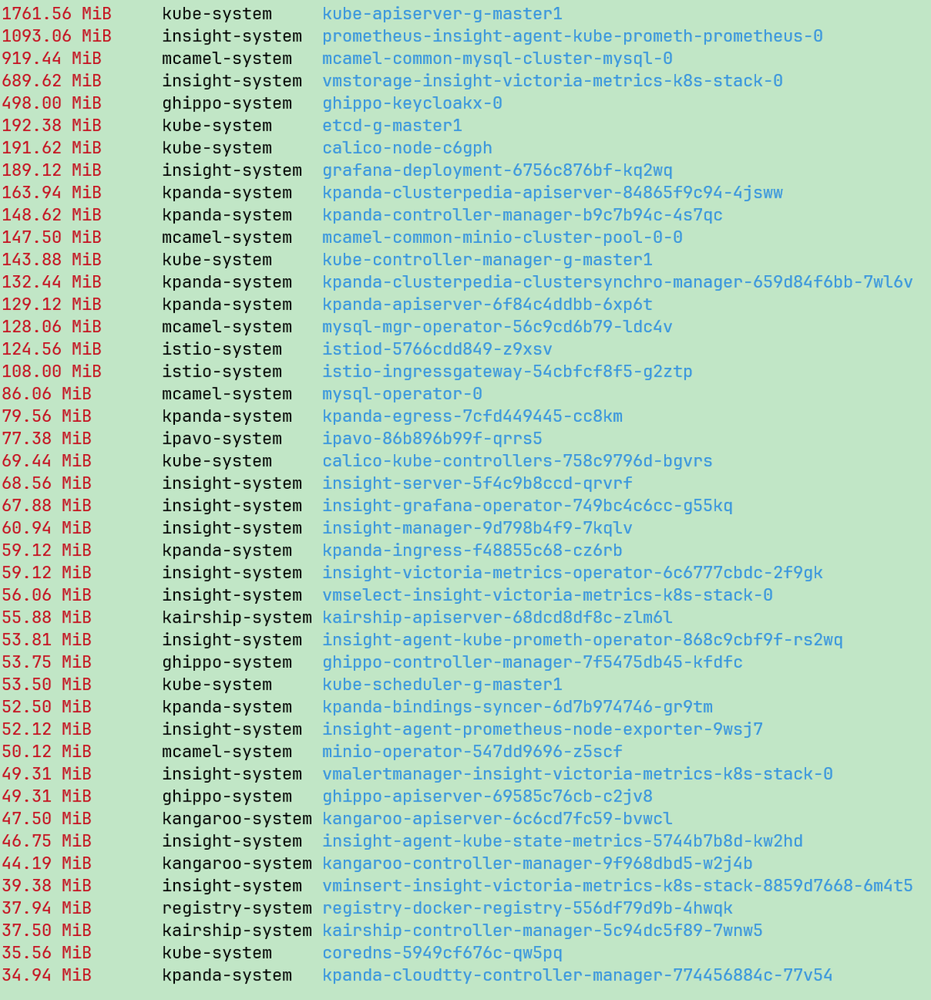
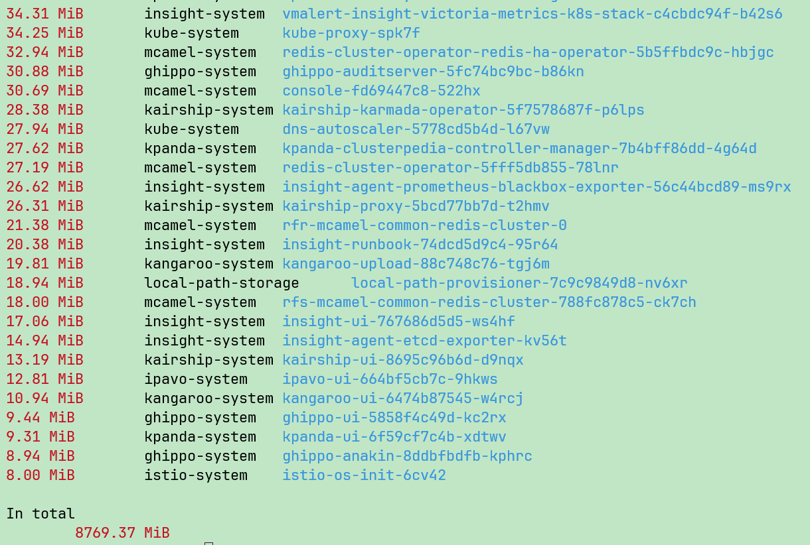
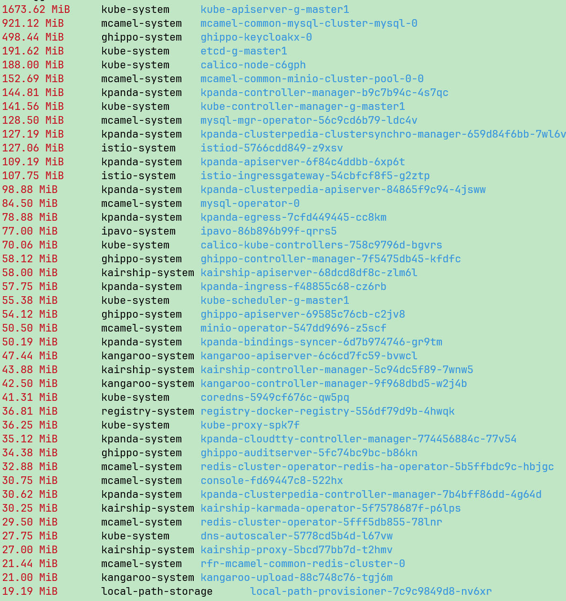
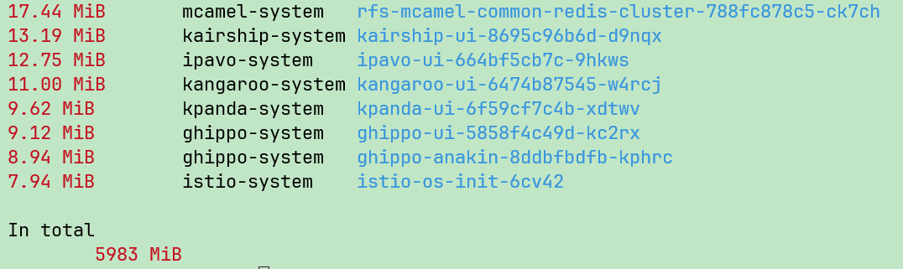

# Lightweight Deployment Trimming Plan Verification

Considering that in some scenarios, especially in the military industry, cloud software deployment faces stringent resource constraints, this document introduces a lightweight trimming and verification plan for deploying **DCE 5.0 Community Edition**, aiming to meet customers' requirements for lightweight deployment.

This trimming plan is verified step by step through four phases, detailed as follows:

## Verification Environment

* Operating System: Kylin Linux Advanced Server V10 (Halberd) for ARM
* CPU: 10C
* Memory: 17Gi

## Installed Components and Resource Statistics

The installation components, trimming plan, and phased trimming approach for DCE 5.0 are as follows:

Full view of Phase 1 lightweight trimming:

### Optimization by Phase

**Phase 1 Optimization**

Phase 1 trims non-essential infrastructure and component modules.

1. Resource usage inside Bootstrap

    

2. Resource usage of Global + kind Bootstrap

    

    

According to script-based statistics, the total memory consumption is: **13.6 GiB**

Estimated memory consumption of removable components:

!!! note

    The calculated statistics may differ from actual deployment usage. For example, dynamic caches generated during system runtime can affect real memory consumption.

| Component | Usage |
| :---- | ----- |
| elasticsearch | 2460.38 MiB (2.40 GiB) |
| kind-cluster | 1005.62 MiB (0.98 GiB) |
| insight | 2655.17 MiB (2.59 GiB) |
| kangaroo | 277.25 MiB (0.27 GiB) |
| Total | 6.24 GiB |

If these four categories of components are not installed, the estimated memory consumption would be **7.36 GiB**. However, previous community edition trimming tests (without these four components) showed that 8 GB memory could only run the system barely, and the system was unstable.

**Phase 2 Optimization**

In Phase 2, MySQL was consolidated from dual instances into a single instance, while some Insight components were further trimmed and optimized.

**Phase 3 Optimization**

Optimization item: remove ES (replicas = 0), based on [issue 2268](https://gitlab.daocloud.cn/ndx/engineering/insight/insight/-/issues/2268#note_558331)

**Phase 4 Optimization**

## Conclusion

This lightweight plan is derived by progressively trimming and scaling down a full **K8s + DCE5 Community Edition** environment under sufficient memory, reaching an idle state. Based on the memory statistics, the total memory just meets the requirements.

In actual real-world scenarios, with an **8Gi memory environment**, installation proceeds sequentially (adaptive trimming).
However, since some steps at the end require manually executing scripts, it triggers **deploy rolling updates**, causing a temporary surge in memory demand.
Additionally, the operating system itself consumes part of the dynamic memory resources.

Therefore, in summary, running the **DCE 5.0 lightweight trimmed environment** in an **8G memory** setup still lacks sufficient resources.

That is, **installation memory requirement ≠ idle state memory usage**

- Using **Phase 4** as the final trimming goal, at least **10G+ memory** is required.
- Using **Phase 3** as the final trimming goal (including observability components), at least **12G+ memory** is required.

For how to achieve lightweight deployment through the installer, refer to
[Installer Lightweight Deployment Plan](./install-light.md).
