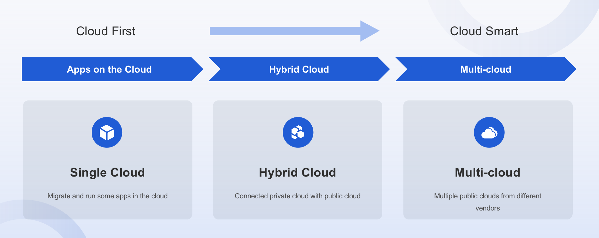

# What is Multicloud, Multi-Cluster Kubernetes Orchestration

Cloud computing has been developed for nearly 15 years in China. With the maturity of technology, enterprise applications are not only simple to the cloud, but also more complex multicloud requirements. The development process of cloud computing from single cloud to multicloud as shown below.

Enterprises from simply go to the cloud to build their own cloud environment.

According to the statistics, the proportion of multicloud as follows:

| Cloud Initiatives                              | Market share |
| ---------------------------------------------- | ------------ |
| Multiple public clouds+multiple private clouds | 43%          |
| Multiple public clouds+one private cloud       | 29%          |
| One public cloud+multiple private clouds       | 12%          |
| One public cloud+one private cloud             | 9%           |
| A public/private cloud                   | 7%           |

It can be seen from the above table that multi- cloud is the tendency and why multi-Cloud, multi-cluster kubernetes orchestration is popular.

Multicloud, multi-cluster kubernetes orchestration: Kairship (Kubernetes Airship) is an out-of-the-box  multicloud application orchestration platform which focuses on application. It realizes the centralized management of multicloud and hybrid cloud,  provides cross cloud deployment, release, operation, elastic expansion and contraction of applications based on cluster to achieve global load balancing. And it can solve the problem of disaster recovery for multicloud.

[Free trial now](../../dce/license0.md){ .md-button .md-button--primary }
