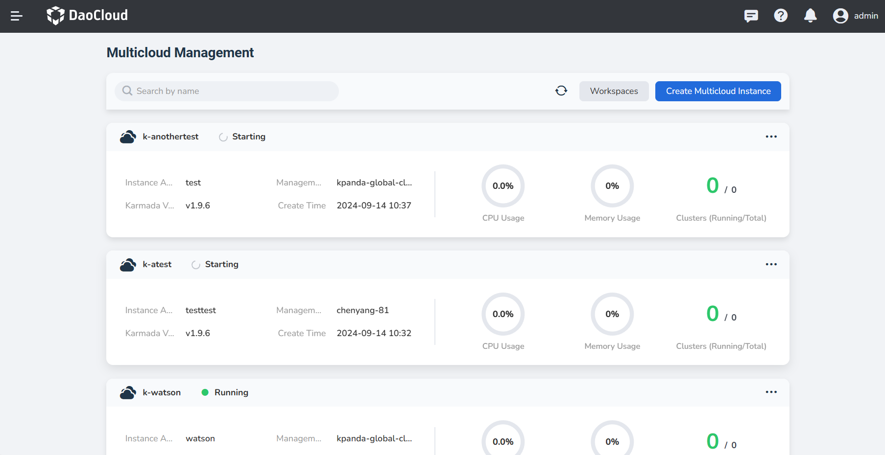
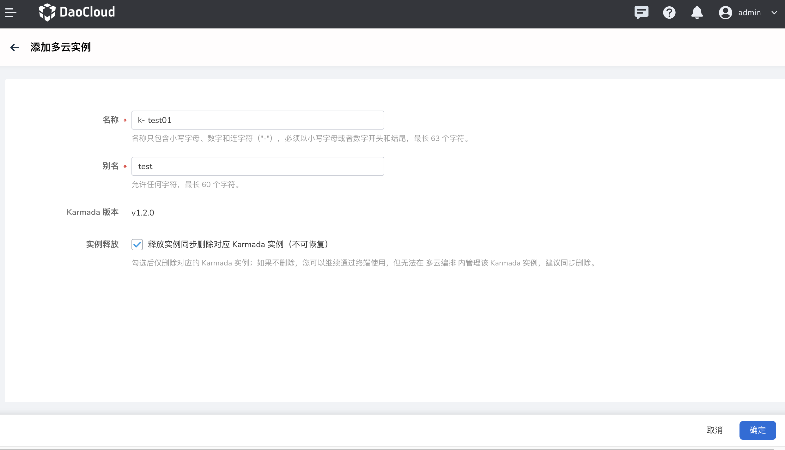

---
hide:
  - toc
---

# add instance

DaoCloud provides powerful multi-instance management capabilities of multicloud modules based on Karmada, and you only need to follow the steps below to perform simple operations.

## Steps

When entering multicloud orchestration for the first time, you need to `add multicloud instance`. The simple operation steps are as follows:

1. In the multicloud instance list, click `Add Multicloud Instance` in the upper right corner.

    

2. In the `Add Multicloud Instance` window, after configuring the instance name and alias, click `OK`.

    

3. Return to the multicloud instance list, and the upper right corner of the screen will prompt that the creation is successful, and the newly created instance will be the first item in the list by default.

## Precautions

The current multicloud orchestration product function design, the created multicloud instance will be in the `global management cluster` by default, and appear in DCE5.0 as a virtual cluster, which is transparent to you, so you don’t need to be aware of it; but some precautions need You follow.

### Instance name prefix default

Because multicloud instances are in the form of virtual clusters in DCE5.0, in order to avoid name conflicts with existing clusters, our design requires adding a prefix before the cluster name to solve this problem.

### The operation of instance release

Recently, we have updated the ability to release Karmada instances synchronously when the instance is released; the purpose of this design is to give users greater resources. When the cluster is deleted, whether to synchronize the existing resources synchronously clean up.

By default, synchronous deletion is enabled. If you disable it, we will not recycle the Karmada instance after the cluster is deleted. You can recycle it yourself according to your needs.

> Note: After deleting an instance, it will be removed from the instance list of multicloud orchestration