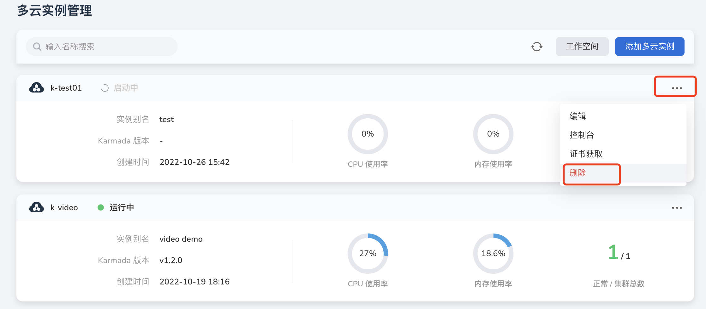
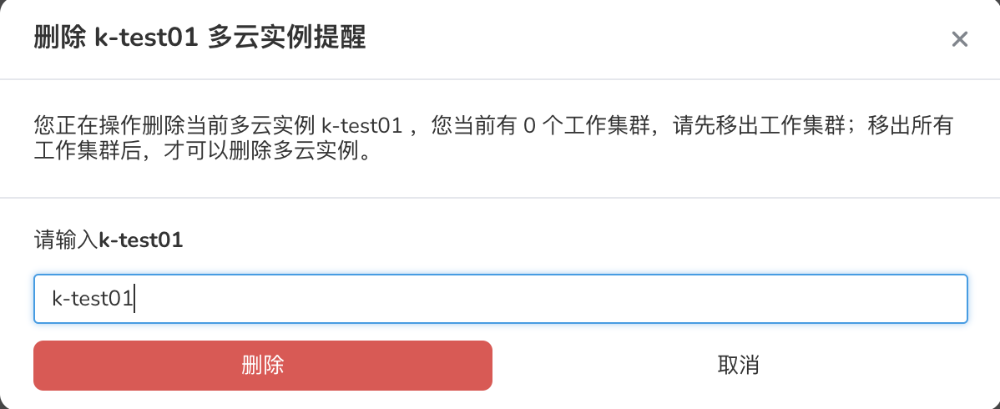

---
hide:
  - toc
---

# delete instance

## Steps

If an instance is no longer used, you can delete it by referring to the following steps.

1. In the multicloud instance list, click the `...` button on the right, and select `Delete` from the pop-up menu.

    

2. Enter the name of the instance in the pop-up window, and click the `Delete` button after confirming that it is correct.

    

!!! note

    To delete an instance, first delete the clusters, workloads, and services related to the instance. After an instance is deleted, all information related to the instance will also be deleted. Please proceed with caution.

## Precautions

In order to ensure that resource scheduling will not remain in the working cluster when deleting, we will restrict you to disassociate all working clusters; after you disassociate, the deletion at this time will be regarded as a safe deletion action .