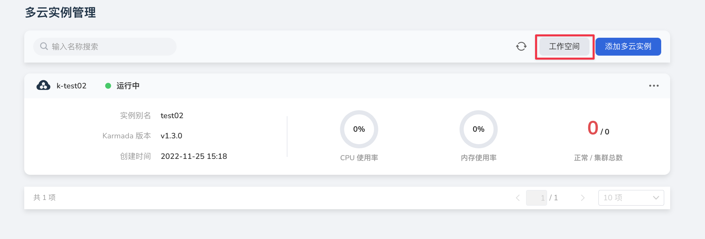
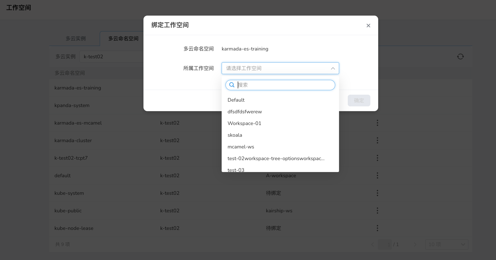

---
hide:
  - toc
---

# Workspace

Workspace is a division design of DCE5.0 that supports global resource management; it is used to manage resources and includes two parts: hierarchy and workspace.
The workspace can be understood as the project under the department, and the administrator maps the hierarchical relationship in the enterprise through the hierarchy and the workspace.

## The relationship between multicloud orchestration and workspace

In multicloud orchestration, a super administrator with a multicloud orchestration module can bind the corresponding multicloud instance or multicloud namespace to the corresponding workspace in the form of resources;
The advantage of this is that it combines the rights management capabilities of DCE5.0 and seamlessly connects the roles and rights of the workspace.

To put it simply, when a multicloud instance or a multicloud namespace is created, users in the workspace can directly obtain the permission of multicloud orchestration, which reduces the cost of permission transmission for multicloud orchestration.

In the multicloud instance list, you can see the management entry of the workspace:

## Workspace management interface

Through the interface, we can easily see the workspace to which each multicloud instance or multicloud namespace belongs.

## Bind/unbind workspace

Click the button at the end of the multicloud resource list to trigger the binding/unbinding operation.

> After the binding is successful, you can view the corresponding multicloud resources in the global management module.

## Precautions

### Permission transfer mapping

1. Each multicloud instance/namespace can only be bound to a single workspace at the same time
    1. In order to ensure the matching stability of resources and permissions, we do not support multiple workspaces directly binding to the same resource object; this is unified in the entire DCE5.0 permission design;
    2. If you want it to be used by other workspaces, we will deal with it later in the shared resource module of the workspace
2. Mapping processing of permissions, how the identity of the workspace is reflected in the multicloud arrangement
    1. There are three identities in the workspace, WorkspaceAdmin/WorkspaceEdit/WorkspaceReadOnly
    2. The permissions of WorkspaceAdmin and WorkspaceEdit are almost equal in multicloud, and the two will be distinguished when adding the corresponding multicloud instance management capabilities later
    3. WorkspaceReadOnly is still a read-only restriction in multicloud orchestration

### Multicloud namespace and workspace binding

When the multicloud workspace is bound to the workspace, the binding relationship will be automatically transferred to all working clusters after the actual binding, and no user operation is required here.

The permissions of multicloud namespaces are the same as those of ordinary single-cluster namespaces, and only have the permissions of a single namespace