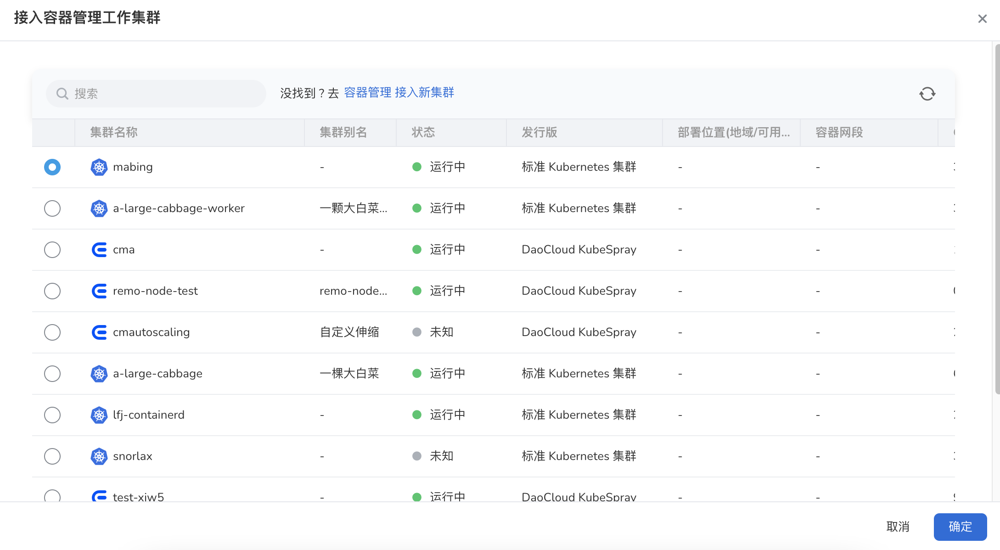

---
hide:
  - toc
---

# Access cluster

After creating a multicloud instance, you need to connect to the working cluster first.

1. Click `Working Cluster Management` in the left navigation bar to enter the multicloud cluster management page, and click the `Access Cluster` button in the upper right corner.

    

2. In the pop-up page, select a working cluster and click `Confirm`.

    

3. Return to the working cluster list, and the screen prompts that the creation is successful. Click the `…` button on the right side of the list to perform more operations on the cluster: suspend/resume scheduling, edit cluster labels, modify cluster taints, and remove.

    