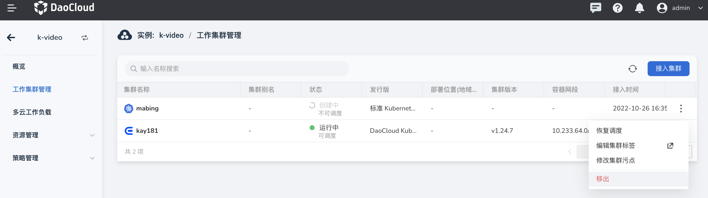

---
hide:
  - toc
---

# remove cluster

If you want to remove a cluster, you can click the `…` button on the right in the list of working clusters, and select `Remove` from the pop-up menu.

Enter the name of the cluster in the pop-up window, and click `Confirm to remove` after confirming that it is correct.

!!! note

    After the working cluster is removed, the cluster workload will no longer be managed by the multi-cloud orchestrator, and all the multi-cloud workloads currently distributed to this cluster will be automatically loaded on other managed clusters.