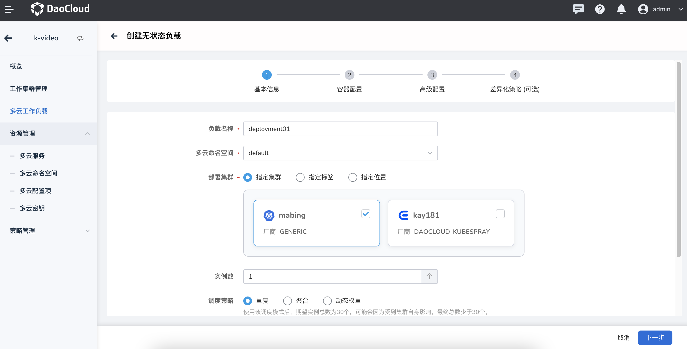
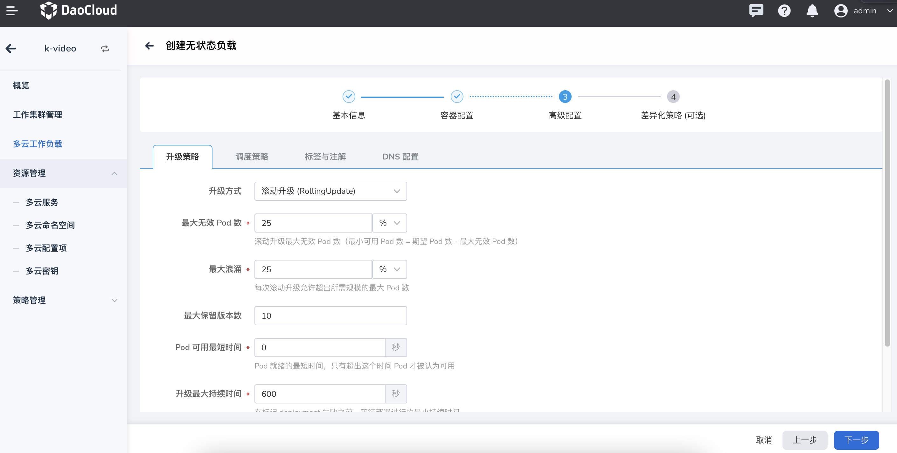

---
hide:
  - toc
---

# Create a multi-cloud workload through the form

## Steps

Follow the steps below to create a stateless load (Deployment).

1. In the left navigation bar, click `Multi-Cloud Workload` to enter the multi-cloud stateless workload page, and click the `Image Creation` button in the upper right corner.

    

2. On the `Create Stateless Payload` page, after configuring the basic information of the payload, click `Next`.

    

    Among the basic information, we need to specify the corresponding deployment work cluster. Multi-cloud orchestration provides very detailed cluster deployment capabilities, which can fully match all the capabilities of Karmada

    Note that when selecting the scheduling strategy for the number of deployment replicas, you need to pay attention to the following instructions:

    - When the deployment type is Duplicate, it means that in each working cluster covered by all, an instance corresponding to the number of replicas is started
    - When the deployment type is aggregation or dynamic weight, it refers to the total number of replicas that are set to be started in all covered working clusters

3. On the `Container Configuration` page, configure the basic information of the container where the load resides. You can choose to configure information such as life cycle and health check, and then click `Next`.

    

4. On the `Advanced Configuration` page, assign the configuration upgrade policy, scheduling policy, label and comment, and DNS, and click `Next`.

    

    If you do not need to configure differentiation after the creation is complete, you can directly use `Confirm` to complete the creation of the multi-cloud workload

5. On the `Differential Configuration` page, after selecting the personalized container configuration, labels and annotations, click `OK`.

    

    You can add the corresponding differentiated configuration item in the list area on the left. After you add a differentiated configuration item, you need to specify the corresponding cluster.
    The selectable range of the cluster is only the cluster selected at the beginning, and the selected cluster will use the specified differential configuration; the unspecified cluster will still use the default configuration

6. A successful creation prompt appears on the screen, you can now [create multi-cloud service](../06resource/service.md)!

    

!!! note

    - When creating a multi-cloud workload through mirroring, if you need to use the advanced capabilities of specifying a location and specifying a label to create, you need to ensure that the corresponding location or label has been set for the working cluster;
    Adding tags needs to be added within a single cluster, and can be jumped to the corresponding cluster maintenance from the working cluster management list.
    - When configuring the number of replicas, you need to pay attention to the corresponding scheduling strategy. Only when it is repeated, will all the configured replicas be started in multiple clusters.