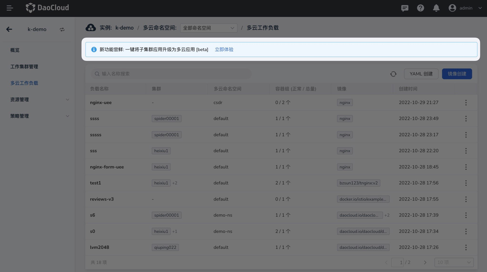
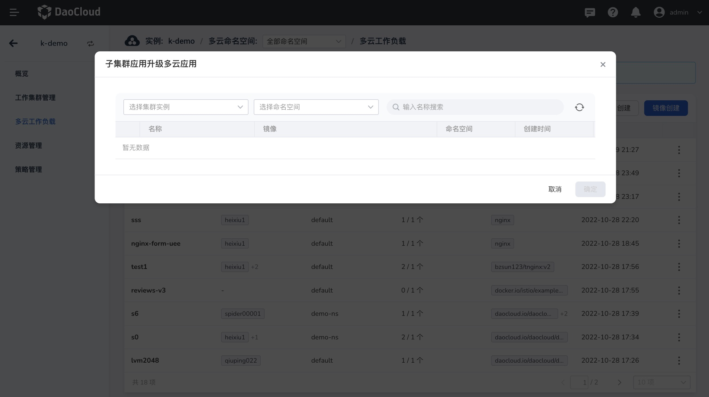
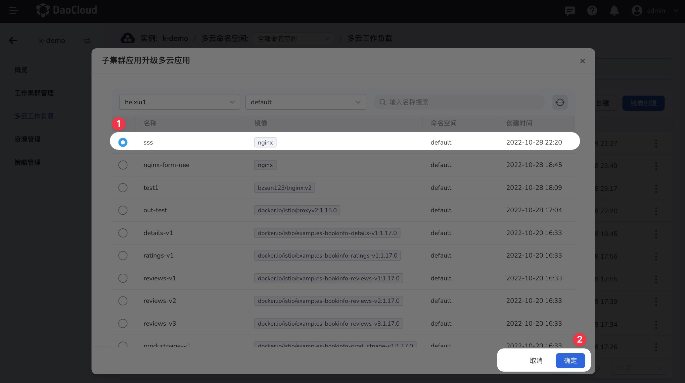

# One-click upgrade for multicloud workloads [Beta]

Multicloud orchestration supports one-click upgrade of sub-cluster workloads to multicloud workloads through simple selection operations.

## Operation Guide

Click the `Try Now` button above to quickly upgrade the application of the sub-cluster to a multicloud application; this function is currently in the trial version, if you encounter any problems, you can give feedback in the button below.

- Select the corresponding sub-cluster. Note that only the working cluster that the current workload has been connected to is displayed here. The current workload that is not connected cannot be viewed. The specific access list can be viewed on the working cluster management page
- Select an application, which supports fuzzy retrieval based on the namespace and workload name, helping you quickly locate the application
- Click `Confirm` to complete the multicloud workload

After multicloudization is completed, actions such as editing and updating can be performed according to normal multicloud workloads, which are no different from standard multicloud workloads.

!!! note

    - When upgrading, the selectable workload only supports the selection of workloads in sub-clusters; multicloud workloads that have already been orchestrated and distributed by multicloud cannot be selected again.
    - When multicloud, the ConfigMap and Secret associated with the workload will be automatically upgraded to multicloud resources.
    - When upgrading multicloud, a corresponding deployment strategy will be automatically created to manage atomic clusters.

## common problem

- Will atomic cluster workloads restart after upgrading multicloud workloads?

    There will be no restart, and when upgrading multicloud workloads, atomic clusters will be managed automatically, while ensuring that atomic cluster workloads can be upgraded without any sense.

- After upgrading a multicloud workload, if the atomic cluster is kicked out of the deployment policy, will the sub-cluster workload be deleted?

    Yes, once managed to multicloud orchestration, the atomic cluster becomes a standard multicloud workload. When the deployment strategy changes and the sub-cluster is no longer propagated, it will be deleted according to Karmada's design principle to ensure consistency.

- What types of Kubernetes resources currently support user upgrades?

    At present, the open operation portal only supports multicloud for Deployment;
    However, if the Deployment in the sub-cluster is associated with the corresponding ConfigMap and Secret, then the resource will be multicloud automatically;
    The purpose of this is that when the multicloud workload is distributed to other clusters, the resources that the workload depends on also exist synchronously, otherwise the workload may start abnormally.