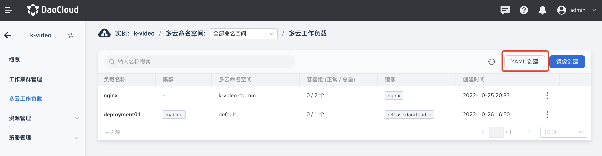

# Create multicloud workloads via YAML

In addition to creating workloads through images, they can also be created by entering YAML statements.

The steps for this creation method are relatively simple, as described below.

1. In the left navigation bar, click `Multicloud Workload`, and click the `Create with YAML` button in the upper right corner.

    

2. For example, after entering the YAML statement for creating a Deployment, click `Next`.

    

3. After entering the YAML statement of the PropagationPolicy, click `Next`.

    

4. After entering the YAML statement of the OverridePolicy, click `OK`.

    

5. Automatically return to the list of multicloud workloads, click `⋮` on the right side of the list, you can edit and modify the YAML, and you can also pause, restart, and delete the workload.

    

## YAML example

The YAML editor that comes with the multicloud orchestration module will automatically detect the YAML syntax, and if there is an error, a relevant prompt will appear.
Here are some common examples that you can use with a little modification.

**Deployment example**

```yaml
#Kubernetes Deployment
apiVersion: apps/v1
kind: Deployment
metadata:
  name: demo-nginx
  labels:
    app: demo-nginx
spec:
  replicas: 1
  selector:
    matchLabels:
      app: demo-nginx
  template:
    metadata:
      labels:
        app: demo-nginx
    spec:
      containers:
      - image: nginx
        name: nginx
```

**Deployment Policy Example**

```yaml
#Karmada PropagationPolicy
apiVersion: policy.karmada.io/v1alpha1
kind: PropagationPolicy
metadata:
  name: demo-nginx-pp
  namespace: default # The default namespace is `default`.
spec:
  resourceSelectors:
    - apiVersion: apps/v1
      kind: Deployment
      name: demo-nginx # If no namespace is specified, the namespace is inherited from the parent object scope.
  placement:
    clusterAffinity:
      clusterNames:
        - demo-stage
        - demo-dev
```

**Examples of Differentiation Strategies**

```yaml
#KarmadaOverridePolicy
apiVersion: policy.karmada.io/v1alpha1
kind: OverridePolicy
metadata:
  name: demo-nginx-op
spec:
  resourceSelectors:
    - apiVersion: apps/v1
      kind: Deployment
      name: demo-nginx
  overrideRules:
    - targetCluster:
        clusterNames:
          - demo-dev
      overriders:
        plaintext:
          - path: "/metadata/labels/env"
            operator: add
            value: demo-dev
    - targetCluster:
        clusterNames:
          - demo-stage
      overriders:
        plaintext:
          - path: "/metadata/labels/env"
            operator: add
            value: demo-stage
```