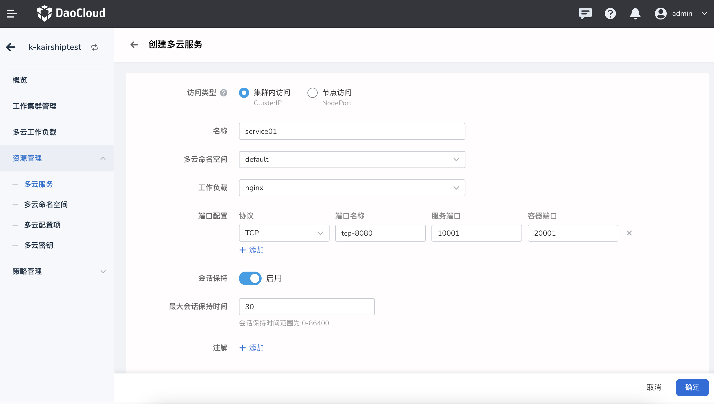
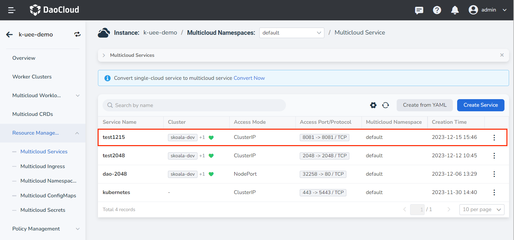

---
hide:
  - toc
---

# Multi-cloud service

Multi-cloud services are applications running on a group of Pods, which are exposed as network services one by one.
Using the DCE multicloud orchestration module, you can use unfamiliar service discovery mechanisms without modifying your applications.
DCE provides the IP address for the Pod running the service and provides the same DNS name for a group of Pods, which can be load balanced among these Pods.

Follow the steps below to manage multi-cloud services.

1. After entering a multi-cloud instance, in the left navigation bar, click `Resource Management` -> `Multi-cloud Service`, and click the `Create` button in the upper right corner.

    

2. On the `Create Multi-Cloud Service` page, after configuring the access type and other information, click `OK`.

    

3. Return to the multi-cloud service list, and the newly created one is the first one by default. Click `⋮` on the right side of the list to update and delete the service.

    

    !!! note

        If a service is deleted, the information related to the service will also disappear, please operate with caution.