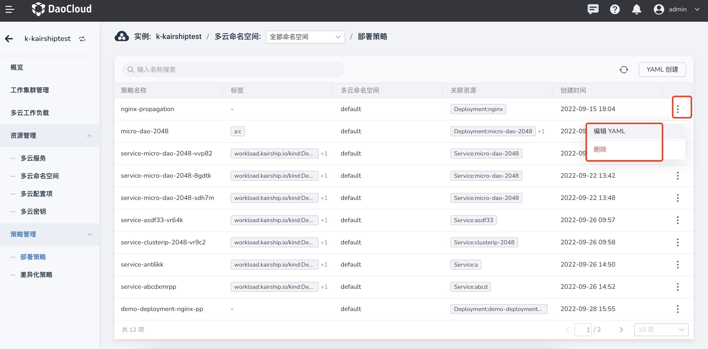

# deployment strategy

Multi-cloud orchestration supports viewing the deployment policy list of the current instance and its associated multi-cloud resources on the interface, supports creating and editing deployment policy information in YAML, and only provides a delete button for idle deployment policies.

Deployment policies define how resources are distributed across multi-cloud and multi-cluster.

Follow the steps below to create a deployment strategy.

1. After entering a multi-cloud instance, in the left navigation bar, click `Policy Management` -> `Deployment Policy`, and click the `YAML Create` button in the upper right corner.

    

2. On the `YAML Creation` page, after entering the correct YAML statement, click `OK`.

    

3. Return to the deployment policy list, and the newly created one is the first one by default. Click `⋮` on the right side of the list to edit YAML and perform delete operations.

    

    !!! note

        If you want to delete a deployment policy, you need to remove the workload related to the policy first. After the deletion, all the information related to the policy will be deleted. Please proceed with caution.

## YAML example

Here is an example YAML for a deployment policy that you can use with a little modification.

```yaml
kind: PropagationPolicy
apiVersion: policy.karmada.io/v1alpha1
metadata:
  name: nginx-propagation
  namespace: default
  uid: 2190e122-a6b0-4994-80e6-5c03a9d1d3a4
  resourceVersion: '24258'
  generation: 1
  creationTimestamp: '2022-09-15T10:04:20Z'
  annotations:
    shadow.clusterpedia.io/cluster-name:k-kairshiptest
spec:
  resourceSelectors:
    - apiVersion: apps/v1
      kind: Deployment
      namespace: default
      name: nginx
  placement:
    clusterAffinity:
      clusterNames:
        -skoala-dev
    clusterTolerations:
      - key: cluster.karmada.io/not-ready
        operator: Exists
        effect: NoExecute
        tolerationSeconds: 300
      - key: cluster.karmada.io/unreachable
        operator: Exists
        effect: NoExecute
        tolerationSeconds: 300
```