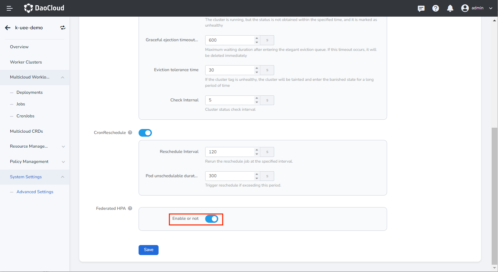
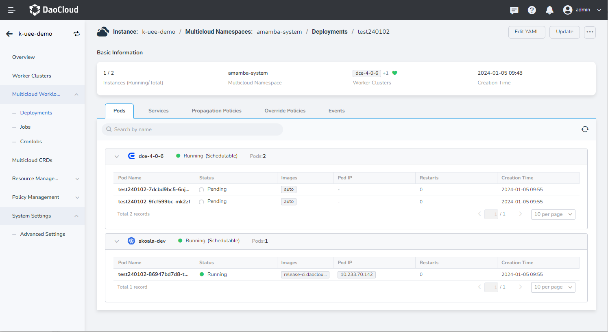
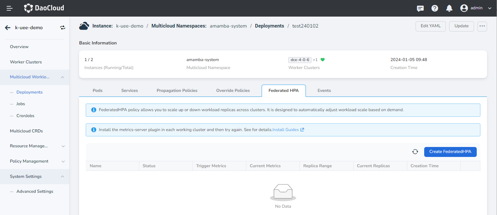
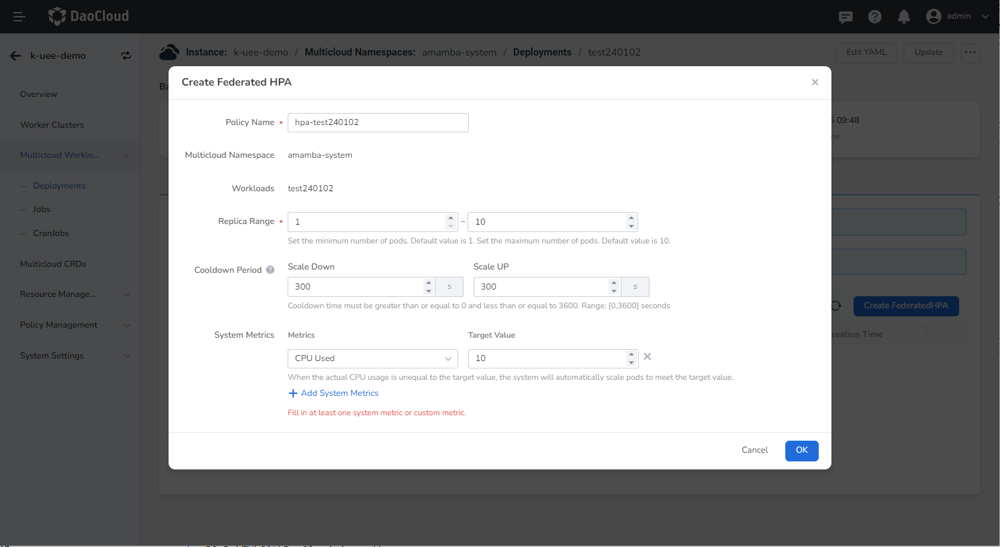
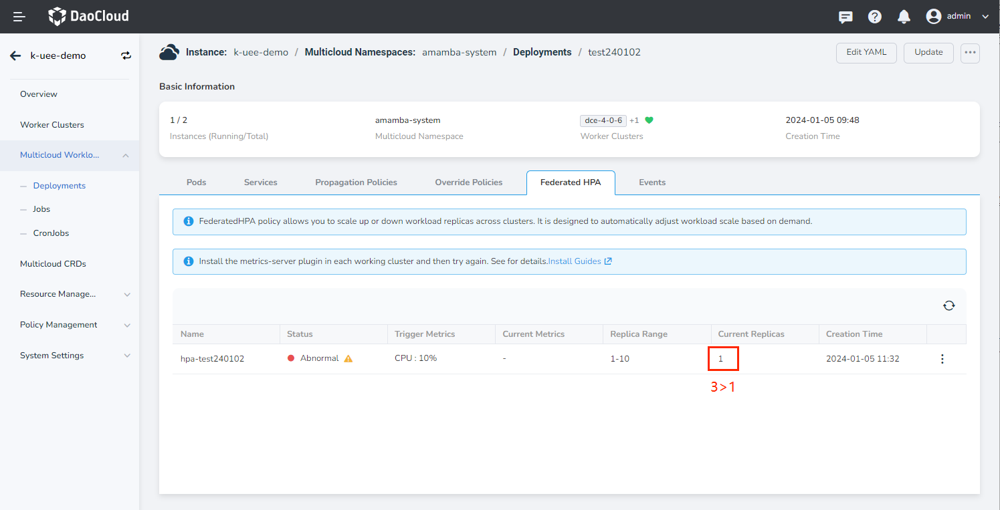
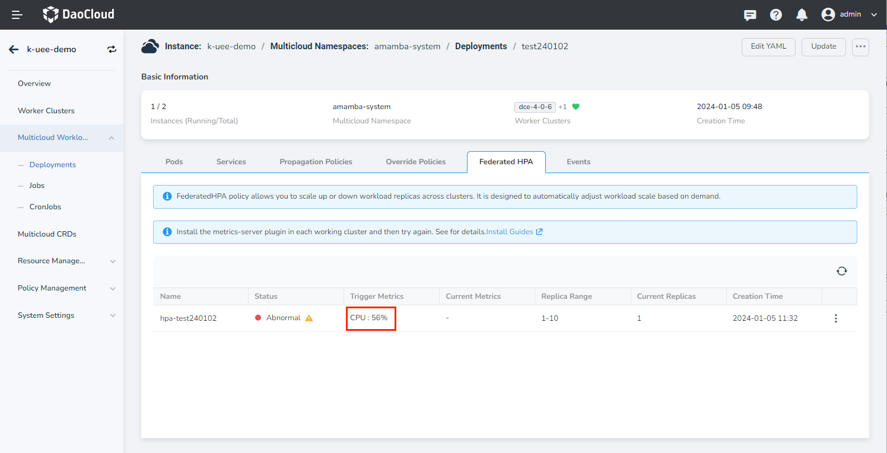

# Cross-Cluster Federsted HPA

Federated Horizontal Pod Autoscaler (FederatedHPA) offers a mechanism to scale the replicas of workloads across multiple clusters, either up or down, based on demand.

This article explains how to implement cross-cluster Federsted HPA.

## Prerequisites

- Ensure the Federated HPA feature is enabled in the advanced settings. This will trigger the automatic installation of the karmada-metrics-adapter plugin on the control plane cluster, which provides the metrics API.
- Install the metrics-server plugin in the member clusters to enable the provision of the metrics API.

## Enabling Federsted HPA

## Creating Multicloud Workload

Refer to [Create Stateless Workload](../workload/deployment.md) to create a multicloud workload.

!!! note

    1. When using cross-cluster Federated HPA, the scheduling strategy of the workload must be set as aggregate/dynamic weight.
    2. Set CPU and memory configuration.
    3. Create a multicloud service for load testing purposes.

## Cross-Cluster Elastic Downscaling

1. Go to the workload details page. The current workload is running normally with 4 replicas.

    

2. Click __Federsted HPA__ and check if the metrics-server plugin is installed in each working cluster. The plugin runs as a __Deployments__ in the __amamba-system__ namespace. It should be installed and running correctly in all member clusters.

    

3. Create a new Federated HPA policy and configure it according to your requirements.

    - Replica Range: Define the range for scaling replicas.
    - Cooldown Period: Define the interval between scaling operations.
    - System Metrics: Define the triggering conditions for scaling operations.

    

4. After creating the rule, refresh the page to view the specific values of the current replicas. Since the service has not been called yet, the actual CPU usage is 0, which is less than the target value. In order to reduce resource waste, a downscaling operation will be performed. The replicas will be reduced from 3 to 1, based on the replica range defined by the user.

    

## Cross-Cluster Elastic Upscaling

Log in to the node where this workload is located and verify if the upscaling strategy is effective through stress testing.

1. Check if the service is running properly.

    

2. Use the command `hey -c 1000 -z 10m http://10.111.254.117:8080` to perform stress testing. After some time, observe an increase in CPU usage and the number of replicas, indicating a successful upscale.

    
