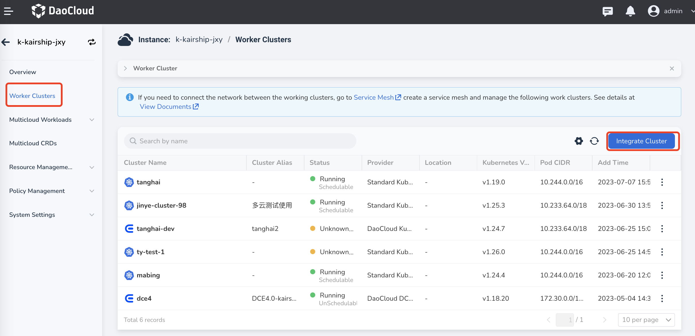
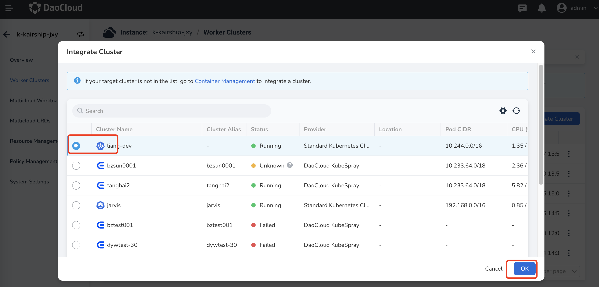
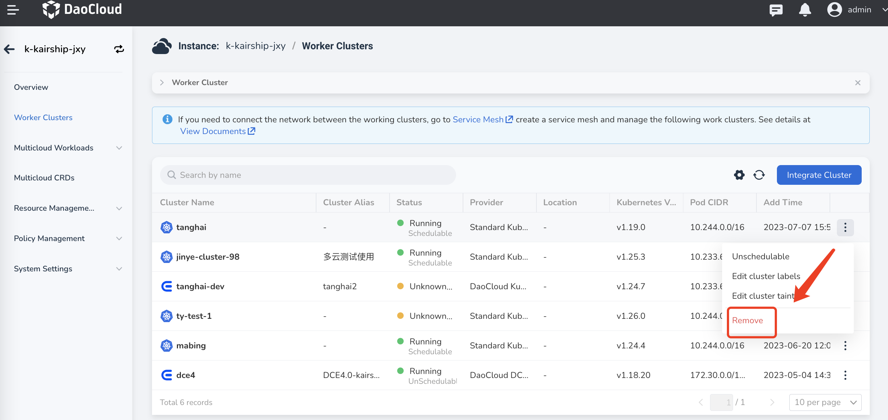
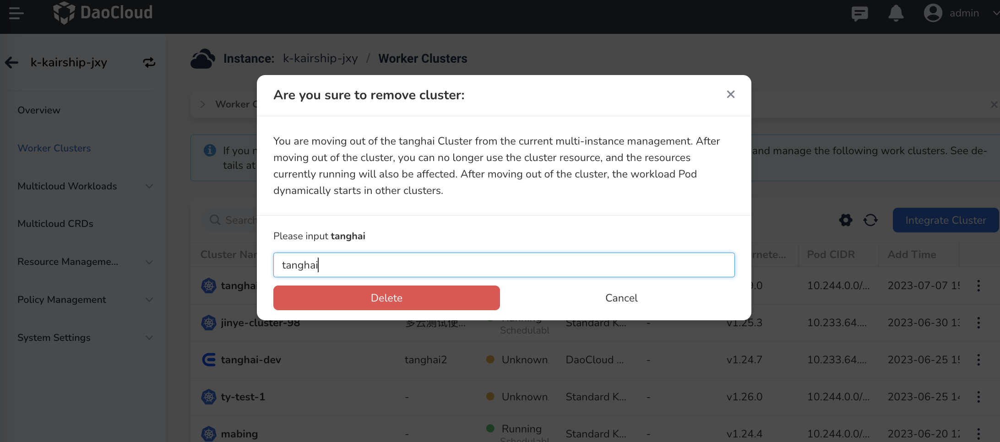
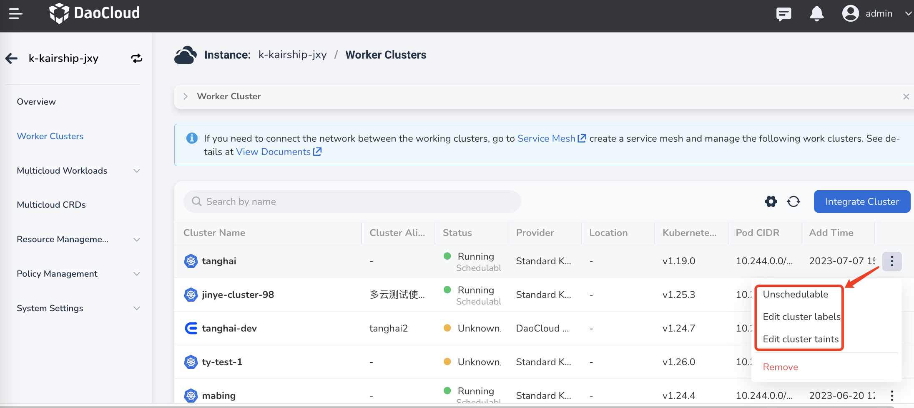
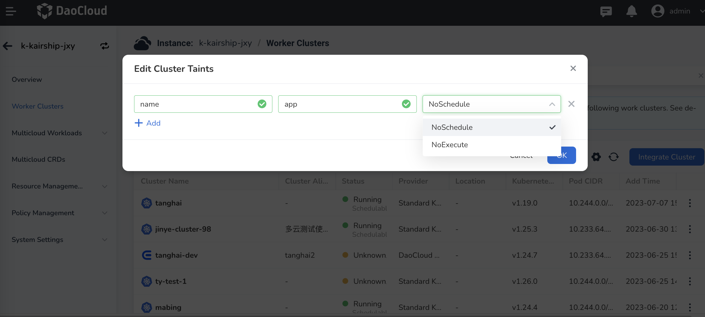

# Manage Worker Clusters

After creating multicloud instances, you need to connect them to work clusters.

## Add a Cluster

1. Click `Work Cluster Management` in the left navigation bar, then click `Connect Cluster` in the top-right corner.

    If you want to establish network connectivity between work clusters, you need to create a mesh instance and manage work clusters on the Service Mesh page. For detailed steps, refer to [MultiCloud Network Interconnect](../mspider/user-guide/multicluster/cluster-interconnect.md).

    

2. Select the work cluster you want to add and click `OK`.

    If the target cluster you want to add is not listed, you can either integrate or create a cluster in the Container Management module. For more details, refer to [Cluster Integration](../kpanda/user-guide/clusters/integrate-cluster.md) or [Create Cluster](../kpanda/user-guide/clusters/create-cluster.md).

    

## Remove a Cluster

1. Click the `⋮` button on the right side of the cluster, and select `Remove` from the pop-up menu.

    

2. In the dialog box, enter the name of the cluster, and click `Confirm Removal` after confirming that it is correct.

    

!!! note
    - After removing a work cluster, the workloads of the cluster will no longer be managed by this multi-cloud instance.
    - All multi-cloud workloads that have been distributed to this cluster will be automatically migrated to other work clusters managed by this multi-cloud instance.

## More Operations

The system will automatically return to the work cluster list. Click the `⋮` button on the right side of the cluster to perform operations such as `Pause/Resume Schedule`, `Edit Cluster Labels`, and `Modify Cluster Taints`.

## Pause/Resume Scheduling

1. Click `Pause Schedule` to pause the scheduling of the cluster. This means that new multi-cloud resources will not be distributed to this cluster, but the previously distributed resources to this cluster will not be affected.

2. At this point, click `Modify Cluster Taint` and you will find that the cluster has been automatically tainted.

    > If you want to resume scheduling, you can also click `Resume Schedule` or manually remove the corresponding cluster taint.

## Modify Cluster Taints

1. Click `Modify Cluster Taints` to control the deployment of workloads, containers, and other resources in the cluster.

2. Enter the key-value information of the taint in the pop-up box. The value can be left empty.

3. Select the taint effect from the drop-down menu and click `OK`.

    > Multiple taints can be added. Currently, two taint effects are supported:

    | Effect      | Description                                                  |
    | ----------- | ------------------------------------------------------------ |
    | NoSchedule  | Only nodes with tolerations matching this taint can be assigned to this cluster. |
    | NoExecute   | Define eviction behavior to deal with cluster failures. If the taint effect is defined as NoExecute, when the workload or pod is already running on this cluster, it will be evicted. If it is not running on this cluster, it will not be scheduled to this cluster either. |

   
